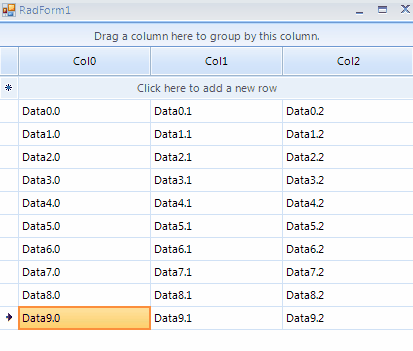

## Environment
 
|Product Version|Product|Author|
|----|----|----|
|2019.1.219|RadGridView for WinForms|[Desislava Yordanova](https://www.telerik.com/blogs/author/desislava-yordanova)|
 

## Description

This article aims to show you a sample approach how you can paste a single value to all selected cells in **RadGridView**.
 


## Solution 

**RadGridView** allows pasting over a single cell. If you need to affect all selected cells with the copied value, it would be necessary to handle the **Pasting** event and perform the desired action. A sample approach is demonstrated in the following code snippet:


#### Handling the Pasting event

````C#
public RadForm1()
{
    InitializeComponent();
 
    for (int i = 0; i < 3; i++)
    {
        this.radGridView1.Columns.Add("Col" + i);
    }
    for (int i = 0; i < 10; i++)
    {
        this.radGridView1.Rows.Add("Data" + i + ".0", "Data" + i + ".1", "Data" + i + ".2");
    }
    this.radGridView1.AutoSizeColumnsMode = Telerik.WinControls.UI.GridViewAutoSizeColumnsMode.Fill;
    this.radGridView1.MultiSelect = true;
    this.radGridView1.SelectionMode = Telerik.WinControls.UI.GridViewSelectionMode.CellSelect;
 
    this.radGridView1.Pasting += radGridView1_Pasting;
}
 
private void radGridView1_Pasting(object sender, Telerik.WinControls.UI.GridViewClipboardEventArgs e)
{
    e.Cancel = true;
    if (e.Format == "Text")
    {
        string data = Clipboard.GetData(DataFormats.Text).ToString();
        if (data != null)
        {
            foreach (GridViewCellInfo cell in this.radGridView1.SelectedCells)
            {
                cell.Value = data;
            }
        }
    }
}
       
````
````VB.NET
     Public Sub New()
        InitializeComponent()

        For i As Integer = 0 To 3 - 1
            Me.RadGridView1.Columns.Add("Col" & i)
        Next

        For i As Integer = 0 To 10 - 1
            Me.RadGridView1.Rows.Add("Data" & i & ".0", "Data" & i & ".1", "Data" & i & ".2")
        Next

        Me.RadGridView1.AutoSizeColumnsMode = Telerik.WinControls.UI.GridViewAutoSizeColumnsMode.Fill
        Me.RadGridView1.MultiSelect = True
        Me.RadGridView1.SelectionMode = Telerik.WinControls.UI.GridViewSelectionMode.CellSelect
        AddHandler Me.RadGridView1.Pasting, AddressOf radGridView1_Pasting
    End Sub

    Private Sub radGridView1_Pasting(ByVal sender As Object, ByVal e As Telerik.WinControls.UI.GridViewClipboardEventArgs)
        e.Cancel = True

        If e.Format = "Text" Then
            Dim data As String = Clipboard.GetData(DataFormats.Text).ToString()

            If data IsNot Nothing Then

                For Each cell As GridViewCellInfo In Me.RadGridView1.SelectedCells
                    cell.Value = data
                Next
            End If
        End If
    End Sub     

````
 

