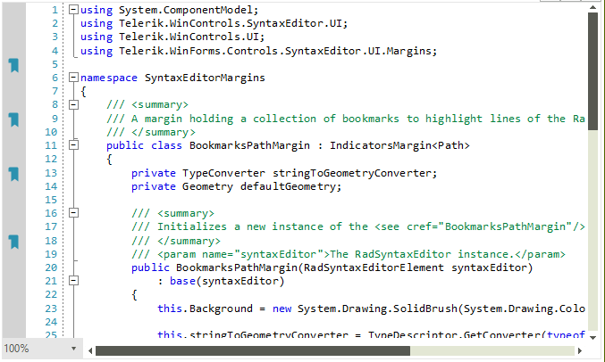

## Environment
 
|Product Version|Product|Author|
|----|----|----|
|2021.2.615|RadSyntaxEditor for WinForms|[Desislava Yordanova](https://www.telerik.com/blogs/author/desislava-yordanova)|
 
## Description

You can add indicators to particular lines of the **RadSyntaxEditor** control by using the **IndicatorsMargin&#60;T&#62;** class. This tutorial demonstrates how to achieve a Path indicator:

 

## Solution 
 
It is possible to construct a custom **IndicatorsMargin&#60;T&#62;**, where **T** is **Path** for example:

#### Defining Custom BookmarksPath Margins

{{source=..\SamplesCS\SyntaxEditor\SyntaxEditorMargins.cs region=BookmarksPathMargin}}
{{source=..\SamplesVB\SyntaxEditor\SyntaxEditorMargins.vb region=BookmarksPathMargin}}

````C#
private void SetupBookmarksPathMargin()
{
    BookmarksPathMargin bookmarksPathMargin = new BookmarksPathMargin(this.radSyntaxEditor1.SyntaxEditorElement);
    this.radSyntaxEditor1.SyntaxEditorElement.Margins.ScrollableLeft.Insert(0, bookmarksPathMargin); 
}
/// <summary>
/// A margin holding a collection of bookmarks to highlight lines of the RadSyntaxEditor control.
/// </summary>
public class BookmarksPathMargin : IndicatorsMargin<Path>
{
    private TypeConverter stringToGeometryConverter;
    private Geometry defaultGeometry;

    /// <summary>
    /// Initializes a new instance of the <see cref="BookmarksPathMargin"/> class.
    /// </summary>
    /// <param name="syntaxEditor">The RadSyntaxEditor instance.</param>
    public BookmarksPathMargin(RadSyntaxEditorElement syntaxEditor)
        : base(syntaxEditor)
    {
        this.Background = new System.Drawing.SolidBrush(System.Drawing.Color.LightGray);

        this.stringToGeometryConverter = TypeDescriptor.GetConverter(typeof(Geometry));
        string data = "M15,5H8C6.9,5,6,5.9,6,7v3h3v11l4-3l4,3V7C17,5.9,16.1,5,15,5z M9,9H7V7c0-0.6,0.4-1,1-1h1V9z";
        var convertor = new Telerik.WinForms.Controls.SyntaxEditor.Utilities.StringToPathGeometryConverter();
        var geometry = convertor.Convert(data);
        this.defaultGeometry = geometry;
    }

    /// <summary>
    /// Called when an indicator needs to be updated. This can happen when the indicator is
    /// first created, when it is brought inside or outside of the viewport or when
    /// the EditorFontSize property of the RadSyntaxEditor or the IndicatorBrush property
    /// of the margin change.
    /// </summary>
    /// <param name="path">The Path to update.</param>
    /// <param name="lineNumber">The line number the indicator is placed on.</param>
    protected override void UpdateIndicator(Path path, int lineNumber)
    {
        if (path.Data != this.defaultGeometry)
        {
            path.Data = this.defaultGeometry;
        } 

        if (path.Width != this.Editor.EditorFontSize)
        {
            path.Width = this.Editor.EditorFontSize;
        }

        if (path.Height != this.Editor.EditorFontSize)
        {
            path.Height = this.Editor.EditorFontSize;
        }

        if (path.Fill != this.IndicatorBrush)
        {
            path.Fill = this.IndicatorBrush;
        }

        path.SmoothingMode = System.Drawing.Drawing2D.SmoothingMode.HighQuality;
        path.Margin = new System.Windows.Forms.Padding(-(int)(path.Width / 2f), -4, 0, 0);
    }
}

````
````VB.NET
Private Sub SetupBookmarksPathMargin()
    Dim bookmarksPathMargin As BookmarksPathMargin = New BookmarksPathMargin(Me.RadSyntaxEditor1.SyntaxEditorElement)
    Me.RadSyntaxEditor1.SyntaxEditorElement.Margins.ScrollableLeft.Insert(0, bookmarksPathMargin)
End Sub

Public Class BookmarksPathMargin
    Inherits IndicatorsMargin(Of Path)

    Private stringToGeometryConverter As TypeConverter
    Private defaultGeometry As Geometry

    Public Sub New(ByVal syntaxEditor As RadSyntaxEditorElement)
        MyBase.New(syntaxEditor)
        Me.Background = New System.Drawing.SolidBrush(System.Drawing.Color.LightGray)
        Me.stringToGeometryConverter = TypeDescriptor.GetConverter(GetType(Geometry))
        Dim data As String = "M15,5H8C6.9,5,6,5.9,6,7v3h3v11l4-3l4,3V7C17,5.9,16.1,5,15,5z M9,9H7V7c0-0.6,0.4-1,1-1h1V9z"
        Dim convertor = New Telerik.WinForms.Controls.SyntaxEditor.Utilities.StringToPathGeometryConverter()
        Dim geometry = convertor.Convert(data)
        Me.defaultGeometry = geometry
    End Sub

    Protected Overrides Sub UpdateIndicator(ByVal path As Path, ByVal lineNumber As Integer)
        If path.Data Is Nothing Then
            path.Data = Me.defaultGeometry
        ElseIf Not path.Data.Equals(Me.defaultGeometry) Then
            path.Data = Me.defaultGeometry
        End If

        If path.Width <> Me.Editor.EditorFontSize Then
            path.Width = Me.Editor.EditorFontSize
        End If

        If path.Height <> Me.Editor.EditorFontSize Then
            path.Height = Me.Editor.EditorFontSize
        End If

        If path.Fill Is Nothing Then
            path.Fill = Me.IndicatorBrush
        ElseIf Not path.Fill.Equals(Me.IndicatorBrush) Then
            path.Fill = Me.IndicatorBrush
        End If

        path.SmoothingMode = System.Drawing.Drawing2D.SmoothingMode.HighQuality
        path.Margin = New System.Windows.Forms.Padding(-CInt((path.Width / 2.0F)), -4, 0, 0)
    End Sub
End Class

````

{{endregion}}

# See Also

* [RadSyntaxEditor]()
* [Layers]()
* [Margins]()

