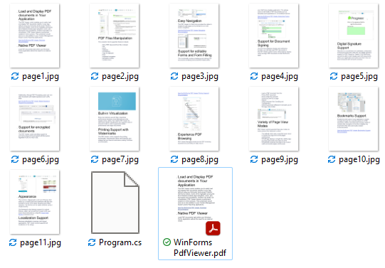

## Environment
 
|Product Version|Product|Author|
|----|----|----|
|2023.3.1114|RadPdfViewer for WinForms|[Desislava Yordanova](https://www.telerik.com/blogs/author/desislava-yordanova)|
 
## Description

**RadPdfViewer** in the Telerik UI for WinForms suite is purposed to display PDF files. However, a common requirement is to extract each page from the loaded document as an image without displaying the control or any UI. This article demonstrates a sample approach how to generate the images for each page using the public API that RadPdfViewer offers.

>caption Exported Pages as Images



## Solution 

**RadPdfViewer** exposes two methods that allow you to export a single page or the entire document to an image:

* **ExportPage**: Exports the specified page to an image.
* **ExportPages**: Exports the entire document to an image.

The ExportPage method will be used in the following code snippet:

````C#

static void Main(string[] args)
{
    Telerik.WinControls.UI.RadPdfViewer rViewer = new Telerik.WinControls.UI.RadPdfViewer();
    rViewer.DocumentLoaded += RViewer_DocumentLoaded;
    rViewer.LoadDocument(@"..\..\WinForms PdfViewer.pdf");
    rViewer.LoadElementTree();
    System.Windows.Forms.Application.DoEvents();
}
private static void RViewer_DocumentLoaded(object sender, System.EventArgs e)
{
    string filePath = @"..\..\page";
    Telerik.WinControls.UI.RadPdfViewerElement pdfViewerElement = sender as Telerik.WinControls.UI.RadPdfViewerElement;
    if (pdfViewerElement != null)
    {
        for (int i = 0; i < pdfViewerElement.Document.Pages.Count; i++)
        {
            System.Drawing.Image imagePage = pdfViewerElement.ExportPage(i, 1, true, System.Drawing.Imaging.ImageFormat.Jpeg);
            imagePage.Save(filePath + i + ".jpg");
        }
    }
}
        
````
````VB.NET

 Sub Main()

     Dim rViewer As Telerik.WinControls.UI.RadPdfViewer = New Telerik.WinControls.UI.RadPdfViewer()
     AddHandler rViewer.DocumentLoaded, AddressOf RViewer_DocumentLoaded
     rViewer.LoadDocument("..\..\WinForms PdfViewer.pdf")
     rViewer.LoadElementTree()
     System.Windows.Forms.Application.DoEvents()
 End Sub

 Private Sub RViewer_DocumentLoaded(ByVal sender As Object, ByVal e As System.EventArgs)
     Dim filePath As String = "..\..\page"
     Dim pdfViewerElement As Telerik.WinControls.UI.RadPdfViewerElement =
         TryCast(sender, Telerik.WinControls.UI.RadPdfViewerElement)

     If pdfViewerElement IsNot Nothing Then

         For i As Integer = 0 To pdfViewerElement.Document.Pages.Count - 1
             Dim imagePage As System.Drawing.Image = pdfViewerElement.ExportPage(i, 1,
                                                                                 True, System.Drawing.Imaging.ImageFormat.Jpeg)
             imagePage.Save(filePath & i & ".jpg")
         Next
     End If
 End Sub  

```` 

### Required Assembly References 

* System.Windows.Forms
* Telerik.WinControls
* Telerik.WinControls.PdfViewer
* Telerik.WinControls.UI
* Telerik.Windows.Documents.Core
* Telerik.Windows.Documents.Fixed


    
   
  
    
 
