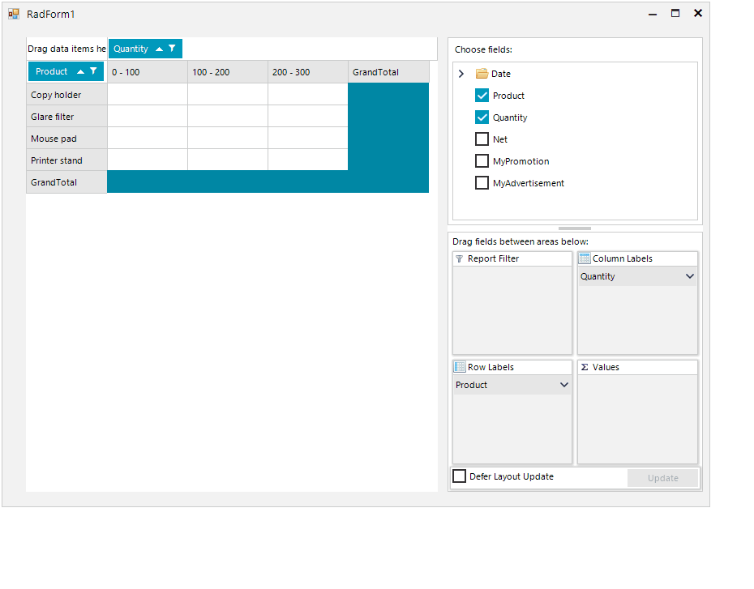

## Environment
<table>
	<tr>
		<td>Product Version</td>
		<td>2018.3.913</td>
	</tr>
	<tr>
		<td>Product</td>
		<td>RadPivotGrid for WinForms</td>
	</tr>
</table>


## Description

An example demonstrating how the default aggreagate function of a node dragged in the **RadPivodFieldList** control to the aggregate descriptions area can be changed.

## Solution

The data provider used in **RadPivotGrid** exposes the **PrepareDescriptionForField** event. The event arguments provide access to the aggregate description and its function. 

>note Not all aggregate functions are suitable for all of the fields and this depends on their type. For example, applying the *Average* function to a string field this will cause an error.
 
The example demonstrates how the event can be handled by also performing an additional check for the data type of the field.

>caption Figure 1: Default Aggregate Function


#### Sample Implementation

````C#
public partial class RadForm1 : Telerik.WinControls.UI.RadForm
{
    LocalDataSourceProvider provider;

    public RadForm1()
    {
        InitializeComponent();

        this.provider = new LocalDataSourceProvider();
        //Setup the provider and add data
        this.radPivotGrid1.DataProvider = this.provider;
        this.provider.PrepareDescriptionForField += Provider_PrepareDescriptionForField;
    }

    private void Provider_PrepareDescriptionForField(object sender, PrepareDescriptionForFieldEventArgs e)
    {
        PropertyAggregateDescription aggregate = e.Description as PropertyAggregateDescription;
        if (aggregate != null && IsNumericType(e.FieldInfo.DataType) && e.FieldInfo.Name == "Product")
        {
            aggregate.AggregateFunction = AggregateFunctions.Average;
        }
    }

    public static bool IsNumericType(Type type)
    {
        return type == typeof(double)
           || type == typeof(Nullable<double>)
           || type == typeof(int)
           || type == typeof(Nullable<int>)
           || type == typeof(byte)
           || type == typeof(Nullable<byte>)
           || type == typeof(short)
           || type == typeof(Nullable<short>)
           || type == typeof(decimal)
           || type == typeof(Nullable<decimal>)
           || type == typeof(float)
           || type == typeof(Nullable<float>)
           || type == typeof(long)
           || type == typeof(Nullable<long>)
           || type == typeof(uint)
           || type == typeof(Nullable<uint>)
           || type == typeof(sbyte)
           || type == typeof(Nullable<sbyte>)
           || type == typeof(ushort)
           || type == typeof(Nullable<ushort>)
           || type == typeof(ulong)
           || type == typeof(Nullable<ulong>);
    }
}

````
````VB.NET
Public Class RadForm1

    Private provider As LocalDataSourceProvider

    Public Sub New()
        InitializeComponent()
        Me.provider = New LocalDataSourceProvider()
        Me.radPivotGrid1.DataProvider = Me.provider
        AddHandler Me.provider.PrepareDescriptionForField, AddressOf Provider_PrepareDescriptionForField
    End Sub

    Private Sub Provider_PrepareDescriptionForField(ByVal sender As Object, ByVal e As PrepareDescriptionForFieldEventArgs)
        Dim aggregate As PropertyAggregateDescription = TryCast(e.Description, PropertyAggregateDescription)

        If aggregate IsNot Nothing AndAlso IsNumericType(e.FieldInfo.DataType) AndAlso e.FieldInfo.Name = "Product" Then
            aggregate.AggregateFunction = AggregateFunctions.Average
        End If
    End Sub

    Public Shared Function IsNumericType(ByVal type As Type) As Boolean
        Return type = GetType(Double) OrElse type = GetType(Nullable(Of Double)) OrElse type = GetType(Integer) OrElse type = GetType(Nullable(Of Integer)) OrElse type = GetType(Byte) OrElse type = GetType(Nullable(Of Byte)) OrElse type = GetType(Short) OrElse type = GetType(Nullable(Of Short)) OrElse type = GetType(Decimal) OrElse type = GetType(Nullable(Of Decimal)) OrElse type = GetType(Single) OrElse type = GetType(Nullable(Of Single)) OrElse type = GetType(Long) OrElse type = GetType(Nullable(Of Long)) OrElse type = GetType(UInteger) OrElse type = GetType(Nullable(Of UInteger)) OrElse type = GetType(SByte) OrElse type = GetType(Nullable(Of SByte)) OrElse type = GetType(UShort) OrElse type = GetType(Nullable(Of UShort)) OrElse type = GetType(ULong) OrElse type = GetType(Nullable(Of ULong))
    End Function
End Class
````

# See Also
* [LocalDataSourceProvider]()
* [Customizing RadPivotFieldList]()