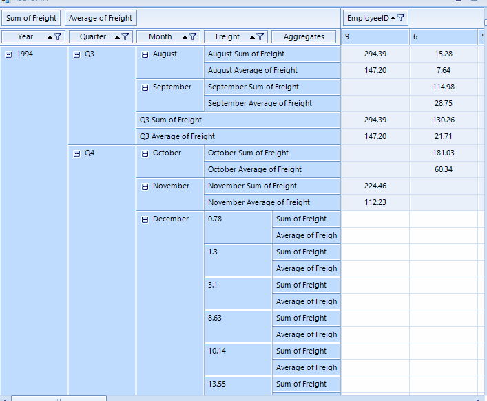

## Environment
|Product Version|Product|Author|
|----|----|----|
|2022.2.622|RadPivotGrid for WinForms|[Dinko Krastev](https://www.telerik.com/blogs/author/dinko-krastev)|


## Description

An example demonstrating how to check the current mouse-hovered PivotGroupElement, in which RowGroupDescription is located.

## Solution

We can subscribe to the __ScreenTipNeeded__ event of the RadPivotGrid control. In the event handler, we can get the currently hovered item. If it is of type __PivotGroupElement__, we can check if the Data.Axis property is Rows and uses the Data.Group.Level property to extract the corresponding __RowGroupDescription__ from the __RowGroupDescriptions__ collection of the __RadPivotGrid__.



#### Sample Implementation


````C#


	private void Pivot_ScreenTipNeeded(object sender, Telerik.WinControls.ScreenTipNeededEventArgs e)
	{
		PivotGroupElement cellGroup = e.Item as PivotGroupElement;
		if (cellGroup != null)
		{
			RadOffice2007ScreenTipElement screenTipGroupCell = new RadOffice2007ScreenTipElement();
			screenTipGroupCell.CaptionLabel.Text = "";

			if (cellGroup.Data.Axis == PivotAxis.Rows & this.RadPivotGrid1.RowGroupDescriptions.Count - 1 >= cellGroup.Data.Group.Level)
			{
				var rowGroupDescriptor = this.RadPivotGrid1.RowGroupDescriptions[cellGroup.Data.Group.Level];
				screenTipGroupCell.MainTextLabel.Text = rowGroupDescriptor.DisplayName;
				screenTipGroupCell.FooterTextLabel.Text = "";
				cellGroup.ScreenTip = screenTipGroupCell;
			}
		}
	}

	

````
````VB.NET

	Private Sub Pivot_ScreenTipNeeded(sender As Object, e As Telerik.WinControls.ScreenTipNeededEventArgs)
		Dim cellGroup As PivotGroupElement = TryCast(e.Item, PivotGroupElement)
		If cellGroup IsNot Nothing Then
			Dim screenTipGroupCell As RadOffice2007ScreenTipElement = New RadOffice2007ScreenTipElement()
			screenTipGroupCell.CaptionLabel.Text = ""

			If cellGroup.Data.Axis = PivotAxis.Rows And Me.RadPivotGrid1.RowGroupDescriptions.Count - 1 >= cellGroup.Data.Group.Level Then
				Dim rowGroupDescriptor = Me.RadPivotGrid1.RowGroupDescriptions(cellGroup.Data.Group.Level)
				screenTipGroupCell.MainTextLabel.Text = rowGroupDescriptor.DisplayName
				screenTipGroupCell.FooterTextLabel.Text = ""
				cellGroup.ScreenTip = screenTipGroupCell
			End If
		End If
	End Sub


````

