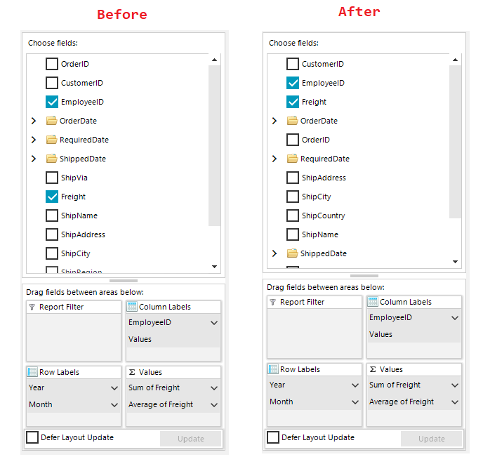

## Environment
|Product Version|Product|Author|
|----|----|----|
|2023.2.718|RadPivotGrid for WinForms|[Dinko Krastev](https://www.telerik.com/blogs/author/dinko-krastev)|


## Description

An example demonstrating how to sort fields section in the RadPivotFieldList.



## Solution

The RadPivotFieldList internally hosts a RadTreeView control responsible for displaying the logical ContainerNodes objects. In order to have the items sorted, you would need to define a SortOrder to the __RadPivotFieldList.FieldsControl__ object. A suitable place to perform this task is the event handler of the RadPivotGrid.UpdateCompleted event. 

````C#


	private void radPivotGrid1_UpdateCompleted(object sender, EventArgs e)
	{
		this.radPivotFieldList1.FieldsControl.SortOrder = System.Windows.Forms.SortOrder.Ascending;
	}


````
````VB.NET


	Private Sub radPivotGrid1_UpdateCompleted(sender As Object, e As EventArgs)
	    Me.RadPivotFieldList1.FieldsControl.SortOrder = System.Windows.Forms.SortOrder.Ascending
	End Sub


````


