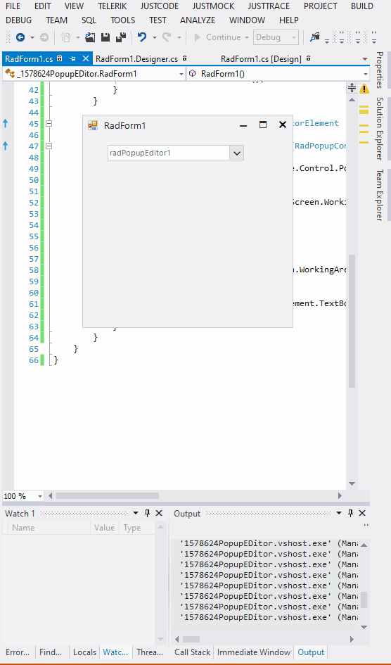

## Environment
 
|Product Version|Product|Author|
|----|----|----|
|2022.2.622|RadPopupEditor for WinForms|[Desislava Yordanova](https://www.telerik.com/blogs/author/desislava-yordanova)|


## Description

The following tutorial demonstrates a sample approach how to size dynamically the drop down in RadPopupEditor. If the control is above the middle of the screen (vertically), the popup should open to the bottom and the height should be enough to reach the bottom of the screen. If the control is below the middle of the screen, the popup should open to the top and the height should reach the top of the screen.




## Solution

Create a derivative of **RadPopupEditorElement** and override its **GetPopupSize** method. The returned size depends on the screen position of the control.
  
````C#  

        public class CustomPopupEditor : RadPopupEditor
        {
            public override string ThemeClassName  
            { 
                get 
                { 
                    return typeof(RadPopupEditor).FullName;  
                }
            }

            protected override RadPopupEditorElement CreateElement()
            {
                return new CustomElement();
            }
        }

        public class CustomElement : RadPopupEditorElement
        { 
            protected override Size GetPopupSize(RadPopupControlBase popup, bool measure)
            {
                Point location = this.ElementTree.Control.PointToScreen(Point.Empty);
            
                int height = 0;
                if (location.Y >= Screen.PrimaryScreen.WorkingArea.Height / 2)
                {
                    height = location.Y;
                }
                else
                { 
                    height = Screen.PrimaryScreen.WorkingArea.Height - location.Y - this.TextBoxElement.TextBoxItem.Size.Height * 2;
                }

                Size s = new Size(this.TextBoxElement.TextBoxItem.Size.Width, height);
                return s;
            }
        }

         
````
````VB.NET

Public Class CustomPopupEditor
    Inherits RadPopupEditor

    Public Overrides ReadOnly Property ThemeClassName As String
        Get
            Return GetType(RadPopupEditor).FullName
        End Get
    End Property

    Protected Overrides Function CreateElement() As RadPopupEditorElement
        Return New CustomElement()
    End Function
End Class

Public Class CustomElement
    Inherits RadPopupEditorElement

    Protected Overrides Function GetPopupSize(ByVal popup As RadPopupControlBase, ByVal measure As Boolean) As Size
        Dim location As Point = Me.ElementTree.Control.PointToScreen(Point.Empty)
        Dim height As Integer = 0

        If location.Y >= Screen.PrimaryScreen.WorkingArea.Height / 2 Then
            height = location.Y
        Else
            height = Screen.PrimaryScreen.WorkingArea.Height - location.Y - Me.TextBoxElement.TextBoxItem.Size.Height * 2
        End If

        Dim s As Size = New Size(Me.TextBoxElement.TextBoxItem.Size.Width, height)
        Return s
    End Function
End Class

````

# See Also

* [Getting Started with PopupEditor]()
