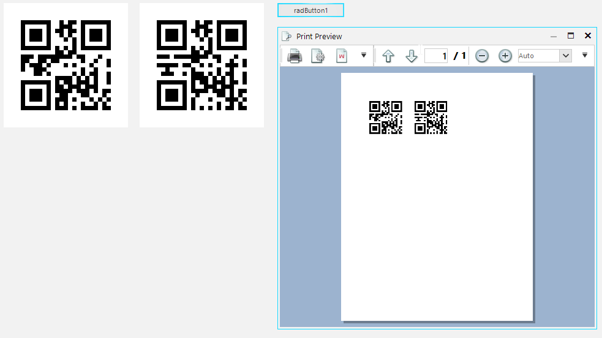

## Environment
 
|Product Version|Product|Author|
|----|----|----|
|2020.1.218|RadBarcode for WinForms|[Desislava Yordanova](https://www.telerik.com/blogs/author/desislava-yordanova)|
 
## Description

**RadBarcode** doesn't support printing out of the box. However, it offers [exporting to image](https://docs.telerik.com/devtools/winforms/controls/barcode/how-to/export-to-image) functionality.

This article demonstrates how to get benefit from the **RadRichTextEditor**'s printing behavior and achieve printing **RadBarcode**. 



## Solution 

Once you have the exported bar code images, you can [insert](https://docs.telerik.com/devtools/winforms/controls/richtexteditor/document-elements/inline-image) them in **RadRichTextEditor** and then print the **RadDocument**:  

````C#

string fileName1 = @"..\..\img1.png";
string fileName2 = @"..\..\img2.png";
Image img = this.radBarcode1.ExportToImage();
img.Save(fileName1, System.Drawing.Imaging.ImageFormat.Png);
Image img2 = this.radBarcode2.ExportToImage();
img2.Save(fileName2, System.Drawing.Imaging.ImageFormat.Png);

RadRichTextEditor radRichTextEditor1 = new RadRichTextEditor();
radRichTextEditor1.LoadElementTree();
Stream stream = File.Open(fileName1, FileMode.Open);
string extension = Path.GetExtension(fileName1);
radRichTextEditor1.InsertImage(stream, extension);

Stream stream2 = File.Open(fileName2, FileMode.Open);
extension = Path.GetExtension(fileName2);
radRichTextEditor1.InsertImage(stream2, extension);
radRichTextEditor1.PrintPreview();

 
   
````
````VB.NET

Dim fileName1 As String = "..\..\img1.png"
Dim fileName2 As String = "..\..\img2.png"
Dim img As Image = Me.RadBarcode1.ExportToImage()
img.Save(fileName1, System.Drawing.Imaging.ImageFormat.Png)
Dim img2 As Image = Me.RadBarcode2.ExportToImage()
img2.Save(fileName2, System.Drawing.Imaging.ImageFormat.Png)

Dim radRichTextEditor1 As RadRichTextEditor = New RadRichTextEditor()
radRichTextEditor1.LoadElementTree()
Dim stream As Stream = File.Open(fileName1, FileMode.Open)
Dim extension As String = Path.GetExtension(fileName1)
radRichTextEditor1.InsertImage(stream, extension)

Dim stream2 As Stream = File.Open(fileName2, FileMode.Open)
extension = Path.GetExtension(fileName2)
radRichTextEditor1.InsertImage(stream2, extension)
radRichTextEditor1.PrintPreview()

````


