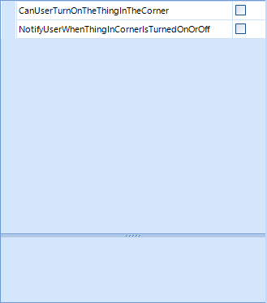

## Environment
<table>
	<tr>
		<td>Product</td>
		<td>Progress® Telerik® UI for WinForms</td>
	</tr>
</table>


## Description
An example showing how to give the PropertyGrid's Label column more width to show longer property names. By default, the PropertyGrid will use equal spacing for both sides, which may trim the end of a long property name.

## Solution

The RadPropertyGrid has a `BestFit` method that, by default, provides equal spacing to both the Label and the Value columns. The `BestFit` method has one overload that takes a **PropertyGridBestFitMode** parameter that allows you to choose a side to best fit; **MaximizeLabelColumnVisibility** and **MaximizeValueColumnVisibility**.

The example below has boolean properties with long property names, these names will be trimmed if the PropertyGrid's Label & Value columns are equally spaced.  Since the editor control for a bool (CheckBox) requires very little width, you may want the Label side to be wider. 

Let's use the following example `UserOptions` model for the RadPropertyGrid's `SelectedObject` property:

```c#
public class UserOptions
{
    public bool CanUserTurnOnTheThingInTheCorner { get; set; }
    public bool NotifyUserWhenThingInCornerIsTurnedOnOrOff { get; set; }
}
```
```VB
Public Class UserOptions
    Public Property CanUserTurnOnTheThingInTheCorner As Boolean
    Public Property NotifyUserWhenThingInCornerIsTurnedOnOrOff As Boolean
End Class
```

In the form's Load event handler, assign the `SelectedObject` to an instance of `UserOptions` and execute `BestFit` with **PropertyGridBestFitMode.MaximizeLabelColumnVisibility** as the parameter value.


```C#
public partial class RadForm1 : Telerik.WinControls.UI.RadForm
{
    public RadForm1()
    {
        InitializeComponent();
        Load += RadForm1_Load;
    }
 
    private void RadForm1_Load(object sender, EventArgs e)
    {
        radPropertyGrid1.SelectedObject = new UserOptions();
        radPropertyGrid1.BestFit(PropertyGridBestFitMode.MaximizeLabelColumnVisibility);
    }
}
```
```VB
Public Partial Class RadForm1
    Inherits Telerik.WinControls.UI.RadForm

    Public Sub New()
        InitializeComponent()
        Load += AddressOf RadForm1_Load
    End Sub

    Private Sub RadForm1_Load(ByVal sender As Object, ByVal e As EventArgs)
        radPropertyGrid1.SelectedObject = New UserOptions()
        radPropertyGrid1.BestFit(PropertyGridBestFitMode.MaximizeLabelColumnVisibility)
    End Sub
End Class
```


### Result




## See Also

- [RadPropertyGrid Overview](https://docs.telerik.com/devtools/winforms/propertygrid/overview)
- [RadPropertyGrid Properties, Methods and Events](https://docs.telerik.com/devtools/winforms/propertygrid/properties-methods-events)

