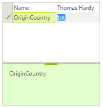
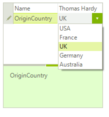

## Environment
<table>
	<tr>
		<td>Product</td>
		<td>RadPropertyGrid for WinForms</td>
	</tr>
</table>


## Description
By default, when you have a string property in the RadPropertyGrid.**SelectedObject**, a [PropertyGridTextBoxEditor]() will be activated. A common requirement is to offer the user a list of predefined values when editing this property. This article demonstrates the different approaches for achieving such a requirement. 

## Solution

Let's consider that we have a **Person** class with two string properties, **Name** and **OriginCountry**. When you try to edit the country you will obtain the following result:



The desired result is to select the country from a drop down list:



## Handling the EditorRequired event

Subscribe to the RadPropertyGrid.[EditorRequired]() event and set the PropertyGridEditorRequiredEventArgs.**Editor** property to **PropertyGridDropDownListEditor**. The code snippet below demonstrates how to populate the drop down with country options:

{{source=..\SamplesCS\KnowledgeBase\PropertyGridDropDownEditor.cs region=EditorRequired}} 
{{source=..\SamplesVB\KnowledgeBase\PropertyGridDropDownEditor.vb region=EditorRequired}}

````C#
        
private void radPropertyGrid1_EditorRequired(object sender, Telerik.WinControls.UI.PropertyGridEditorRequiredEventArgs e)
{
    if (e.Item.Name == "OriginCountry")
    {
        PropertyGridDropDownListEditor ddl = new PropertyGridDropDownListEditor();
        BaseDropDownListEditorElement el = ddl.EditorElement as BaseDropDownListEditorElement;
        el.DataSource = GetCountries();
        e.Editor = ddl;
    }
}
        
private object GetCountries()
{
    List<string> countries = new List<string>();
    countries.Add("USA");
    countries.Add("France");
    countries.Add("UK");
    countries.Add("Germany");
    countries.Add("Australia");
    return countries;
}

````
````VB.NET
Private Sub radPropertyGrid1_EditorRequired(sender As Object, e As Telerik.WinControls.UI.PropertyGridEditorRequiredEventArgs)
    If e.Item.Name = "OriginCountry" Then
        Dim ddl As PropertyGridDropDownListEditor = New PropertyGridDropDownListEditor()
        Dim el As BaseDropDownListEditorElement = TryCast(ddl.EditorElement, BaseDropDownListEditorElement)
        el.DataSource = GetCountries()
        e.Editor = ddl
    End If
End Sub
Private Function GetCountries() As Object
    Dim countries As List(Of String) = New List(Of String)()
    countries.Add("USA")
    countries.Add("France")
    countries.Add("UK")
    countries.Add("Germany")
    countries.Add("Australia")
    Return countries
End Function

````

{{endregion}}

## Using EditorAttribute and handling the EditorInitialized event

You can specify the [EditorAttribute](https://msdn.microsoft.com/en-us/library/system.componentmodel.editorattribute(v=vs.110).aspx) in the Person.**OriginCountry** property indicating that the **PropertyGridDropDownListEditor** will be used:


````C#
          
[Editor(typeof(PropertyGridDropDownListEditor), typeof(BaseInputEditor))]

````
````VB.NET
 <Editor(GetType(PropertyGridDropDownListEditor), GetType(BaseInputEditor))> _
````

Then, subscribe to the RadPropertyGrid.[EditorInitialized]() event where you can set the editor's **DataSource** property:

{{source=..\SamplesCS\KnowledgeBase\PropertyGridDropDownEditor.cs region=Initialized}} 
{{source=..\SamplesVB\KnowledgeBase\PropertyGridDropDownEditor.vb region=Initialized}}

````C#
        
private void radPropertyGrid1_EditorInitialized(object sender, PropertyGridItemEditorInitializedEventArgs e)
{
    PropertyGridDropDownListEditor ddl = e.Editor as  PropertyGridDropDownListEditor;
    if (ddl != null)
    {
        BaseDropDownListEditorElement el = ddl.EditorElement as BaseDropDownListEditorElement;
        el.DataSource = GetCountries();
        el.Text = ((PropertyGridItem)e.Item).Value + "";
    }
}

````
````VB.NET
Private Sub EditorInitialized(sender As Object, e As PropertyGridItemEditorInitializedEventArgs)
    Dim ddl As PropertyGridDropDownListEditor = TryCast(e.Editor, PropertyGridDropDownListEditor)
    If ddl IsNot Nothing Then
        Dim el As BaseDropDownListEditorElement = TryCast(ddl.EditorElement, BaseDropDownListEditorElement)
        el.DataSource = GetCountries()
        el.Text = (CType(e.Item, PropertyGridItem)).Value & ""
    End If
End Sub

````

{{endregion}}

## Using a custom TypeConverter

You can also create a [TypeConverter](https://msdn.microsoft.com/en-us/library/ayybcxe5.aspx). In it we will override the **GetStandardValuesSupported** method, which indicates whether the object supports a standard set of values that can be picked from a predefined list. Then, we will override the **GetStandardValuesExclusive** method which indicates whether the collection of standard values is exclusive or the user is allowed to add custom values. Lastly, in the **GetStandardValues** method we should specify the predefined list. The property grid uses this collection to build a list and provide it to the user for selection.

{{source=..\SamplesCS\KnowledgeBase\PropertyGridDropDownEditor.cs region=TypeConverter}} 
{{source=..\SamplesVB\KnowledgeBase\PropertyGridDropDownEditor.vb region=TypeConverter}}

````C#
public class CustomTypeConverter : TypeConverter
{
    public override bool GetStandardValuesSupported(ITypeDescriptorContext context)
    {
        return true;
    }
    public override bool GetStandardValuesExclusive(ITypeDescriptorContext context)
    {
        return true;
    }
    public override StandardValuesCollection GetStandardValues(ITypeDescriptorContext context)
    {
        return new StandardValuesCollection(new string[] { "USA", "France", "UK", "Germany", "Australia" });
    }
}

````
````VB.NET
Public Class CustomTypeConverter
    Inherits TypeConverter
    Public Overrides Function GetStandardValuesSupported(ByVal context As ITypeDescriptorContext) As Boolean
        Return True
    End Function
    Public Overrides Function GetStandardValuesExclusive(ByVal context As ITypeDescriptorContext) As Boolean
        Return True
    End Function
    Public Overrides Function GetStandardValues(ByVal context As ITypeDescriptorContext) As StandardValuesCollection
        Return New StandardValuesCollection(New String() {"USA", "France", "UK", "Germany", "Australia"})
    End Function
End Class

````

{{endregion}}

After applying the [TypeConverterAttribute](https://msdn.microsoft.com/en-us/library/system.componentmodel.typeconverterattribute(v=vs.110).aspx), when you try to modify the **OriginCountry** property **RadPropertyGrid** will display a drop down list editor with the predefined set of values:


````C#
 [TypeConverter(typeof(CustomTypeConverter))]    

````
````VB.NET
<TypeConverter(GetType(CustomTypeConverter))>

````

# See Also

 * [PropertyGrid Overview]()
 * [PropertyGrid Events ]()

