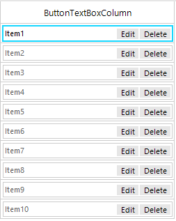

## Environment
 
|Product Version|Product|Author|
|----|----|----|
|2020.2.512|RadGridView for WinForms|[Nadya Karaivanova](https://www.telerik.com/blogs/author/nadya-karaivanova)|
 
## Description

A common requirement is to display a button and text box in [GridViewDataColumn](https://docs.telerik.com/devtools/winforms/controls/gridview/columns/gridviewdatacolumn). This article demonstrated how you can create **RadButtonTextBoxColumn** based on the functionality that **RadGridView** offers.
 


## Solution 

**RadGridView** provides a flexible mechanism for creating custom cell types with custom content elements. Thus, you can create a custom cell with [RadButtonTextBoxElement](https://docs.telerik.com/devtools/winforms/controls/editors/buttontextbox/buttontextbox) in it and use this cell in a custom column in the grid. Following the steps in the provided in [Creating custom cells](https://docs.telerik.com/devtools/winforms/controls/gridview/cells/creating-custom-cells) article, it is possible to create **RadButtonTextBoxColumn**. Below is a sample demonstration how you can achieve this. Feel free to extend it so that suits your requirements the best.

````C#
 public partial class RadForm1 : Telerik.WinControls.UI.RadForm
 {
     public RadForm1()
     {
         InitializeComponent();
         this.radGridView1.AllowAddNewRow = false;
         RadButtonTextBoxColumn customColumn = new RadButtonTextBoxColumn("ButtonTextBoxColumn");
         this.radGridView1.Columns.Add(customColumn);
         this.radGridView1.Columns[0].Width = 250;
         for (int i = 1; i <= 10; i++)
         {
             this.radGridView1.Rows.Add("Item" + i);
         }
     }
 }
 public class ButtonTextBoxCell : GridDataCellElement
 {
     public ButtonTextBoxCell(GridViewColumn column, GridRowElement row) : base(column, row)
     {
     }

     private RadButtonTextBoxElement buttonTextBoxElement;
     protected override void CreateChildElements()
     {
         base.CreateChildElements();
         buttonTextBoxElement = new RadButtonTextBoxElement();
         RadButtonElement buttonElement1 = new RadButtonElement();
         RadButtonElement buttonElement2 = new RadButtonElement();
         buttonElement1.Text = "Edit";
         buttonElement2.Text = "Delete";
         buttonTextBoxElement.RightButtonItems.Add(buttonElement1);
         buttonTextBoxElement.RightButtonItems.Add(buttonElement2);
         this.Children.Add(buttonTextBoxElement);

     }

     protected override void SetContentCore(object value)
     {
         this.buttonTextBoxElement.Text = this.Value.ToString();
     }

     public override bool IsCompatible(GridViewColumn data, object context)
     {
         return data is RadButtonTextBoxColumn && context is GridDataRowElement;
     }
     protected override Type ThemeEffectiveType
     {
         get
         {
             return typeof(GridDataCellElement);
         }
     }
 }
 public class RadButtonTextBoxColumn : GridViewDataColumn
 {
     public RadButtonTextBoxColumn(string fieldName) : base(fieldName)
     {
     }

     public override Type GetCellType(GridViewRowInfo row)
     {
         if (row is GridViewDataRowInfo)
         {
             return typeof(ButtonTextBoxCell);
         }
         return base.GetCellType(row);
     }
 }
   
````
````VB.NET

Public Class RadForm1
    Public Sub New()
        InitializeComponent()
        Me.RadGridView1.AllowAddNewRow = False
        Dim customColumn As RadButtonTextBoxColumn = New RadButtonTextBoxColumn("ButtonTextBoxColumn")
        Me.RadGridView1.Columns.Add(customColumn)
        Me.RadGridView1.Columns(0).Width = 250

        For i As Integer = 1 To 10
            Me.RadGridView1.Rows.Add("Item" & i)
        Next
    End Sub
End Class

Public Class ButtonTextBoxCell
    Inherits GridDataCellElement

    Public Sub New(ByVal column As GridViewColumn, ByVal row As GridRowElement)
        MyBase.New(column, row)
    End Sub

    Private buttonTextBoxElement As RadButtonTextBoxElement
    Protected Overrides Sub CreateChildElements()
        MyBase.CreateChildElements()
        buttonTextBoxElement = New RadButtonTextBoxElement()
        Dim buttonElement1 As RadButtonElement = New RadButtonElement()
        Dim buttonElement2 As RadButtonElement = New RadButtonElement()
        buttonElement1.Text = "Edit"
        buttonElement2.Text = "Delete"
        buttonTextBoxElement.RightButtonItems.Add(buttonElement1)
        buttonTextBoxElement.RightButtonItems.Add(buttonElement2)
        Me.Children.Add(buttonTextBoxElement)
    End Sub

    Protected Overrides Sub SetContentCore(ByVal value As Object)
        Me.buttonTextBoxElement.Text = Me.Value.ToString()
    End Sub

    Public Overrides Function IsCompatible(ByVal data As GridViewColumn, ByVal context As Object) As Boolean
        Return TypeOf data Is RadButtonTextBoxColumn AndAlso TypeOf context Is GridDataRowElement
    End Function

    Protected Overrides ReadOnly Property ThemeEffectiveType As Type
        Get
            Return GetType(GridDataCellElement)
        End Get
    End Property
End Class

Public Class RadButtonTextBoxColumn
    Inherits GridViewDataColumn
    Public Sub New(ByVal fieldName As String)
        MyBase.New(fieldName)
    End Sub

    Public Overrides Function GetCellType(ByVal row As GridViewRowInfo) As Type
        If TypeOf row Is GridViewDataRowInfo Then
            Return GetType(ButtonTextBoxCell)
        End If
        Return MyBase.GetCellType(row)
    End Function
End Class

````

