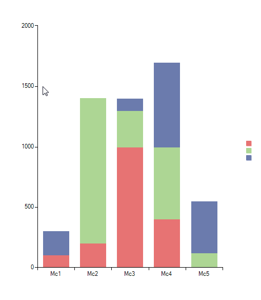

|Product Version|Product|Author|Last modified|
|----|----|----|----|
|Q2 2013|RadChartView for WinForms|Dimitar Karamfilov|09/13/2013|

  
## PROBLEM
This article demonstrates how to implement drag and drop functionality in  RadChartView. This will allow the user to move data points from one category to another. 

 
 
## SOLUTION  
First we will populate RadChartView with some data. In each category we have a single data point with value of 0. This is needed because all categories must remain visible despite there is no actual data in them:  

````C#
BarSeries bar = new BarSeries();
bar.Name = "FakeSeries";
bar.CombineMode = ChartSeriesCombineMode.Stack;
CategoricalDataPoint point = new CategoricalDataPoint();
point.Category = "Mc1";
point.Value = 0;
bar.DataPoints.Add(point);
point = new CategoricalDataPoint();
point.Category = "Mc2";
point.Value = 0;
bar.DataPoints.Add(point);
point = new CategoricalDataPoint();
point.Category = "Mc3";
point.Value = 0;
bar.DataPoints.Add(point);
point = new CategoricalDataPoint();
point.Category = "Mc4";
point.Value = 0;
bar.DataPoints.Add(point);
point = new CategoricalDataPoint();
point.Category = "Mc5";
point.Value = 0;
bar.DataPoints.Add(point);
 
this.radChartView1.Series.Add(bar);
bar.IsVisibleInLegend = false;
 
bar = new BarSeries();
bar.Name = "Series1";
bar.CombineMode = ChartSeriesCombineMode.Stack;
 
point = new CategoricalDataPoint();
point.Category = "Mc1";
point.Value = 100;
bar.DataPoints.Add(point);
point = new CategoricalDataPoint();
point.Category = "Mc2";
point.Value = 200;
bar.DataPoints.Add(point);
point = new CategoricalDataPoint();
point.Category = "Mc3";
point.Value = 1000;
bar.DataPoints.Add(point);
point = new CategoricalDataPoint();
point.Category = "Mc4";
point.Value = 400;
bar.DataPoints.Add(point);
 
this.radChartView1.Series.Add(bar);
 
bar = new BarSeries();
bar.Name = "Series2";
bar.CombineMode = ChartSeriesCombineMode.Stack;
 
point = new CategoricalDataPoint();
point.Category = "Mc2";
point.Value = 1200;
bar.DataPoints.Add(point);
point = new CategoricalDataPoint();
point.Category = "Mc3";
point.Value = 300;
bar.DataPoints.Add(point);
point = new CategoricalDataPoint();
point.Category = "Mc4";
point.Value = 600;
bar.DataPoints.Add(point);
point = new CategoricalDataPoint();
point.Category = "Mc5";
point.Value = 120;
bar.DataPoints.Add(point);
 
this.radChartView1.Series.Add(bar);
 
bar = new BarSeries();
bar.Name = "Series3";
bar.CombineMode = ChartSeriesCombineMode.Stack;
 
point = new CategoricalDataPoint();
point.Category = "Mc1";
point.Value = 200;
bar.DataPoints.Add(point);
point = new CategoricalDataPoint();
point.Category = "Mc3";
point.Value = 100;
bar.DataPoints.Add(point);
point = new CategoricalDataPoint();
point.Category = "Mc4";
point.Value = 700;
bar.DataPoints.Add(point);
point = new CategoricalDataPoint();
point.Category = "Mc5";
point.Value = 430;
bar.DataPoints.Add(point);

````
````VB.NET
Dim bar As BarSeries = New BarSeries()
bar.Name = "FakeSeries"
bar.CombineMode = ChartSeriesCombineMode.Stack
 
Dim point As CategoricalDataPoint = New CategoricalDataPoi
point.Category = "Mc1"
point.Value = 0
bar.DataPoints.Add(point)
point = New CategoricalDataPoint()
point.Category = "Mc2"
point.Value = 0
bar.DataPoints.Add(point)
point = New CategoricalDataPoint()
point.Category = "Mc3"
point.Value = 0
bar.DataPoints.Add(point)
point = New CategoricalDataPoint()
point.Category = "Mc4"
point.Value = 0
bar.DataPoints.Add(point)
point = New CategoricalDataPoint()
point.Category = "Mc5"
point.Value = 0
bar.DataPoints.Add(point)
 
Me.radChartView1.Series.Add(bar)
bar.IsVisibleInLegend = False
 
bar = New BarSeries()
bar.Name = "Series1"
bar.CombineMode = ChartSeriesCombineMode.Stack
 
point = New CategoricalDataPoint()
point.Category = "Mc1"
point.Value = 100
bar.DataPoints.Add(point)
point = New CategoricalDataPoint()
point.Category = "Mc2"
point.Value = 200
bar.DataPoints.Add(point)
point = New CategoricalDataPoint()
point.Category = "Mc3"
point.Value = 1000
bar.DataPoints.Add(point)
point = New CategoricalDataPoint()
point.Category = "Mc4"
point.Value = 400
bar.DataPoints.Add(point)
 
Me.radChartView1.Series.Add(bar)
 
bar = New BarSeries()
bar.Name = "Series2"
bar.CombineMode = ChartSeriesCombineMode.Stack
 
point = New CategoricalDataPoint()
point.Category = "Mc2"
point.Value = 1200
bar.DataPoints.Add(point)
point = New CategoricalDataPoint()
point.Category = "Mc3"
point.Value = 300
bar.DataPoints.Add(point)
point = New CategoricalDataPoint()
point.Category = "Mc4"
point.Value = 600
bar.DataPoints.Add(point)
point = New CategoricalDataPoint()
point.Category = "Mc5"
point.Value = 120
bar.DataPoints.Add(point)
 
Me.radChartView1.Series.Add(bar)
 
bar = New BarSeries()
bar.Name = "Series3"
bar.CombineMode = ChartSeriesCombineMode.Stack
 
point = New CategoricalDataPoint()
point.Category = "Mc1"
point.Value = 200
bar.DataPoints.Add(point)
point = New CategoricalDataPoint()
point.Category = "Mc3"
point.Value = 100
bar.DataPoints.Add(point)
point = New CategoricalDataPoint()
point.Category = "Mc4"
point.Value = 700
bar.DataPoints.Add(point)
point = New CategoricalDataPoint()
point.Category = "Mc5"
point.Value = 430
bar.DataPoints.Add(point)

````

Then you should subscribe to the MouseDown, DragDrop and DragOver events and also we need to enable the drop functionality for the RadChartView:

````C#
this.radChartView1.AllowDrop = true;
this.radChartView1.MouseDown += radChartView1_MouseDown;
this.radChartView1.DragDrop += radChartView1_DragDrop;
this.radChartView1.DragOver += radChartView1_DragOver;

````
````VB.NET
Me.radChartView1.AllowDrop = True
AddHandler Me.radChartView1.MouseDown, AddressOf radChartView1_MouseDown
AddHandler Me.radChartView1.DragDrop, AddressOf radChartView1_DragDrop
AddHandler Me.radChartView1.DragOver, AddressOf radChartView1_DragOver

````

In the MouseDown event handler we need to check if the mouse is over a valid for dragging point  (data point) and if it is we can perform the drag operation:

````C#
private void radChartView1_MouseDown(object sender, MouseEventArgs e)
{
    CategoricalDataPoint point = ((BarSeries)this.radChartView1.Series[0]).HitTest(e.X, e.Y) as CategoricalDataPoint;
 
    if (point != null)
    {
        this.radChartView1.DoDragDrop(point, DragDropEffects.Move);
    }
}

````
````VB.NET
Private Sub radChartView1_MouseDown(ByVal sender As Object, ByVal e As MouseEventArgs)
    Dim point As CategoricalDataPoint = TryCast((CType(Me.radChartView1.Series(0), BarSeries)).HitTest(e.X, e.Y), CategoricalDataPoint)
 
    If Not point Is Nothing Then
        Me.radChartView1.DoDragDrop(point, DragDropEffects.Move)
    End If
End Sub

````

In the DragOver event handler we are preserving the move effect if the user is dragging the appropriate datatype:

````C#
void radChartView1_DragOver(object sender, DragEventArgs e)
{
    if (e.Data.GetDataPresent(typeof(CategoricalDataPoint)))
    {
        e.Effect = DragDropEffects.Move;
    }
}

````
````VB.NET
Private Sub radChartView1_DragOver(ByVal sender As Object, ByVal e As DragEventArgs)
    If e.Data.GetDataPresent(GetType(CategoricalDataPoint)) Then
        e.Effect = DragDropEffects.Move
    End If
End Sub

````

Finally, we need to implement the DragDrop event handler where we are actually updating the RadChartView in order to respond to the drag and drop operation. We are checking if the mouse is over a valid drop location and then we are cloning the data points, adding it to the new series and deleting it from the old one:

````C#
void radChartView1_DragDrop(object sender, DragEventArgs e)
{
    CategoricalDataPoint point = e.Data.GetData(typeof(CategoricalDataPoint)) as CategoricalDataPoint;
 
    if (point != null)
    {
        CategoricalDataPoint dropPoint = null;
        Point dropLocation = this.radChartView1.PointToClient(new Point(e.X, e.Y));
 
        dropPoint = this.radChartView1.Series[0].HitTest(dropLocation.X, dropLocation.Y) as CategoricalDataPoint;
                                         
        if (dropPoint == null)
        {
            for (int i = 0; i < this.radChartView1.Bounds.Bottom; i++)
            {
                dropPoint = this.radChartView1.Series[0].HitTest(dropLocation.X, i) as CategoricalDataPoint;
 
                if (dropPoint!= null)
                {
                    break;
                }
            }
        }
 
        if (dropPoint != null)
        {
            BarSeries barSeries = point.Parent.Presenter as BarSeries;
 
            CategoricalDataPoint clone = new CategoricalDataPoint();
            clone.Category = dropPoint.Category;
            clone.Value = point.Value;
            barSeries.DataPoints.Add(clone);
            barSeries.DataPoints.Remove(point);
        }
    }
}

````
````VB.NET
Private Sub radChartView1_DragDrop(ByVal sender As Object, ByVal e As DragEventArgs)
    Dim point As CategoricalDataPoint = TryCast(e.Data.GetData(GetType(CategoricalDataPoint)), CategoricalDataPoint)
 
    If Not point Is Nothing Then
        Dim dropPoint As CategoricalDataPoint = Nothing
        Dim dropLocation As Point = Me.radChartView1.PointToClient(New Point(e.X, e.Y))
 
        dropPoint = TryCast(Me.radChartView1.Series(0).HitTest(dropLocation.X, dropLocation.Y), CategoricalDataPoint)
 
        If dropPoint Is Nothing Then
            Dim i As Integer = 0
            Do While i < Me.radChartView1.Bounds.Bottom
                dropPoint = TryCast(Me.radChartView1.Series(0).HitTest(dropLocation.X, i), CategoricalDataPoint)
 
                If Not dropPoint Is Nothing Then
                    Exit Do
                End If
                i += 1
            Loop
        End If
 
        If Not dropPoint Is Nothing Then
            Dim barSeries As BarSeries = TryCast(point.Parent.Presenter, BarSeries)
 
            Dim clone As CategoricalDataPoint = New CategoricalDataPoint()
            clone.Category = dropPoint.Category
            clone.Value = point.Value
            barSeries.DataPoints.Add(clone)
            barSeries.DataPoints.Remove(point)
        End If
    End If
End Sub

````

