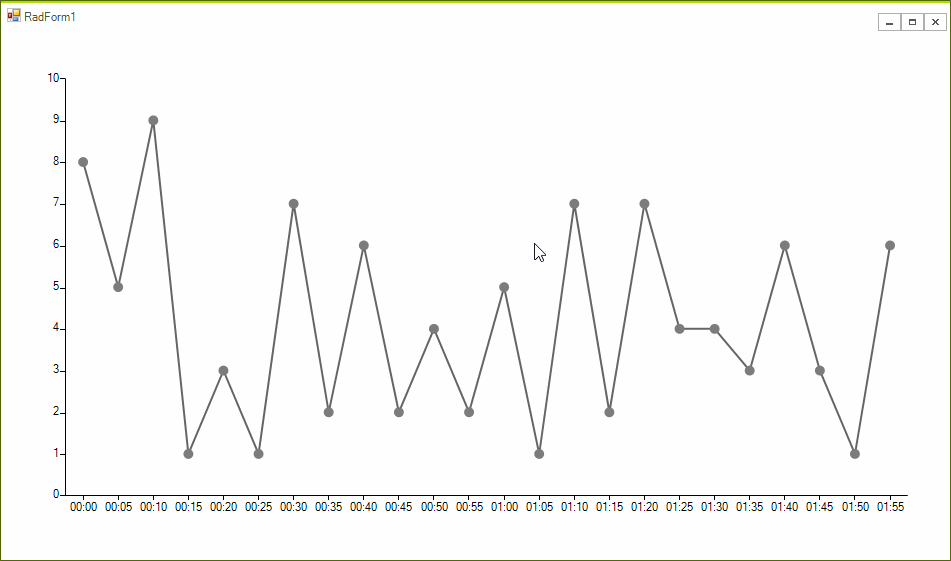

## Environment
<table>
	<tr>
		<td>Product Version</td>
		<td>2019.1.117</td>
	</tr>
	<tr>
		<td>Product</td>
		<td>RadChartView for WinForms</td>
	</tr>
</table>


## Description

An example demonstrating how zooming in the **RadChartView** control can be restricted to a predefined DateTime interval.

## Solution

The example features a **DateTimeContinuousAxis** and suggests a solution how zooming can be restricted to an interval no less than ten minutes. The key in the suggested approach is to handle the **ZoomChanging** event and to cancel it when the time span between the first and last visible point in the view port is about to become less than the predefined interval, in this case - 10 minutes.

>caption Figure 1: Restricting Zoom



>note  A similar approach can be also used with other types of axes.

#### Implementation

````C#
public partial class RadForm1 : Telerik.WinControls.UI.RadForm
{
    public RadForm1()
    {
        InitializeComponent();

        LineSeries lineSeries = new LineSeries();
        lineSeries.PointSize = new SizeF(10, 10);

        DateTime current = new DateTime(2018, 12, 21, 0, 0, 0);

        Random rand = new Random();
        for (int i = 0; i < 24; i++)
        {
            lineSeries.DataPoints.Add(new CategoricalDataPoint(rand.Next(1, 10), current.AddMinutes(i * 5)));
        }

        DateTimeContinuousAxis continuousAxis = new DateTimeContinuousAxis();
        continuousAxis.LabelInterval = 1;
        continuousAxis.MajorStepUnit = TimeInterval.Hour;
        continuousAxis.PlotMode = AxisPlotMode.OnTicksPadded;
        continuousAxis.LabelFormat = "{0:HH:mm}";

        lineSeries.HorizontalAxis = continuousAxis;
        this.radChartView1.Series.Add(lineSeries);

        this.radChartView1.ShowPanZoom = true;

        this.radChartView1.View.ZoomChanging += View_ZoomChanging;
    }

    private void View_ZoomChanging(object sender, ZoomChangingEventArgs e)
    {
        if (e.NewHorizontalScaleFactor < e.OldHorizontalScaleFactor)
        {
            return;
        }

        IChartView view = ((IChartView)this.radChartView1.View);
        foreach (var series in this.radChartView1.Series)
        {
            List<CategoricalDataPoint> visiblePoints = new List<CategoricalDataPoint>();
            foreach (var dp in series.DataPoints)
            {
                CategoricalDataPoint cdp = (CategoricalDataPoint)dp;
                if (this.CheckIfDataPointIsVisible(view, cdp))
                {
                    visiblePoints.Add(cdp);
                }
            }

            if (visiblePoints.Count >= 2)
            {
                TimeSpan span = (DateTime)visiblePoints.Last().Category - (DateTime)visiblePoints[0].Category;
                if (span.TotalMinutes <= 10)
                {
                    e.Cancel = true;
                }
            }
        }
    }

    private bool CheckIfDataPointIsVisible(IChartView view, CategoricalDataPoint cdp)
    {
        bool inXRange = cdp.LayoutSlot.X >= -view.PlotOriginX && cdp.LayoutSlot.X <= -view.PlotOriginX + view.ViewportWidth;
        bool inYRange = cdp.LayoutSlot.Y >= -view.PlotOriginY && cdp.LayoutSlot.Y <= -view.PlotOriginY + view.ViewportHeight;

        return inXRange && inYRange;
    }
}


````
````VB.NET
Public Class RadForm1

    Public Sub New()
        InitializeComponent()

        Dim lineSeries As LineSeries = New LineSeries()
        lineSeries.PointSize = New SizeF(10, 10)
        Dim current As DateTime = New DateTime(2018, 12, 21, 0, 0, 0)
        Dim rand As Random = New Random()

        For i As Integer = 0 To 24 - 1
            lineSeries.DataPoints.Add(New CategoricalDataPoint(rand.[Next](1, 10), current.AddMinutes(i * 5)))
        Next

        Dim continuousAxis As DateTimeContinuousAxis = New DateTimeContinuousAxis()
        continuousAxis.LabelInterval = 1
        continuousAxis.MajorStepUnit = TimeInterval.Hour
        continuousAxis.PlotMode = AxisPlotMode.OnTicksPadded
        continuousAxis.LabelFormat = "{0:HH:mm}"
        lineSeries.HorizontalAxis = continuousAxis
        Me.RadChartView1.Series.Add(lineSeries)
        Me.RadChartView1.ShowPanZoom = True

        AddHandler Me.RadChartView1.View.ZoomChanging, AddressOf View_ZoomChanging
    End Sub

    Private Sub View_ZoomChanging(ByVal sender As Object, ByVal e As ZoomChangingEventArgs)
        If e.NewHorizontalScaleFactor < e.OldHorizontalScaleFactor Then
            Return
        End If

        Dim view As IChartView = (CType(Me.RadChartView1.View, IChartView))

        For Each series In Me.RadChartView1.Series
            Dim visiblePoints As List(Of CategoricalDataPoint) = New List(Of CategoricalDataPoint)()

            For Each dp In series.DataPoints
                Dim cdp As CategoricalDataPoint = CType(dp, CategoricalDataPoint)

                If Me.CheckIfDataPointIsVisible(view, cdp) Then
                    visiblePoints.Add(cdp)
                End If
            Next

            If visiblePoints.Count >= 2 Then
                Dim endDate As DateTime = CType(visiblePoints.Last().Category, DateTime)
                Dim startDate As DateTime = CType(visiblePoints(0).Category, DateTime)
                Dim span As TimeSpan = endDate - startDate

                If span.TotalMinutes <= 10 Then
                    e.Cancel = True
                End If
            End If
        Next
    End Sub

    Private Function CheckIfDataPointIsVisible(ByVal view As IChartView, ByVal cdp As CategoricalDataPoint) As Boolean
        Dim inXRange As Boolean = cdp.LayoutSlot.X >= -view.PlotOriginX AndAlso cdp.LayoutSlot.X <= -view.PlotOriginX + view.ViewportWidth
        Dim inYRange As Boolean = cdp.LayoutSlot.Y >= -view.PlotOriginY AndAlso cdp.LayoutSlot.Y <= -view.PlotOriginY + view.ViewportHeight
        Return inXRange AndAlso inYRange
    End Function

End Class
````

# See Also
* [Masked Edit Box]()