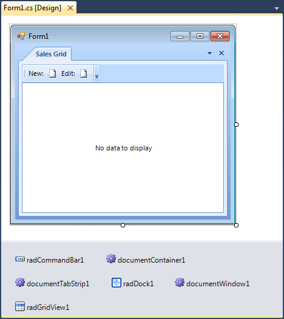

  
|Product Version|Product|Author|Last modified|
|----|----|----|----|
|Q1 2011|RadControls for WinForms|Nikolay Diyanov|May 28, 2011|
   
 
## PROBLEM  
   
After you update to a new version of the Telerik WinForms suite, you start seeing RadControls for WinForms in the component tray and you are not able to select them on the form.  
  
   
## SOLUTION  
   
The design-time capabilities of RadControls for WinForms are implemented in the Telerik.WinControls.UI.Design.dll assembly. If decide to use our installer to install the WinForms suite on your machine, this assembly is automatically installed in your [Global Assemly Cache](http://msdn.microsoft.com/en-us/library/yf1d93sz%28v=vs.71%29.aspx). The same is the situation if you decide to upgrade your Telerik version via our [Visual Studio Extensions](https://docs.telerik.com/devtools/winforms/visual-studio-integration/visual-studio-extensions/overview) - the Telerik.WinControls.UI.Design assembly will be set in your GAC. However, if you decide to upgrade Telerik assembly references manually by downloading the archive file that contains assemblies only, please be aware that these two approaches do not install the Design assembly in your GAC automatically.   
   
So, to resolve this case, you should simply install the Telerik.WinControls.UI.Design.dll assembly manually in your GAC. If you have downloaded the archive file that contains the Telerik WinForms assemblies, you can find this assembly there. If you decide to follow the Upgrade Wizard approach, then you can find the assembly at: *%APPDATA%\Telerik\Updates*  
If this still does not resolve the issue, please make sure that all references to Telerik assemblies point to assemblies having the latest version. As we provide two builds - one for .NET 2.0 and one for .NET 4.0 it is also important to make sure that the referenced assemblies end up by the same number - .20 or .40.

