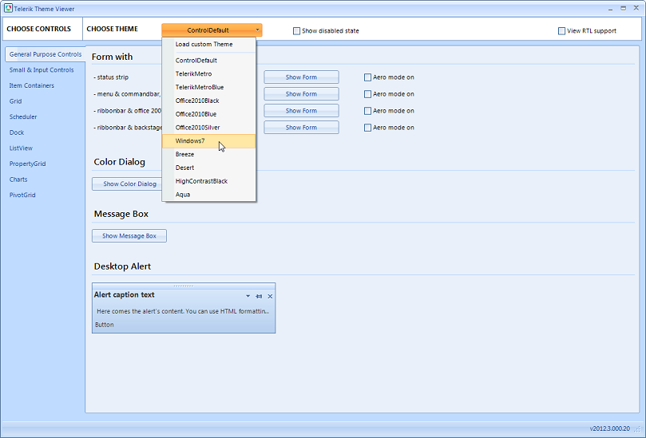
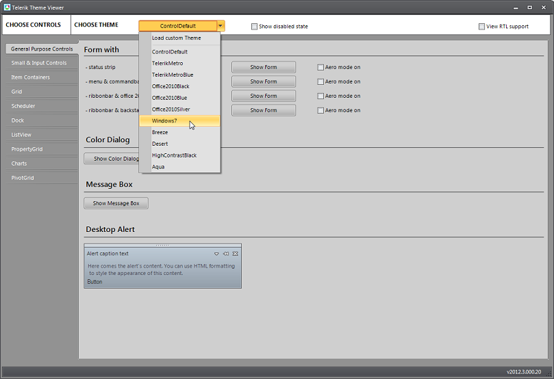

|Date Posted|Product|Author|
|----|----|----|
|Sep 28, 2012|Telerik UI for WinForms|Nikolay Diyanov| 
  
   
## Problem
   
There are two often asked questions regarding the usage of themes in RadControls for WinForms:  
 
- Whether RadControls for WinForms can have absolutely no theme applied and how will they look?
- Whether the ControlDefault theme can be replaced by another theme acting as a default theme and which is the best theme to be applied in terms of performance.

This article aims to answer these two questions.  
   
## Solution  

Let’s start answering the questions in the order they are given:  
   
**Whether RadControls for WinForms can have absolutely no theme applied and how will they look?**  

RadControls for WinForms get the **ControlDefault** theme applied to them by default if no other theme is set. So the question here can be paraphrased to “Can we restrain the ControlDefault theme from being applied to the controls?” The answer is: there is no straightforward way to do that. You can’t restrain the ControlDefault from being applied by the means given by the suite. This can only be achieved by a modification in our Source Code.  
   
Still, the next paragraph will prove that you actually do not need to try to prevent all themes from being applied.  
   
RadControls for WinForms suite uses custom renderers and they do not rely on the renderer that builds the look of the native Microsoft Windows Forms controls. Therefore, when you strip all themes from RadControls for WinForms, you should not expect them to start looking like the standard controls. Instead, when all themes are stripped, RadControls will lose their colors and also the way they are laid out.  
   

Here is how a sample form looks with the ControlDefault theme:  

   
   

And here is how it looks when even the ControlDefault theme is switched off:  
 
 
   
**Whether the ControlDefault theme can be replaced and which is the best theme to be applied in terms of performance?**

Yes, it can. You should set the ControlDefault property of the ThemeRepository class in the static constructor of the form in which you plan to make the theme switch. For example, the following code will skip the process of loading the ControlDefault theme and will directly load the Office2010Black theme as a default theme for all controls at runtime:  
   
````C#
static Form1()
{
    new Telerik.WinControls.Themes.Office2010BlackTheme();
    ThemeRepository.ControlDefault = ThemeRepository.FindTheme("Office2010Black");
}

````
````VB.NET
Shared Sub New()
    Dim TempOffice2010BlackTheme As Telerik.WinControls.Themes.Office2010BlackTheme = New Telerik.WinControls.Themes.Office2010BlackTheme()
    ThemeRepository.ControlDefault = ThemeRepository.FindTheme("Office2010Black")
End Sub

```` 

This code assumes that you have added a reference to *Telerik.WinControls.Themes.Office2010Black*assembly to your project.  
   

Here is how our ThemeViewer will look when the code is applied. Note that the ControlDefault theme will not be loaded at all:  
 
controldefault-theme001.png)   
   

And here is how it looks when even the ControlDefault theme is switched off:  
 
    

As to which is the best theme in terms of performance, all themes are virtually the same. There is no theme that is noticeable quicker or slower than the other ones.


