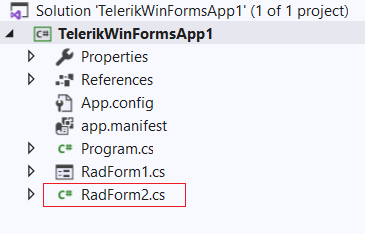

## Environment
 
|Product Version|Product|Author|
|----|----|----|
|2021.3.914|RadForm for WinForms|[Desislava Yordanova](https://www.telerik.com/blogs/author/desislava-yordanova)|
 
## Description

Sometimes, when a **RadForm** is added, it does not show up as a design component in Visual Studio. It just looks like a partial class. It is not possible to select it and open the designer and double clicking on it does not open the form designer:



## Solution 

Usually, the issue is caused by some settings applied to Visual Studio and it may not be reproducible on a fresh installation and then get reproducible when the developer logs in to the Microsoft account and settings synced. 

The problem is that when a new form is added the **SubType** is not set as Form, so the designer does not recognize it as such. The solution is to manually edit the *.vbproj/*.csproj file and add **<SubType>Form</SubType>** to the Form and Designer files. For example: 

```XML
    <Compile Include="RadForm1.vb">
      <SubType>Form</SubType>
    </Compile>
    <Compile Include="RadForm1.Designer.vb">
      <DependentUpon>RadForm1.vb</DependentUpon>
      <SubType>Form</SubType>
    </Compile>
    <Compile Include="RadForm2.Designer.vb">
      <DependentUpon>RadForm2.vb</DependentUpon>
    </Compile>
    <Compile Include="RadForm2.vb" />
    <EmbeddedResource Include="RadForm1.resx">
      <DependentUpon>RadForm1.vb</DependentUpon>
    </EmbeddedResource>
```

In the case above RadForm2 and RadForm2.Designer files should get the Forms **SubType** like their RadForm1 counterparts.
 


    
   
  
    
 
