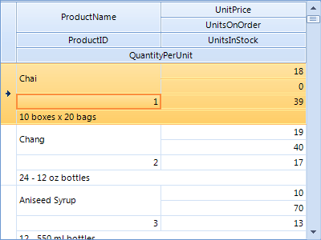
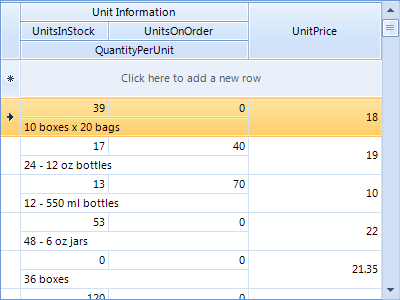
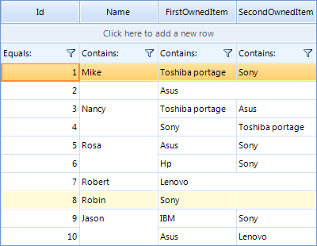

|Date Posted|Product|Author|
|----|----|----|
|June 24, 2014|RadGridView|[Dimitar Karamfilov](https://www.telerik.com/blogs/author/dimitar-karamfilov)| 
 
## Problem
  
A common question regarding **RadGridView** is whether it supports merging cells. This article aims to answer this question in detail.  
  
## Solution

There are three ways to merge cells in **RadGridView**:  

1\. Use [HtmlView](https://docs.telerik.com/devtools/winforms/gridview/view-definitions/html-view)definition – merging will be applied to both data cells and header cells.  

2\. Use [ColumnGroupView](https://docs.telerik.com/devtools/winforms/gridview/view-definitions/column-groups-view) definition – merging will be applied like in the html view. Also you can visually separate your data by adding custom groups.  

3\. Use the styling capabilities of the grid to hide the borders between the cells in order to visually display the cells as merged.  

Now, let's have a closer look at each approach:
       
1\. The **HtmlView** ** definition** gives you the opportunity to merge the cells like in html tables. You can just set the **Colspan** and **RowSpan** properties. For example, you can create a simple view as follows:  

````C#
HtmlViewDefinition view = new HtmlViewDefinition();
 
view.RowTemplate.Rows.Add(new RowDefinition());
view.RowTemplate.Rows.Add(new RowDefinition());
view.RowTemplate.Rows.Add(new RowDefinition());
view.RowTemplate.Rows.Add(new RowDefinition());
 
view.RowTemplate.Rows[0].Cells.Add(new CellDefinition("ProductName"));
view.RowTemplate.Rows[2].Cells.Add(new CellDefinition("ProductID"));
 
view.RowTemplate.Rows[0].Cells.Add(new CellDefinition("UnitPrice"));
view.RowTemplate.Rows[1].Cells.Add(new CellDefinition("UnitsOnOrder"));
view.RowTemplate.Rows[2].Cells.Add(new CellDefinition("UnitsInStock"));
 
view.RowTemplate.Rows[3].Cells.Add(new CellDefinition("QuantityPerUnit"));
 
view.RowTemplate.Rows[0].Cells[0].RowSpan = 2;
view.RowTemplate.Rows[3].Cells[0].ColSpan = 2;
 
this.radGridView1.ViewDefinition = view;

````
````VB.NET
Dim view As New HtmlViewDefinition()
 
view.RowTemplate.Rows.Add(New RowDefinition())
view.RowTemplate.Rows.Add(New RowDefinition())
view.RowTemplate.Rows.Add(New RowDefinition())
view.RowTemplate.Rows.Add(New RowDefinition())
 
view.RowTemplate.Rows(0).Cells.Add(New CellDefinition("ProductName"))
view.RowTemplate.Rows(2).Cells.Add(New CellDefinition("ProductID"))
 
view.RowTemplate.Rows(0).Cells.Add(New CellDefinition("UnitPrice"))
view.RowTemplate.Rows(1).Cells.Add(New CellDefinition("UnitsOnOrder"))
view.RowTemplate.Rows(2).Cells.Add(New CellDefinition("UnitsInStock"))
view.RowTemplate.Rows(3).Cells.Add(New CellDefinition("QuantityPerUnit"))
 
view.RowTemplate.Rows(0).Cells(0).RowSpan = 2
view.RowTemplate.Rows(3).Cells(0).ColSpan = 2
 
Me.radGridView1.ViewDefinition = view

````

  
  

2. The **ColumnGroupView definition** allows you to group the columns in the grid header. This is achieved by creating groups and adding rows to them:  
 
````C#
ColumnGroupsViewDefinition view = new ColumnGroupsViewDefinition();
view.ColumnGroups.Add(new GridViewColumnGroup("Unit Information"));
 
view.ColumnGroups[0].Rows.Add(new GridViewColumnGroupRow());
view.ColumnGroups[0].Rows[0].Columns.Add(this.radGridView1.Columns["UnitsInStock"]);
view.ColumnGroups[0].Rows[0].Columns.Add(this.radGridView1.Columns["UnitsOnOrder"]);
view.ColumnGroups[0].Rows.Add(new GridViewColumnGroupRow());
view.ColumnGroups[0].Rows[1].Columns.Add(this.radGridView1.Columns["QuantityPerUnit"]);
 
view.ColumnGroups.Add(new GridViewColumnGroup("Price"));
view.ColumnGroups[1].Rows.Add(new GridViewColumnGroupRow());
view.ColumnGroups[1].Rows[0].Columns.Add(this.radGridView1.Columns["UnitPrice"]);
view.ColumnGroups[1].ShowHeader = false;
 
radGridView1.ViewDefinition = view;

````
````VB.NET
Dim view As New ColumnGroupsViewDefinition()
view.ColumnGroups.Add(New GridViewColumnGroup("Unit Information"))
 
view.ColumnGroups(0).Rows.Add(New GridViewColumnGroupRow())
view.ColumnGroups(0).Rows(0).Columns.Add(Me.radGridView1.Columns("UnitsInStock"))
view.ColumnGroups(0).Rows(0).Columns.Add(Me.radGridView1.Columns("UnitsOnOrder"))
view.ColumnGroups(0).Rows.Add(New GridViewColumnGroupRow())
view.ColumnGroups(0).Rows(1).Columns.Add(Me.radGridView1.Columns("QuantityPerUnit"))
 
view.ColumnGroups.Add(New GridViewColumnGroup("Price"))
view.ColumnGroups(1).Rows.Add(New GridViewColumnGroupRow())
view.ColumnGroups(1).Rows(0).Columns.Add(Me.radGridView1.Columns("UnitPrice"))
view.ColumnGroups(1).ShowHeader = False
 
radGridView1.ViewDefinition = view

````
  
    
  

3. You can implement custom solution which will visually merge the cells with equal values. First, you can create a methods that iterates through the grid cells and compares their values (one for vertical and one for horizontal merging). Also, in this methods you can hide the text and set the border for the cells.   

````C#
private void MergeHorizontally(RadGridView radGridView, int startColumnIndex, int endColumnIndex)
{
    foreach (GridViewRowInfo item in radGridView.Rows)
    {
        for (int i = startColumnIndex; i < endColumnIndex; i++)
        {
            GridViewCellInfo firstCell = item.Cells[i];
            GridViewCellInfo secondCell = item.Cells[i + 1];
             
            string firstCellText = (firstCell != null && firstCell.Value != null ? firstCell.Value.ToString() : string.Empty);
            string secondCellText = (secondCell != null && secondCell.Value != null ? secondCell.Value.ToString() : string.Empt
 
            setCellBorders(firstCell, Color.FromArgb(209, 225, 245));
            setCellBorders(secondCell, Color.FromArgb(209, 225, 245));
             
            if (firstCellText == secondCellText)
            {
                firstCell.Style.BorderRightColor = Color.Transparent;
                secondCell.Style.BorderLeftColor = Color.Transparent;
                secondCell.Style.ForeColor = Color.Transparent;
            }
            else
            {
                secondCell.Style.ForeColor = Color.Black;
            }
        }
    }
}
 
private void MergeVertically(RadGridView radGridView, int[] columnIndexes)
{
    GridViewRowInfo Prev = null;
    foreach (GridViewRowInfo item in radGridView.Rows)
    {
        if (Prev != null)
        {
            string firstCellText = string.Empty;
            string secondCellText = string.Empty;
 
            foreach (int i in columnIndexes)
            {
                GridViewCellInfo firstCell = Prev.Cells[i];
                GridViewCellInfo secondCell = item.Cells[i];
 
                firstCellText = (firstCell != null && firstCell.Value != null ? firstCell.Value.ToString() : string.Empty);
                secondCellText = (secondCell != null && secondCell.Value != null ? secondCell.Value.ToString() : string.Empty);
 
                setCellBorders(firstCell, Color.FromArgb(209, 225, 245));
                setCellBorders(secondCell, Color.FromArgb(209, 225, 245));
 
                if (firstCellText == secondCellText)
                {
                    firstCell.Style.BorderBottomColor = Color.Transparent;
                    secondCell.Style.BorderTopColor = Color.Transparent;
                    secondCell.Style.ForeColor = Color.Transparent;
                }
                else
                {
                    secondCell.Style.ForeColor = Color.Black;
                    Prev = item;
                    break;
                }
            }
        }
        else
        {
            Prev = item;
        }
    }
}

````
````VB.NET
Private Sub MergeHorizontally(radGridView As RadGridView, startColumnIndex As Integer, endColumnIndex As Integer)
    For Each item As GridViewRowInfo In radGridView.Rows
        For i As Integer = startColumnIndex To endColumnIndex - 1
            Dim firstCell As GridViewCellInfo = item.Cells(i)
            Dim secondCell As GridViewCellInfo = item.Cells(i + 1)
 
            Dim firstCellText As String = (If(firstCell IsNot Nothing AndAlso firstCell.Value IsNot Nothing, firstCell.Value.ToString(), String.Em
            Dim secondCellText As String = (If(secondCell IsNot Nothing AndAlso secondCell.Value IsNot Nothing, secondCell.Value.ToString(), Strin
 
            setCellBorders(firstCell, Color.FromArgb(209, 225, 245))
            setCellBorders(secondCell, Color.FromArgb(209, 225, 245))
 
            If firstCellText = secondCellText Then
                firstCell.Style.BorderRightColor = Color.Transparent
                secondCell.Style.BorderLeftColor = Color.Transparent
                secondCell.Style.ForeColor = Color.Transparent
            Else
                secondCell.Style.ForeColor = Color.Black
            End If
        Next
    Next
End Sub
 
Private Sub MergeVertically(radGridView As RadGridView, columnIndexes As Integer())
    Dim Prev As GridViewRowInfo = Nothing
    For Each item As GridViewRowInfo In radGridView.Rows
        If Prev IsNot Nothing Then
            Dim firstCellText As String = String.Empty
            Dim secondCellText As String = String.Empty
 
            For Each i As Integer In columnIndexes
                Dim firstCell As GridViewCellInfo = Prev.Cells(i)
                Dim secondCell As GridViewCellInfo = item.Cells(i)
 
                firstCellText = (If(firstCell IsNot Nothing AndAlso firstCell.Value IsNot Nothing, firstCell.Value.ToString(), String.Empty))
                secondCellText = (If(secondCell IsNot Nothing AndAlso secondCell.Value IsNot Nothing, secondCell.Value.ToString(), String.Empty))
 
                setCellBorders(firstCell, Color.FromArgb(209, 225, 245))
                setCellBorders(secondCell, Color.FromArgb(209, 225, 245))
 
                 
 
                If firstCellText = secondCellText Then
                    firstCell.Style.BorderBottomColor = Color.Transparent
                    secondCell.Style.BorderTopColor = Color.Transparent
                    secondCell.Style.ForeColor = Color.Transparent
                Else
                    secondCell.Style.ForeColor = Color.Black
                    Prev = item
                    Exit For
                End If
            Next
        Else
            Prev = item
        End If
    Next
End Sub

```` 
Also we can add a support for printing. And this can be achieved by painting a white lines on top of the borders and white space in the cells that have duplicate values.

````C#
void radGridView1_PrintCellPaint(object sender, PrintCellPaintEventArgs e)
{
    if (e.Row.Index >= 0)
    {
        GridViewCellInfo cell = this.radGridView1.Rows[e.Row.Index].Cells[e.Column.Index];
 
        if (cell.Style.BorderTopColor == Color.Transparent)
        {
            e.Graphics.DrawLine(
                Pens.White, new Point(e.CellRect.Left + 1, e.CellRect.Top),
                new Point(e.CellRect.Right - 1, e.CellRect.Top));
        }
        if (cell.Style.BorderLeftColor == Color.Transparent)
        {
            e.Graphics.DrawLine(
                Pens.White, new Point(e.CellRect.Left, e.CellRect.Top),
                new Point(e.CellRect.Left - 1, e.CellRect.Bottom));
        }
        if (cell.Style.ForeColor == Color.Transparent)
        {
            Rectangle r = new Rectangle(e.CellRect.X + 1,e.CellRect.Y + 1,e.CellRect.Width - 2,e.CellRect.Height - 2);
            e.Graphics.FillRectangle(Brushes.White, r);
        }
    }
}

````
````VB.NET
Private Sub radGridView1_PrintCellPaint(sender As Object, e As PrintCellPaintEventArgs)
    If e.Row.Index >= 0 Then
        Dim cell As GridViewCellInfo = Me.radGridView1.Rows(e.Row.Index).Cells(e.Column.Index)
 
        If cell.Style.BorderTopColor = Color.Transparent Then
            e.Graphics.DrawLine(Pens.White, New Point(e.CellRect.Left + 1, e.CellRect.Top), New Point(e.CellRect.Right - 1, e.CellRect.Top))
        End If
        If cell.Style.BorderLeftColor = Color.Transparent Then
            e.Graphics.DrawLine(Pens.White, New Point(e.CellRect.Left, e.CellRect.Top), New Point(e.CellRect.Left - 1, e.CellRect.Bottom))
        End If
        If cell.Style.ForeColor = Color.Transparent Then
            Dim r As New Rectangle(e.CellRect.X + 1, e.CellRect.Y + 1, e.CellRect.Width - 2, e.CellRect.Height - 2)
            e.Graphics.FillRectangle(Brushes.White, r)
        End If
    End If
End Sub

````

    

Please note that this approach has few limitations. For example, the cell editing functionality will remain as in a usual grid (you cannot edit the value for all cells at one place). The selection behavior will also remain the same. And the layout should be manually updated after any change made by the user.

>note A complete solution in C# and VB.NET can be found [here](https://github.com/telerik/winforms-sdk/tree/master/GridView/GridViewMergeCells).