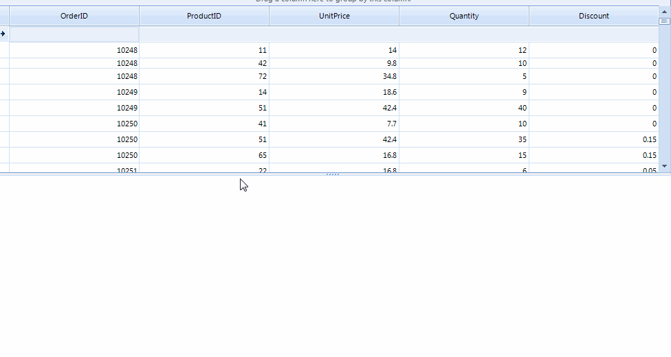

|Date Posted|Product|Author|
|----|----|----|
|January 07, 2015|Telerik UI for WinForms|[Desislava Yordanova](https://www.telerik.com/blogs/author/desislava-yordanova)| 

## Problem
 
This article demonstrates how to implement integration between **RadGridView** and **RadChartView**.

 
 
## Solution
 
1\. First, let's populate the **RadGridView** with data. For this purpose, we will [*bind*](https://docs.telerik.com/devtools/winforms/gridview/populating-with-data/tutorial-binding-to-datatable-or-dataset) it to the NorthWind.**OrderDetails** table.

2\. You should enable multiple selection in **RadGridView** by setting its **MultiSelect** property to *true*. Additionally, you need to change the **SelectionMode** property to *CellSelect*. Thus, you will be able to select specific grid cells and populate the **RadChartView** with the respective data.
        
````C#
this.radGridView1.MultiSelect = true;
this.radGridView1.SelectionMode = Telerik.WinControls.UI.GridViewSelectionMode.CellSelect;

````
````VB.NET
Me.RadGridView1.MultiSelect = True
Me.RadGridView1.SelectionMode = Telerik.WinControls.UI.GridViewSelectionMode.CellSelect

````

3\. Subscribe to the RadGridView.**SelectionChanged** event and generate a **BarSeries** for each distinct column that participates in the grid’s selection. Afterwards, add the cell value as a **CategoricalDataPoint **to the series:
    
````C#
private void radGridView1_SelectionChanged(object sender, EventArgs e)
{
    if (this.radGridView1.SelectedCells.Count > 0)
    {
        PopulateChart(this.radGridView1.SelectedCells);
    }
}
 
private void PopulateChart(GridViewSelectedCellsCollection gridViewSelectedCellsCollection)
{
    List<string> orderIds = new List<string>();
    this.radChartView1.Series.Clear();
    this.radChartView1.Axes.Clear();
    this.radChartView1.ShowLegend = true;
 
    foreach (GridViewCellInfo cell in gridViewSelectedCellsCollection)
    {
        double cellValue;
        if (double.TryParse(cell.Value + "", out cellValue))
        {
            BarSeries barSeries;
            DataRowView rowView = cell.RowInfo.DataBoundItem as DataRowView;
            if (!orderIds.Contains(rowView.Row["OrderID"].ToString()))
            {
                orderIds.Add(rowView.Row["OrderID"].ToString());
                barSeries = new BarSeries();
                barSeries.Name = rowView.Row["OrderID"].ToString();
                barSeries.LegendTitle = barSeries.Name;
              
                this.radChartView1.Series.Add(barSeries);
            }
            else
            {
                barSeries = GetBarSeries(rowView.Row["OrderID"].ToString()) as BarSeries ;
            }
            barSeries.DataPoints.Add(new CategoricalDataPoint(cellValue, cell.ColumnInfo.Name));
        }
    }
 
    this.radChartView1.Invalidate();
}
 
private ChartSeries GetBarSeries(string p)
{
    foreach (ChartSeries s in this.radChartView1.Series)
    {
        if (s.Name == p)
        {
            return s;
        }
    }
 
    return null;
}

````
````VB.NET
Private Sub radGridView1_SelectionChanged(sender As Object, e As EventArgs)
    If Me.RadGridView1.SelectedCells.Count > 0 Then
        PopulateChart(Me.RadGridView1.SelectedCells)
    End If
End Sub
 
Private Sub PopulateChart(gridViewSelectedCellsCollection As GridViewSelectedCellsCollection)
    Dim orderIds As New List(Of String)()
    Me.RadChartView1.Series.Clear()
    Me.RadChartView1.Axes.Clear()
    Me.RadChartView1.ShowLegend = True
 
    For Each cell As GridViewCellInfo In gridViewSelectedCellsCollection
        Dim cellValue As Double
        If Double.TryParse(cell.Value & "", cellValue) Then
            Dim barSeries As BarSeries
            Dim rowView As DataRowView = TryCast(cell.RowInfo.DataBoundItem, DataRowView)
            If Not orderIds.Contains(rowView.Row("OrderID").ToString()) Then
                orderIds.Add(rowView.Row("OrderID").ToString())
                barSeries = New BarSeries()
                barSeries.Name = rowView.Row("OrderID").ToString()
                barSeries.LegendTitle = barSeries.Name
 
                Me.RadChartView1.Series.Add(barSeries)
            Else
                barSeries = TryCast(GetBarSeries(rowView.Row("OrderID").ToString()), BarSeries)
            End If
            barSeries.DataPoints.Add(New CategoricalDataPoint(cellValue, cell.ColumnInfo.Name))
        End If
    Next
 
    Me.RadChartView1.Invalidate()
End Sub
 
Private Function GetBarSeries(p As String) As ChartSeries
    For Each s As ChartSeries In Me.RadChartView1.Series
        If s.Name = p Then
            Return s
        End If
    Next
 
    Return Nothing
End Function

````

>note A complete solution in C# and VB.NET can be found [here](https://github.com/telerik/winforms-sdk/tree/master/ChartView/GridChartIntegration).