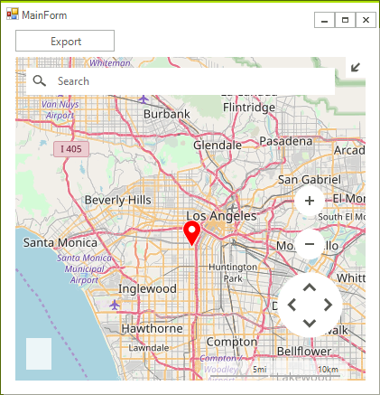
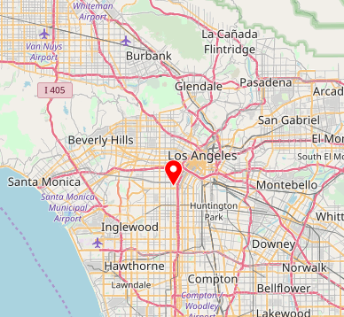

## Environment
<table>
	<tr>
		<td>Product Version</td>
		<td>2018.1 220</td>
	</tr>
	<tr>
		<td>Product</td>
		<td>RadMap for WinForms</td>
	</tr>
</table>


## Description

An article demonstrating how the currently visible part of map control can be exported to an image. The suggested approach will also handle a case painting the layers, making it possible for any pins to be exported as well.

## Solution

**RadMap** will be exported with the help of the **Graphics** and **RadGdiGraphics** classes.

>caption Figure 1: Exporting RadMap

|Control|Exported Image|
|----|----|
|||

The control will be set up with the **OpenStreetMapProvider** including a layer with pins.

#### Initial Setup

{{source=..\SamplesCS\KnowledgeBase\RadMapExportImageForm.cs region=InitialSetup}} 
{{source=..\SamplesVB\KnowledgeBase\RadMapExportImageForm.vb region=InitialSetup}}
````C#
public RadMapExportImageForm()
{
    InitializeComponent();
    MapLayer pinLayer = new MapLayer("PinsLayer");
    this.radMap1.Layers.Add(pinLayer);
    OpenStreetMapProvider osmProvider = new OpenStreetMapProvider();
    osmProvider.InitializationComplete += OsmProvider_InitializationComplete;
    this.radMap1.MapElement.Providers.Add(osmProvider);
}
private void OsmProvider_InitializationComplete(object sender, EventArgs e)
{
    MapPin element = new MapPin(new PointG(34.0140562, -118.2880489));
    element.Text = "Los Angeles";
    element.BackColor = Color.Red;
    this.radMap1.Layers["PinsLayer"].Add(element);
    this.radMap1.BringIntoView(element.Location, 10);
}

````
````VB.NET
Sub New()
    InitializeComponent()
    Dim pinLayer As MapLayer = New MapLayer("PinsLayer")
    Me.RadMap1.Layers.Add(pinLayer)
    Dim osmProvider As OpenStreetMapProvider = New OpenStreetMapProvider()
    AddHandler osmProvider.InitializationComplete, AddressOf OsmProvider_InitializationComplete
    Me.RadMap1.MapElement.Providers.Add(osmProvider)
End Sub
Private Sub OsmProvider_InitializationComplete(sender As Object, e As EventArgs)
    Dim element As MapPin = New MapPin(New PointG(34.0140562, -118.2880489))
    element.Text = "Los Angeles"
    element.BackColor = Color.Red
    Me.RadMap1.Layers("PinsLayer").Add(element)
    Me.RadMap1.BringIntoView(element.Location, 10)
End Sub

````


{{endregion}}

#### Actual Export Implementation

{{source=..\SamplesCS\KnowledgeBase\RadMapExportImageForm.cs region=ExportToImage}} 
{{source=..\SamplesVB\KnowledgeBase\RadMapExportImageForm.vb region=ExportToImage}}
````C#
private void radButton1_Click(object sender, EventArgs e)
{
    Bitmap bitmap = new Bitmap((int)this.radMap1.MapElement.ViewportInPixels.Size.Width, (int)this.radMap1.MapElement.ViewportInPixels.Height);
    Graphics g = Graphics.FromImage(bitmap);
    RadGdiGraphics gg = new RadGdiGraphics(g);
    foreach (MapVisualElement element in this.radMap1.MapElement.Providers[0].GetContent(this.radMap1.MapElement))
    {
        element.Paint(gg, this.radMap1.MapElement);
    }
    object state = gg.SaveState();

	//As of R2 2021 calling TranslateTransform is not necessary
    //gg.TranslateTransform(-this.radMap1.MapElement.ViewportInPixels.X, -this.radMap1.MapElement.ViewportInPixels.Y);

    this.radMap1.MapElement.Layers["PinsLayer"].Paint(gg, this.radMap1.MapElement);
    gg.RestoreState(state);
    bitmap.Save(@"..\..\test.png", ImageFormat.Png);
}
    }

````
````VB.NET
Private Sub RadButton1_Click(sender As Object, e As EventArgs) Handles RadButton1.Click
    Dim bitmap As Bitmap = New Bitmap(CInt(Me.RadMap1.MapElement.ViewportInPixels.Size.Width), CInt(Me.RadMap1.MapElement.ViewportInPixels.Height))
    Dim g As Graphics = Graphics.FromImage(bitmap)
    Dim gg As RadGdiGraphics = New RadGdiGraphics(g)
    For Each element As MapVisualElement In Me.RadMap1.MapElement.Providers(0).GetContent(Me.RadMap1.MapElement)
        element.Paint(gg, Me.RadMap1.MapElement)
    Next
    Dim state As Object = gg.SaveState()
	
	'As of R2 2021 calling TranslateTransform is not necessary
    'gg.TranslateTransform(-Me.RadMap1.MapElement.ViewportInPixels.X, -Me.RadMap1.MapElement.ViewportInPixels.Y)
    Me.RadMap1.MapElement.Layers("PinsLayer").Paint(gg, Me.RadMap1.MapElement)
    gg.RestoreState(state)
    bitmap.Save("..\..\test.png", ImageFormat.Png)
End Sub

````


{{endregion}}

>important As of **R2 2021** calling the **TranslateTransform** method for the **RadGdiGraphics** object is not necessary. For older versions, please make sure that the method is executed.


>tip A complete solution providing a C# and VB.NET project is available [here](https://github.com/telerik/winforms-sdk/tree/master/Map/RadMapToAnImage).  
