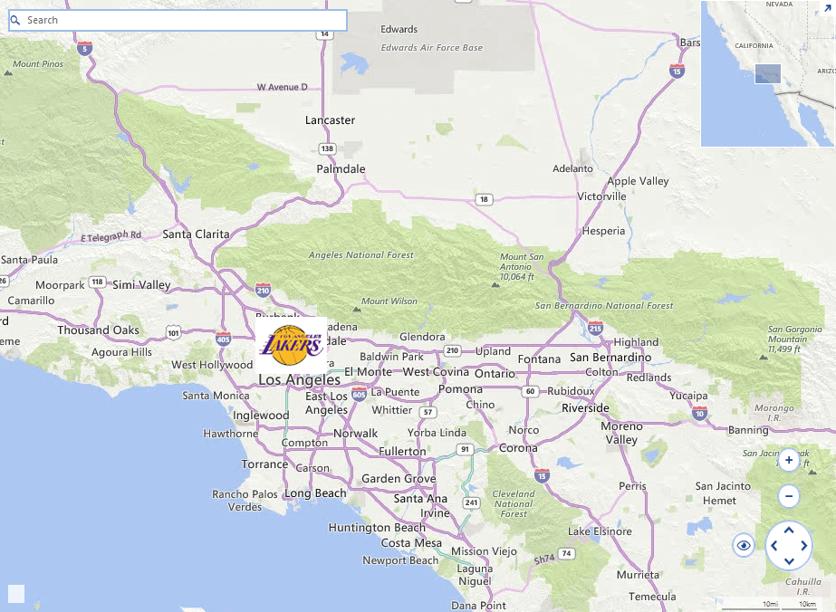

## Environment
<table>
	<tr>
		<td>Product Version</td>
		<td>2018.1 220</td>
	</tr>
	<tr>
		<td>Product</td>
		<td>RadMap for WinForms</td>
	</tr>
</table>


## Description

**RadMap** supports pins and they can be added to it so that additional information be displayed in a friendly manner. The default implementation relies on the System.Drawing.Graphics and System.Drawing.GraphicsPath classes and at the end the pins are painted as shapes according to calculated paths. Currently, the **MapPin** object does not support images and this article will suggest a possible implementation.

## Solution

The image below demonstrates the end result utilizing the custom pin.

>caption Figure 1: Pin with an Image


The **MapPin** object will be extended with a new Image property. The actual rendering of the image will happen in the virtual Paint method, preserving the default implementation if no image is specified for a particular pin.

1\. Inherit the **MapPin** class and add a new Image property to it.
* Override the **Paint** method and use the Graphics.DrawImage method.
* Override the **ViewPortChanged** and **HitTest** methods so that the pin`s location is validated. This way we will ensure that the pin is inside the visible portion of the map when the image will be painted.

#### Custom Pin Implementation

{{source=..\SamplesCS\KnowledgeBase\RadMapCustomPin.cs region=CustomMapPin}} 
{{source=..\SamplesVB\KnowledgeBase\RadMapCustomPin.vb region=CustomMapPin}}
````C#
public class CustomMapPin : MapPin
{
    private Image image;
    private PointL pixelLocation;
    private RectangleL drawRect;
    private bool isImageInViewPort;
    public CustomMapPin(PointG location)
        : base(location)
    {
    }
    public Image Image
    {
        get
        {
            return image;
        }
        set
        {
            this.image = value;
        }
    }
    public override bool IsInViewport
    {
        get { return this.Image != null ? this.isImageInViewPort : base.IsInViewport; }
    }
    public override void Paint(IGraphics graphics, IMapViewport viewport)
    {
        if (this.Image == null)
        {
            base.Paint(graphics, viewport);
            return;
        }
        object state = graphics.SaveState();
        graphics.TranslateTransform(drawRect.X, drawRect.Y);
        Graphics g = graphics.UnderlayGraphics as Graphics;
        long mapSize = MapTileSystemHelper.MapSize(viewport.ZoomLevel);
        for (int i = -1; i <= viewport.NumberOfWraparounds; i++)
        {
            g.DrawImage(this.Image, new RectangleF(i * mapSize, 0, this.Image.Size.Width, this.Image.Size.Height));
        }
        graphics.RestoreState(state);
    }
    public override void ViewportChanged(IMapViewport viewport, ViewportChangeAction action)
    {
        if (this.Image == null)
        {
            base.ViewportChanged(viewport, action);
            return;
        }
        long mapSize = MapTileSystemHelper.MapSize(viewport.ZoomLevel);
        if ((action & ViewportChangeAction.Zoom) != 0)
        {
            this.pixelLocation = MapTileSystemHelper.LatLongToPixelXY(this.Location, viewport.ZoomLevel);
        }
        if ((action & ViewportChangeAction.Pan) != 0)
        {
            this.drawRect = new RectangleL(pixelLocation.X - this.Image.Size.Width / 2, pixelLocation.Y - this.Image.Size.Height, this.Image.Size.Width, this.Image.Size.Height);
        }
        RectangleL wraparoundDrawRect = this.drawRect;
        for (int i = 0; i <= viewport.NumberOfWraparounds; i++)
        {
            if (wraparoundDrawRect.IntersectsWith(viewport.ViewportInPixels))
            {
                this.isImageInViewPort = true;
                break;
            }
            wraparoundDrawRect.Offset(mapSize, 0L);
        }
        if (!this.IsInViewport)
        {
            return;
        }
    }
    public override bool HitTest(PointG pointG, PointL pointL, IMapViewport viewport)
    {
        if (this.Image == null)
        {
            return base.HitTest(pointG, pointL, viewport);
        }
        return this.drawRect.Contains(pointL);
    }
}

````
````VB.NET
Public Class CustomMapPin
    Inherits MapPin
    Private _image As Image
    Private pixelLocation As PointL
    Private drawRect As RectangleL
    Private isImageInViewPort As Boolean
    Public Sub New(ByVal location As PointG)
        MyBase.New(location)
    End Sub
    Public Property Image As Image
        Get
            Return _image
        End Get
        Set(ByVal value As Image)
            Me._image = value
        End Set
    End Property
    Public Overrides ReadOnly Property IsInViewport As Boolean
        Get
            Return If(Me.Image IsNot Nothing, Me.isImageInViewPort, MyBase.IsInViewport)
        End Get
    End Property
    Public Overrides Sub Paint(ByVal graphics As IGraphics, ByVal viewport As IMapViewport)
        If Me.Image Is Nothing Then
            MyBase.Paint(graphics, viewport)
            Return
        End If
        Dim state As Object = graphics.SaveState()
        graphics.TranslateTransform(drawRect.X, drawRect.Y)
        Dim g As Graphics = TryCast(graphics.UnderlayGraphics, Graphics)
        Dim mapSize As Long = MapTileSystemHelper.MapSize(viewport.ZoomLevel)
        For i As Integer = -1 To viewport.NumberOfWraparounds
            g.DrawImage(Me.Image, New RectangleF(i * mapSize, 0, Me.Image.Size.Width, Me.Image.Size.Height))
        Next
        graphics.RestoreState(state)
    End Sub
    Public Overrides Sub ViewportChanged(ByVal viewport As IMapViewport, ByVal action As ViewportChangeAction)
        If Me.Image Is Nothing Then
            MyBase.ViewportChanged(viewport, action)
            Return
        End If
        Dim mapSize As Long = MapTileSystemHelper.MapSize(viewport.ZoomLevel)
        If (action And ViewportChangeAction.Zoom) <> 0 Then
            Me.pixelLocation = MapTileSystemHelper.LatLongToPixelXY(Me.Location, viewport.ZoomLevel)
        End If
        If (action And ViewportChangeAction.Pan) <> 0 Then
            Me.drawRect = New RectangleL(pixelLocation.X - Me.Image.Size.Width / 2, pixelLocation.Y - Me.Image.Size.Height, Me.Image.Size.Width, Me.Image.Size.Height)
        End If
        Dim wraparoundDrawRect As RectangleL = Me.drawRect
        For i As Integer = 0 To viewport.NumberOfWraparounds
            If wraparoundDrawRect.IntersectsWith(viewport.ViewportInPixels) Then
                Me.isImageInViewPort = True
                Exit For
            End If
            wraparoundDrawRect.Offset(mapSize, 0L)
        Next
        If Not Me.IsInViewport Then
            Return
        End If
    End Sub
    Public Overrides Function HitTest(ByVal pointG As PointG, ByVal pointL As PointL, ByVal viewport As IMapViewport) As Boolean
        If Me.Image Is Nothing Then
            Return MyBase.HitTest(pointG, pointL, viewport)
        End If
        Return Me.drawRect.Contains(pointL)
    End Function
End Class

````


{{endregion}} 

2\. Instatiate the custom pin object and add it to the map.

#### Use the Custom Pin

{{source=..\SamplesCS\KnowledgeBase\RadMapCustomPin.cs region=InitialSetup}}
{{source=..\SamplesVB\KnowledgeBase\RadMapCustomPin.vb region=InitialSetup}}
````C#
public RadMapCustomPin()
{
    InitializeComponent();
    this.SetupProviders();
    MapLayer pointLayer = new MapLayer("PointG");
    this.radMap1.Layers.Add(pointLayer);
    MapPin element = new CustomMapPin(new PointG(34.04302, -118.26725))
    {
        Image = Properties.Resources.NBALakers
    };
    element.Text = "Los Angeles";
    element.BackColor = Color.Red;
    this.radMap1.Layers["PointG"].Add(element);
}
private void SetupProviders()
{
    BingRestMapProvider bingProvider = new BingRestMapProvider();
    bingProvider.Culture = System.Threading.Thread.CurrentThread.CurrentCulture;
    bingProvider.ImagerySet = ImagerySet.Road;
    bingProvider.UseSession = true;
    bingProvider.BingKey = this.bingKey;
    this.radMap1.MapElement.Providers.Add(bingProvider);
}

````
````VB.NET
Public Sub New()
    InitializeComponent()
    Me.SetupProviders()
    Dim pointLayer As MapLayer = New MapLayer("PointG")
    Me.radMap1.Layers.Add(pointLayer)
    Dim element As MapPin = New CustomMapPin(New PointG(34.04302, -118.26725)) With {.Image = My.Resources.NBALakers}
    element.Text = "Los Angeles"
    element.BackColor = Color.Red
    Me.radMap1.Layers("PointG").Add(element)
End Sub
Private Sub SetupProviders()
    Dim bingProvider As BingRestMapProvider = New BingRestMapProvider()
    bingProvider.Culture = System.Threading.Thread.CurrentThread.CurrentCulture
    bingProvider.ImagerySet = ImagerySet.Road
    bingProvider.UseSession = True
    bingProvider.BingKey = Me.bingKey
    Me.radMap1.MapElement.Providers.Add(bingProvider)
End Sub
Class

````


{{endregion}}

>note A complete solution providing a C# and VB.NET project is available [here](https://github.com/telerik/winforms-sdk/tree/master/Map/RadMapCustomPins).  

# See Also
* [Drawing Markers and Regions]()