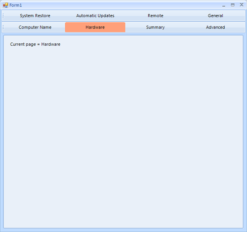
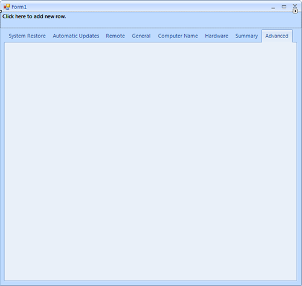

|Product Version|Product|Author|Last modified|
|----|----|----|----|
|Q2 2015|RadPageView for WinForms|Dimitar Karamfilov|15/1/2014|
 

 
 
## PROBLEM  
   
This article will show how **RadCommandBar** can be used with combination with **RadPageView** to achieve multiline strips (pages), which will make the navigation easy when the page view has more pages. Also this will allow the user to benefit from both controls features and navigate between pages in a flexible way.  
  
   
## SOLUTION
   
We can start by creating a blank project where we can add a **RadCommandBar** (docked to the Top as is by default) and a RadPageView with a few pages:   
  
   
Now we are ready to add the actual code, which will add buttons to the command bar. First we will create a **CommandBarRowElement** and **CommandBarStripElement**, we will use these elements to host and separate the buttons. Each row will contain a strip with maximum four buttons in it. New row will be created every time when the button number is greater than four. Then we will create, initialize and add a button to the corresponding command bar row for each page. Also we can hide the strip’s overflow button.  
   
We can add a label to each page which will give us a visual clue that the current page is changed. Finally we can hide the original page view strip items:  


````C#
public Form1()
{
    InitializeComponent();
   
    CommandBarRowElement row = new CommandBarRowElement();
    CommandBarStripElement strip = new CommandBarStripElement();
    row.Strips.Add(strip);
    radCommandBar1.Rows.Add(row);
 
    foreach (RadPageViewPage page in radPageView1.Pages)
    {
        if (strip.Items.Count >3)
        {
            row = new CommandBarRowElement();
            strip = new CommandBarStripElement();
            row.Strips.Add(strip);
            radCommandBar1.Rows.Add(row);
        }
 
        CommandBarButton pageButton = new CommandBarButton();
        pageButton.DrawText = true;
        pageButton.Orientation = Orientation.Horizontal;
        pageButton.Image = null;
        pageButton.Text = page.Item.Text;
        pageButton.Click += new EventHandler(pageButton_Click);
        pageButton.StretchHorizontally = true;
        strip.Items.Add(pageButton);
        strip.StretchHorizontally = true;
         
        strip.OverflowButton.Visibility = Telerik.WinControls.ElementVisibility.Collapsed;
 
        //adding a label to each page in order to verify the change when a command bar button is clicked
        RadLabel pageTitle = new RadLabel();
        pageTitle.Text = "Current page = " + page.Item.Text;
        pageTitle.Location = new Point(10, 10);
        page.Controls.Add(pageTitle);
    }
    RadPageViewStripElement stripElement = radPageView1.ViewElement as RadPageViewStripElement;
    stripElement.ItemContainer.Visibility = Telerik.WinControls.ElementVisibility.Collapsed;
}
 
void pageButton_Click(object sender, EventArgs e)
{
    CommandBarButton pageButton = sender as CommandBarButton;
    radPageView1.SelectedPage = radPageView1.Pages[pageButton.Text];
    //reset all buttons colors
    foreach (CommandBarRowElement row in radCommandBar1.Rows)
    {
        foreach (CommandBarStripElement strip in row.Strips)
        {
            foreach (CommandBarButton button in strip.Items)
            {
                button.ResetValue(LightVisualElement.BackColorProperty, Telerik.WinControls.ValueResetFlags.Local);
                button.ResetValue(LightVisualElement.NumberOfColorsProperty, Telerik.WinControls.ValueResetFlags.Local);
            }
        }
    }
    pageButton.BackColor = Color.LightSalmon;
    pageButton.NumberOfColors = 1;
}


````
````VB.NET
Public Sub New()
    InitializeComponent()
     
    Dim row As New CommandBarRowElement()
    Dim strip As New CommandBarStripElement()
    row.Strips.Add(strip)
    radCommandBar1.Rows.Add(row)
 
    For Each page As RadPageViewPage In radPageView1.Pages
        If strip.Items.Count > 3 Then
            row = New CommandBarRowElement()
            strip = New CommandBarStripElement()
            row.Strips.Add(strip)
            RadCommandBar1.Rows.Add(row)
        End If
 
        Dim pageButton As New CommandBarButton()
        pageButton.DrawText = True
        pageButton.Orientation = Orientation.Horizontal
        pageButton.Image = Nothing
        pageButton.Text = page.Item.Text
        pageButton.StretchHorizontally = True
        AddHandler pageButton.Click, AddressOf pageButton_Click
        strip.Items.Add(pageButton)
 
        strip.OverflowButton.Visibility = Telerik.WinControls.ElementVisibility.Collapsed
        strip.StretchHorizontally = True
        'adding a label to each page in order to verify the change when a command bar button is clicked
        Dim pageTitle As New RadLabel()
        pageTitle.Text = "Current page = " & page.Item.Text
        pageTitle.Location = New Point(10, 10)
        page.Controls.Add(pageTitle)
    Next
    Dim stripElement As RadPageViewStripElement = TryCast(radPageView1.ViewElement, RadPageViewStripElement)
    stripElement.ItemContainer.Visibility = Telerik.WinControls.ElementVisibility.Collapsed
End Sub
 
Private Sub pageButton_Click(sender As Object, e As EventArgs)
    Dim pageButton As CommandBarButton = TryCast(sender, CommandBarButton)
 
    RadPageView1.SelectedPage = RadPageView1.Pages(pageButton.Text)
    'reset all buttons colors
    For Each row As CommandBarRowElement In RadCommandBar1.Rows
        For Each strip As CommandBarStripElement In row.Strips
            For Each button As CommandBarButton In strip.Items
                button.ResetValue(LightVisualElement.BackColorProperty, Telerik.WinControls.ValueResetFlags.Local)
                button.ResetValue(LightVisualElement.NumberOfColorsProperty, Telerik.WinControls.ValueResetFlags.Local)
            Next
        Next
    Next
    pageButton.BackColor = Color.LightSalmon
    pageButton.NumberOfColors = 1
End Sub

````

>note The complete examples in C# and VB can be downloaded by clicking the following [link](https://github.com/telerik/winforms-sdk/tree/master/PageView/MultilinePageView).

