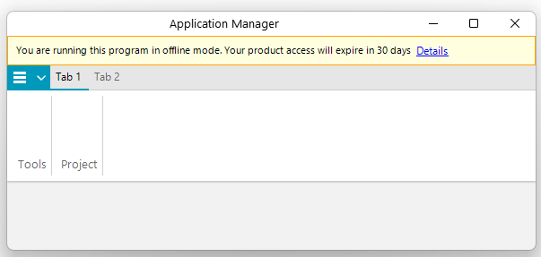

## Environment

| Product | Version | Author |
| --- | --- | --- |
| RadRibbonBar for WinForms | 2024.2.514 | [Nadya Todorova](https://www.telerik.com/blogs/author/nadya-karaivanova)|

## Description

It is often required to display custom messages or banners in the header of the RadRibbonBar to notify users about certain conditions or information, such as running the program in offline mode or warning about a period expiry date. This article demonstrates how to add a custom message banner to the header of the RadRibbonBar component in a WinForms application.

>caption RadRibbonBar Banner




## Solution

To add a custom banner to the RadRibbonBar header, follow these steps:

1. Use `LightVisualElement` objects for the message text.
2. Add these elements into a `StackLayoutElementLite`.
3. Customize the appearance of the `StackLayoutElementLite` .
4. Add the stack to the Header.Children collection of the `RadRibbonBar`.
5. Adjust the margin of the application button element based on the header size so that it do not overlap the message.

Here is a code snippet illustrating this example:

````C#
public RadForm1()
{
    InitializeComponent();
    this.Text = "Application Manager";

    LightVisualElement lve = new LightVisualElement
    {
        Text = "You are running this program in offline mode. Your product access will expire in 30 days",
        StretchVertically = true
    };

    LightVisualElement lve2 = new LightVisualElement
    {
        Text = "Details",
        Font = new Font("Segoe UI", 9f, FontStyle.Underline),
        ForeColor = Color.Blue,
        StretchVertically = true
    };
    lve2.Click += this.Lve2_Click;

    var stackElement = new StackLayoutElementLite
    {
        Padding = new Padding(6),
        StretchHorizontally = true,
        Children = { lve, lve2 },
        DrawFill = true,
        GradientStyle = Telerik.WinControls.GradientStyles.Solid,
        BackColor = Color.LightYellow,
        DrawBorder = true,
        BorderGradientStyle = Telerik.WinControls.GradientStyles.Solid,
        BorderColor = Color.Orange
    };

    this.radRibbonBar1.ShowExpandButton = false;
    var tabStrip = this.radRibbonBar1.RibbonBarElement.TabStripElement;
    tabStrip.Header.Visibility = Telerik.WinControls.ElementVisibility.Visible;
    tabStrip.Header.DrawText = false;
    tabStrip.Header.Children.Add(stackElement);
    tabStrip.PropertyChanged += this.TabStrip_PropertyChanged;
}

private void Lve2_Click(object sender, EventArgs e)
{
    // Action for the Details click event
}

private void TabStrip_PropertyChanged(object sender, PropertyChangedEventArgs e)
{
    if (e.PropertyName == "Bounds")
    {
        RibbonTabStripElement tabStrip = this.radRibbonBar1.RibbonBarElement.TabStripElement;
        RadApplicationMenuButtonElement appBtn = this.radRibbonBar1.RibbonBarElement.ApplicationButtonElement;
        appBtn.Margin = new Padding(0, (int)tabStrip.Header.DesiredSize.Height, 0, 0);
    }
}

````

## See Also

- [RadRibbonBar Documentation](https://docs.telerik.com/devtools/winforms/controls/ribbonbar/overview)
