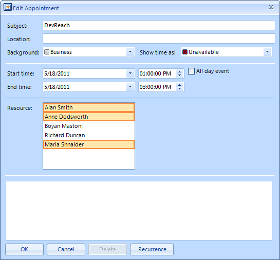

|Article relates to|Product|Author|
|----|----|----|
|Q1 2011|Telerik UI for WinForms|Ivan Todorov| 
 
## How To

Create a custom EditAppointmentDialog which allows assigning multiple resources to a single appointment.
   
## Description
 
The data engine of RadScheduler allows the user to have appointments and resources in *many-to-many* relation. However, you cannot create such relations using the standard **EditAppointmentDialog** because the resources combo box does not allow multi selection.

>important As of **R1 2021** the **EditAppointmentDialog** provides UI for [selecting multiple resources](https://docs.telerik.com/devtools/winforms/controls/scheduler/appointments-and-dialogs/working-with-resources) per appointment. In certain cases (e.g. unbound mode), the Resource **RadDropDownList** is replaced with a **RadCheckedDropDownList**. Otherwise, the default drop down with single selection for resources is shown. To enable the multiple resources selection in bound mode, it is necessary to specify the AppointmentMappingInfo. Resources property. The Resources property should be set to the name of the relation that connects the Appointments and the AppointmentsResources tables.
   
## Solution 
 
In order to get the desired functionality, you should create a custom EditAppointmentDialog, hide the resources combo box and add a RadListControl which allows multiple selection. Then you should override the logic for loading and saving the users’ settings.  
   

   
>note A complete solution in C# and VB.NET can be found [here](https://github.com/telerik/winforms-sdk/tree/master/Scheduler/SchedulerMultipleResourcesEditDialog).

