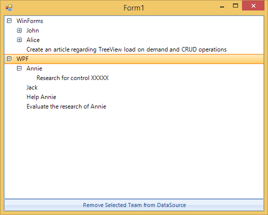
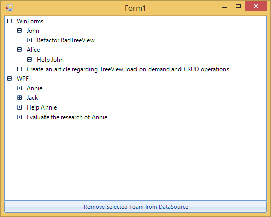

|Date Posted|Product|Author|
|----|----|----|
|April 03, 2014|RadTreeView for WinForms|Georgi Georgiev|

## Problem:

You have a complex hierarchy, which includes business objects of different types. Some of them have children and some - do not. How to visualize it, using **RadTreeView** and keep the CRUD operations?   
 
## Solution:

Use [Load On Demand](https://docs.telerik.com/devtools/winforms/treeview/data-binding/load-on-demand) and load the hierarchy manually.  


   
In this example, we will use the following scenario: A hierarchy, which has **Teams**, each **Team** has **TeamMembers** and **Tasks**, and each **TeamMember** has his own **Tasks**. Every **Team**, **TeamMember** and **Task** have names which will be displayed in the **RadTreeView**.  
   
Below you can see the implementation of these types. Note that their child collections are **BindingLists** and that every type implements [INotifyPropertyChanged](http://msdn.microsoft.com/en-us/library/vstudio/system.componentmodel.inotifypropertychanged). We will use this approach so that every property change will bubble up to the top-most collection which we will monitor:  
   
````C#
public class Team : INotifyPropertyChanged
{
    private string teamName;
 
    public string TeamName
    {
        get { return this.teamName; }
        set
        {
            this.teamName = value;
            this.OnPropertyChanged("TeamName");
        }
    }
 
    public BindingList<TeamMember> TeamMembers { get; private set; }
    public BindingList<Task> TeamTasks { get; private set; }
 
    public Team(string teamName)
    {
        this.TeamName = teamName;
 
        this.TeamMembers = new BindingList<TeamMember>();
        this.TeamTasks = new BindingList<Task>();
 
        this.TeamMembers.ListChanged += TeamMembers_ListChanged;
        this.TeamTasks.ListChanged += TeamTasks_ListChanged;
    }
 
    private void TeamTasks_ListChanged(object sender, ListChangedEventArgs e)
    {
        this.OnPropertyChanged("TeamTasks");
    }
 
    private void TeamMembers_ListChanged(object sender, ListChangedEventArgs e)
    {
        this.OnPropertyChanged("TeamName");
    }
 
    public event PropertyChangedEventHandler PropertyChanged;
 
    protected virtual void OnPropertyChanged(string propName)
    {
        if (this.PropertyChanged != null)
        {
            this.PropertyChanged(this, new PropertyChangedEventArgs(propName));
        }
    }
}
 
public class TeamMember : INotifyPropertyChanged
{
    private string memberName;
 
    public string MemberName
    {
        get
        {
            return this.memberName;
        }
        set
        {
            this.memberName = value;
            this.OnPropertyChanged("MemberName");
        }
    }
    public BindingList<Task> MemberTasks { get; private set; }
 
    public TeamMember(string memberName)
    {
        this.MemberName = memberName;
 
        this.MemberTasks = new BindingList<Task>();
 
        this.MemberTasks.ListChanged += MemberTasks_ListChanged;
    }
 
    void MemberTasks_ListChanged(object sender, ListChangedEventArgs e)
    {
        this.OnPropertyChanged("MemberTasks");
    }
 
    public event PropertyChangedEventHandler PropertyChanged;
 
    protected virtual void OnPropertyChanged(string propName)
    {
        if (this.PropertyChanged != null)
        {
            this.PropertyChanged(this, new PropertyChangedEventArgs(propName));
        }
    }
}
 
public class Task : INotifyPropertyChanged
{
    private string taskName;
 
    public string TaskName
    {
        get { return this.taskName; }
        set
        {
            this.taskName = value;
            this.OnPropertyChanged("TaskName");
        }
    }
 
    public Task(string taskName)
    {
        this.TaskName = taskName;
    }
 
    public event PropertyChangedEventHandler PropertyChanged;
 
    protected virtual void OnPropertyChanged(string propName)
    {
        if (this.PropertyChanged != null)
        {
            this.PropertyChanged(this, new PropertyChangedEventArgs(propName));
        }
    }
}

````
````VB.NET
Public Class Team
    Implements INotifyPropertyChanged
    Private m_teamName As String
 
    Public Property TeamName() As String
        Get
            Return Me.m_teamName
        End Get
        Set(value As String)
            Me.m_teamName = value
            Me.OnPropertyChanged("TeamName")
        End Set
    End Property
 
    Public Property TeamMembers() As BindingList(Of TeamMember)
        Get
            Return m_TeamMembers
        End Get
        Private Set(value As BindingList(Of TeamMember))
            m_TeamMembers = value
        End Set
    End Property
    Private m_TeamMembers As BindingList(Of TeamMember)
    Public Property TeamTasks() As BindingList(Of Task)
        Get
            Return m_TeamTasks
        End Get
        Private Set(value As BindingList(Of Task))
            m_TeamTasks = value
        End Set
    End Property
    Private m_TeamTasks As BindingList(Of Task)
 
    Public Sub New(teamName As String)
        Me.TeamName = teamName
 
        Me.TeamMembers = New BindingList(Of TeamMember)()
        Me.TeamTasks = New BindingList(Of Task)()
 
        AddHandler Me.TeamMembers.ListChanged, AddressOf TeamMembers_ListChanged
        AddHandler Me.TeamTasks.ListChanged, AddressOf TeamTasks_ListChanged
    End Sub
 
    Private Sub TeamTasks_ListChanged(sender As Object, e As ListChangedEventArgs)
        Me.OnPropertyChanged("TeamTasks")
    End Sub
 
    Private Sub TeamMembers_ListChanged(sender As Object, e As ListChangedEventArgs)
        Me.OnPropertyChanged("TeamName")
    End Sub
 
    Public Event PropertyChanged As PropertyChangedEventHandler Implements INotifyPropertyChanged.PropertyChanged
 
    Protected Overridable Sub OnPropertyChanged(propName As String)
        RaiseEvent PropertyChanged(Me, New PropertyChangedEventArgs(propName))
    End Sub
End Class
 
Public Class TeamMember
    Implements INotifyPropertyChanged
    Private m_memberName As String
 
    Public Property MemberName() As String
        Get
            Return Me.m_memberName
        End Get
        Set(value As String)
            Me.m_memberName = value
            Me.OnPropertyChanged("MemberName")
        End Set
    End Property
    Public Property MemberTasks() As BindingList(Of Task)
        Get
            Return m_MemberTasks
        End Get
        Private Set(value As BindingList(Of Task))
            m_MemberTasks = value
        End Set
    End Property
    Private m_MemberTasks As BindingList(Of Task)
 
    Public Sub New(memberName As String)
        Me.MemberName = memberName
 
        Me.MemberTasks = New BindingList(Of Task)()
 
        AddHandler Me.MemberTasks.ListChanged, AddressOf MemberTasks_ListChanged
    End Sub
 
    Private Sub MemberTasks_ListChanged(sender As Object, e As ListChangedEventArgs)
        Me.OnPropertyChanged("MemberTasks")
    End Sub
 
    Public Event PropertyChanged As PropertyChangedEventHandler Implements INotifyPropertyChanged.PropertyChanged
 
    Protected Overridable Sub OnPropertyChanged(propName As String)
        RaiseEvent PropertyChanged(Me, New PropertyChangedEventArgs(propName))
    End Sub
End Class
 
Public Class Task
    Implements INotifyPropertyChanged
    Private m_taskName As String
 
    Public Property TaskName() As String
        Get
            Return Me.m_taskName
        End Get
        Set(value As String)
            Me.m_taskName = value
            Me.OnPropertyChanged("TaskName")
        End Set
    End Property
 
    Public Sub New(taskName As String)
        Me.TaskName = taskName
    End Sub
 
    Public Event PropertyChanged As PropertyChangedEventHandler Implements INotifyPropertyChanged.PropertyChanged
 
    Protected Overridable Sub OnPropertyChanged(propName As String)
        RaiseEvent PropertyChanged(Me, New PropertyChangedEventArgs(propName))
    End Sub
End Class

````
 
Now, we need to initialize the RadTreeView, which will visualize our business objects:

````C#
this.TreeView = new RadTreeView();
this.TreeView.Parent = this;
this.TreeView.Dock = DockStyle.Fill;
this.TreeView.AllowRemove = true;
this.TreeView.AllowAdd = true;
this.TreeView.LazyMode = true;
this.TreeView.AllowDefaultContextMenu = true;

````
````VB.NET
Me.TreeView = New RadTreeView()
Me.TreeView.Parent = Me
Me.TreeView.Dock = DockStyle.Fill
Me.TreeView.AllowRemove = True
Me.TreeView.AllowAdd = True
Me.TreeView.LazyMode = True
Me.TreeView.AllowDefaultContextMenu = True

````

Since we will not bind our objects to RadTreeView, we will use the Tag property to save the business object. The following method will be very helpful further in this article:

````C#
private RadTreeNode CreateNode(string text, object tag)
{
    RadTreeNode newNode = new RadTreeNode(text);
    newNode.Tag = tag;
    return newNode;
}

````
````VB.NET
Private Function CreateNode(text As String, tag As Object) As RadTreeNode
    Dim newNode As New RadTreeNode(text)
    newNode.Tag = tag
    Return newNode
End Function

````

After we have this method and our tree view set up, we can actually create the hierarchy:

````C#
private void InitializeHierarchy()
{
    //the Teams collection is a property of the Form
    this.Teams = new BindingList<Team>();
 
    Team winFormsTeam = new Team("WinForms");
    this.Teams.Add(winFormsTeam);
 
    TeamMember john = new TeamMember("John");
    winFormsTeam.TeamMembers.Add(john);
    Task johnsTask = new Task("Refactor RadTreeView");
    john.MemberTasks.Add(johnsTask);
 
    TeamMember alice = new TeamMember("Alice");
    winFormsTeam.TeamMembers.Add(alice);
    Task aliceTask = new Task("Help John");
    alice.MemberTasks.Add(aliceTask);
 
    Task winFormsUnassignedTask = new Task("Create an article regarding TreeView load on demand and CRUD operations");
    winFormsTeam.TeamTasks.Add(winFormsUnassignedTask);
 
    Team wpfTeam = new Team("WPF");
    this.Teams.Add(wpfTeam);
 
    TeamMember annie = new TeamMember("Annie");
    wpfTeam.TeamMembers.Add(annie);
 
    Task annieTask = new Task("Research for control XXXXX");
    annie.MemberTasks.Add(annieTask);
 
    Task unnasignedWpfTask = new Task("Help Annie");
    wpfTeam.TeamTasks.Add(unnasignedWpfTask);
 
    Task secondUnnasignedWpfTask = new Task("Evaluate the research of Annie");
    wpfTeam.TeamTasks.Add(secondUnnasignedWpfTask);
 
    TeamMember memberWithoutTasks = new TeamMember("Jack");
    wpfTeam.TeamMembers.Add(memberWithoutTasks);
 
    foreach (Team team in this.Teams)
    {
        this.TreeView.Nodes.Add(this.CreateNode(team.TeamName, team));
    }
}

````
````VB.NET
Private Sub InitializeHierarchy()
    'the Teams collection is a property of the Form
    Me.Teams = New BindingList(Of Team)()
 
    Dim winFormsTeam As New Team("WinForms")
    Me.Teams.Add(winFormsTeam)
 
    Dim john As New TeamMember("John")
    winFormsTeam.TeamMembers.Add(john)
    Dim johnsTask As New Task("Refactor RadTreeView")
    john.MemberTasks.Add(johnsTask)
 
    Dim alice As New TeamMember("Alice")
    winFormsTeam.TeamMembers.Add(alice)
    Dim aliceTask As New Task("Help John")
    alice.MemberTasks.Add(aliceTask)
 
    Dim winFormsUnassignedTask As New Task("Create an article regarding TreeView load on demand and CRUD operations")
    winFormsTeam.TeamTasks.Add(winFormsUnassignedTask)
 
    Dim wpfTeam As New Team("WPF")
    Me.Teams.Add(wpfTeam)
 
    Dim annie As New TeamMember("Annie")
    wpfTeam.TeamMembers.Add(annie)
 
    Dim annieTask As New Task("Research for control XXXXX")
    annie.MemberTasks.Add(annieTask)
 
    Dim unnasignedWpfTask As New Task("Help Annie")
    wpfTeam.TeamTasks.Add(unnasignedWpfTask)
 
    Dim secondUnnasignedWpfTask As New Task("Evaluate the research of Annie")
    wpfTeam.TeamTasks.Add(secondUnnasignedWpfTask)
 
    Dim memberWithoutTasks As New TeamMember("Jack")
    wpfTeam.TeamMembers.Add(memberWithoutTasks)
 
    For Each team As Team In Me.Teams
        Me.TreeView.Nodes.Add(Me.CreateNode(team.TeamName, team))
    Next
End Sub

````

You see at the bottom that we are adding the **Teams** to the **Nodes** collection of the **RadTreeView**. They will be our base and when expanded we will load their children.

As we speak about loading children, you need to subscribe to the **NodesNeeded** event. In the event handler we will check for the Tag of the parent node and of the current node. This will allow us to get the appropriate type and load its children. For example, If the parent is a Team then we need to load this **Team’s TeamMembers** and **Tasks**:

````C#
private void TreeView_NodesNeeded(object sender, NodesNeededEventArgs e)
{
    if (e.Parent == null || e.Parent.Tag == null || e.Parent.Tag is Task)
    {
        return;
    }
 
    Team team = e.Parent.Tag as Team;
    if (team != null)
    {
        foreach (TeamMember member in team.TeamMembers)
        {
            e.Nodes.Add(this.CreateNode(member.MemberName, member));
        }
 
        foreach (Task task in team.TeamTasks)
        {
            e.Nodes.Add(this.CreateNode(task.TaskName, task));
        }
    }
 
    TeamMember teamMember = e.Parent.Tag as TeamMember;
    if (teamMember != null)
    {
        foreach (Task task in teamMember.MemberTasks)
        {
            e.Nodes.Add(this.CreateNode(task.TaskName, task));
        }
    }
}

````
````VB.NET
Private Sub TreeView_NodesNeeded(sender As Object, e As NodesNeededEventArgs)
    If e.Parent Is Nothing OrElse e.Parent.Tag Is Nothing OrElse TypeOf e.Parent.Tag Is Task Then
        Return
    End If
 
    Dim team As Team = TryCast(e.Parent.Tag, Team)
    If team IsNot Nothing Then
        For Each member As TeamMember In team.TeamMembers
            e.Nodes.Add(Me.CreateNode(member.MemberName, member))
        Next
 
        For Each task As Task In team.TeamTasks
            e.Nodes.Add(Me.CreateNode(task.TaskName, task))
        Next
    End If
 
    Dim teamMember As TeamMember = TryCast(e.Parent.Tag, TeamMember)
    If teamMember IsNot Nothing Then
        For Each task As Task In teamMember.MemberTasks
            e.Nodes.Add(Me.CreateNode(task.TaskName, task))
        Next
    End If
End Sub

````



If you run the application now, you will notice that the nodes are loading their children, however there is something which we do not really like. We know that the **Tasks** do not have any children, yet, they have expanders in front of them. We can easily correct that by using the **NodeFormatting** event. In the event handler we simply check if the node’s **Tag** is a **Task** and if it is **TeamMember**, whether it has any Tasks, and if it is a **Team**, whether it has any **TeamMembers** or **Tasks** and hide the expander appropriately.

````C#
private void TreeView_NodeFormatting(object sender, TreeNodeFormattingEventArgs e)
{
    Team team = e.Node.Tag as Team;
    TeamMember teamMember = e.Node.Tag as TeamMember;
    if ((e.Node.Tag == null || e.Node.Tag is Task) ||
        (team != null && team.TeamMembers.Count == 0 && team.TeamTasks.Count == 0) ||
        (teamMember != null && teamMember.MemberTasks.Count == 0))
    {
        e.NodeElement.ExpanderElement.Visibility = Telerik.WinControls.ElementVisibility.Hidden;
    }
    else
    {
        e.NodeElement.ExpanderElement.ResetValue(VisualElement.VisibilityProperty, ValueResetFlags.Local);
    }
}

````
````VB.NET
Private Sub TreeView_NodeFormatting(sender As Object, e As TreeNodeFormattingEventArgs)
    Dim team As Team = TryCast(e.Node.Tag, Team)
    Dim teamMember As TeamMember = TryCast(e.Node.Tag, TeamMember)
    If (e.Node.Tag Is Nothing OrElse TypeOf e.Node.Tag Is Task) OrElse (team IsNot Nothing AndAlso team.TeamMembers.Count = 0 AndAlso team.TeamTasks.Count = 0) OrElse (teamMember IsNot Nothing AndAlso teamMember.MemberTasks.Count = 0) Then
        e.NodeElement.ExpanderElement.Visibility = Telerik.WinControls.ElementVisibility.Hidden
    Else
        e.NodeElement.ExpanderElement.ResetValue(VisualElement.VisibilityProperty, ValueResetFlags.Local)
    End If
End Sub

````

Now, our hierarchy is properly visualized, all we have left to do is to implement the CRUD operations which will keep the **RadTreeView** and the **BindingList** synchronized. To handle the case where a node is removed/added from/to RadTreeView you will need to subscribe to the **NodeRemoving** and **NodeAdded** event handlers, respectively. What will happen in these event handlers is very similar to what is happening in the **NodesNeeded** event handler from before, where we check the parent and modify its children: 

````C#
private void TreeView_NodeAdded(object sender, RadTreeViewEventArgs e)
{
    if (e.Node.Parent == null)
    {
        return;
    }
 
    Team team = e.Node.Parent.Tag as Team;
    if (team != null)
    {
        TeamMember member = e.Node.Tag as TeamMember;
        if (member != null)
        {
            team.TeamMembers.Add(member);
        }
 
        Task task = e.Node.Tag as Task;
        if (task != null)
        {
            team.TeamTasks.Add(task);
        }
    }
 
    TeamMember teamMember = e.Node.Parent.Tag as TeamMember;
    if (teamMember != null)
    {
        Task task = e.Node.Tag as Task;
        if (task != null)
        {
            teamMember.MemberTasks.Add(task);
        }
    }
}
 
private void TreeView_NodeRemoving(object sender, RadTreeViewCancelEventArgs e)
{
    if (e.Node.Parent == null)
    {
        return;
    }
 
    Team team = e.Node.Parent.Tag as Team;
    if (team != null)
    {
        TeamMember member = e.Node.Tag as TeamMember;
        if (member != null)
        {
            team.TeamMembers.Remove(member);
        }
 
        Task task = e.Node.Tag as Task;
        if (task != null)
        {
            team.TeamTasks.Remove(task);
        }
    }
 
    TeamMember teamMember = e.Node.Parent.Tag as TeamMember;
    if (teamMember != null)
    {
        Task task = e.Node.Tag as Task;
        if (task != null)
        {
            teamMember.MemberTasks.Remove(task);
        }
    }
}

````
````VB.NET
Private Sub TreeView_NodeAdded(sender As Object, e As RadTreeViewEventArgs)
    If e.Node.Parent Is Nothing Then
        Return
    End If
 
    Dim team As Team = TryCast(e.Node.Parent.Tag, Team)
    If team IsNot Nothing Then
        Dim member As TeamMember = TryCast(e.Node.Tag, TeamMember)
        If member IsNot Nothing Then
            team.TeamMembers.Add(member)
        End If
 
        Dim task As Task = TryCast(e.Node.Tag, Task)
        If task IsNot Nothing Then
            team.TeamTasks.Add(task)
        End If
    End If
 
    Dim teamMember As TeamMember = TryCast(e.Node.Parent.Tag, TeamMember)
    If teamMember IsNot Nothing Then
        Dim task As Task = TryCast(e.Node.Tag, Task)
        If task IsNot Nothing Then
            teamMember.MemberTasks.Add(task)
        End If
    End If
End Sub
 
Private Sub TreeView_NodeRemoving(sender As Object, e As RadTreeViewCancelEventArgs)
    If e.Node.Parent Is Nothing Then
        Return
    End If
 
    Dim team As Team = TryCast(e.Node.Parent.Tag, Team)
    If team IsNot Nothing Then
        Dim member As TeamMember = TryCast(e.Node.Tag, TeamMember)
        If member IsNot Nothing Then
            team.TeamMembers.Remove(member)
        End If
 
        Dim task As Task = TryCast(e.Node.Tag, Task)
        If task IsNot Nothing Then
            team.TeamTasks.Remove(task)
        End If
    End If
 
    Dim teamMember As TeamMember = TryCast(e.Node.Parent.Tag, TeamMember)
    If teamMember IsNot Nothing Then
        Dim task As Task = TryCast(e.Node.Tag, Task)
        If task IsNot Nothing Then
            teamMember.MemberTasks.Remove(task)
        End If
    End If
End Sub

````

And to handle the case where something is modified in the data source, we will need to subscribe to the ListChanged event of the BindingList and rebuild the RadTreeView by clearing the nodes and re-adding the first level nodes.  You can optionally save the expanded node’s state as per [this article](https://docs.telerik.com/devtools/winforms/treeview/how-to/keep-radtreeview-states-on-reset).  