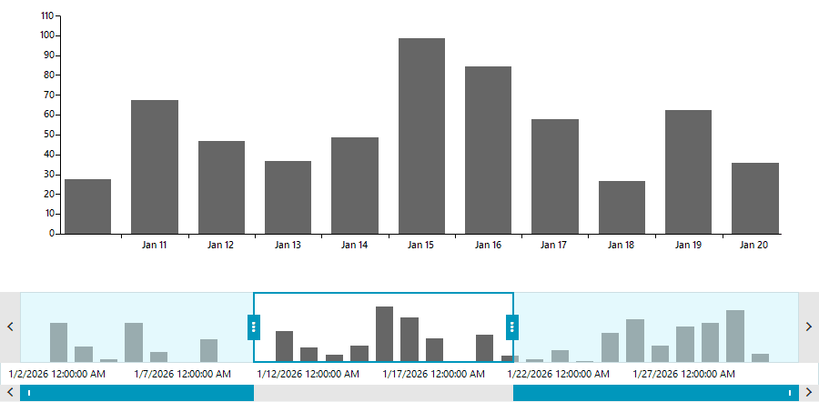

## Environment

|Product Version|Product|Author|
|----|----|----|
|2026.3.812|RadRangeSelector for WinForms|[Desislava Yordanova](https://www.telerik.com/blogs/author/desislava-yordanova)|

## Description

When integrating **RadRangeSelector** with **RadChartView**, the range selector operates on normalized percentage values from `0` to `100`. Out of the box, `RadRangeSelector` does not expose a native `SnapMode` or `SnapInterval` property to automatically restrict thumb movements to specific steps.

In applications displaying chronological data with a `DateTimeContinuousAxis`, you may want the selection thumbs to snap to discrete date-time boundaries (for example, whole days, 12-hour intervals, or 1-hour steps) rather than arbitrary floating-point percentages.

This article demonstrates how to calculate the equivalent percentage step for a given `TimeSpan` and snap the `StartRange` and `EndRange` properties in the `SelectionChanged` event.



## Solution

To implement snapping to date-time intervals:

1. Associate `RadRangeSelector` with `RadChartView` by setting `radRangeSelector1.AssociatedControl = this.radChartView1` after data binding is complete.
2. Set `UpdateMode = UpdateMode.Deferred` on the range selector. Deferred update mode calculates and applies the final range when the user releases the thumb, avoiding UI jitter during dragging.
3. Retrieve the minimum and maximum dates represented on the chart's `DateTimeContinuousAxis` (or from your underlying data source).
4. Calculate the percentage step corresponding to your target `TimeSpan` interval:
   $$\text{stepPercentage} = \frac{\text{snapInterval.Ticks}}{\text{totalDurationTicks}} \times 100$$
5. In the `SelectionChanged` event handler, round the current `StartRange` and `EndRange` to the nearest multiple of `stepPercentage` and update the control using a re-entrancy guard flag.

````C#
using System;
using Telerik.Charting;
using Telerik.Documents.Model.Drawing.Charts;
using Telerik.WinControls.UI;
using Telerik.WinControls.UI.RangeSelector.InterfacesAndEnum;
using BarSeries = Telerik.WinControls.UI.BarSeries;

namespace WinForms_Sample
{
    public partial class ChartForm : RadForm
    {
        private bool isUpdating = false;
        private readonly TimeSpan snapInterval = TimeSpan.FromDays(1);
        private DateTime minDate;
        private DateTime maxDate;
        public ChartForm()
        {
            InitializeComponent();
            InitializeChartAndRangeSelector();
        }
        private void InitializeChartAndRangeSelector()
        {
            // 1. Populate sample DateTime data
            this.minDate = new DateTime(2026, 1, 1);
            this.maxDate = new DateTime(2026, 1, 31);

            BarSeries series = new BarSeries();
            DateTimeContinuousAxis dateTimeAxis = new DateTimeContinuousAxis();
            dateTimeAxis.Minimum = this.minDate;
            dateTimeAxis.Maximum = this.maxDate;
            dateTimeAxis.LabelFormat = "{0:MMM dd}";
            dateTimeAxis.LabelFitMode = AxisLabelFitMode.MultiLine;
            series.HorizontalAxis = dateTimeAxis;

            DateTime currentDate = this.minDate;
            Random rnd = new Random();
            while (currentDate <= this.maxDate)
            {
                series.DataPoints.Add(new CategoricalDataPoint(rnd.Next(10, 100), currentDate));
                currentDate = currentDate.AddDays(1);
            }

            this.radChartView1.Series.Add(series);

            // 2. Associate the chart with RadRangeSelector
            this.radRangeSelector1.AssociatedControl = this.radChartView1;
            this.radRangeSelector1.UpdateMode = UpdateMode.Deferred;

            // 3. Subscribe to SelectionChanged for snapping
            this.radRangeSelector1.SelectionChanged += RadRangeSelector1_SelectionChanged;

             
        }

        private void RadRangeSelector1_SelectionChanged(object sender, EventArgs e)
        {
            if (this.isUpdating)
            {
                return;
            }

            this.isUpdating = true;
            try
            {
                float step = GetStepPercentage();
                if (step <= 0)
                {
                    return;
                }

                float snappedStart = SnapValue(this.radRangeSelector1.StartRange, step);
                float snappedEnd = SnapValue(this.radRangeSelector1.EndRange, step);

                // Ensure selection maintains at least one step interval
                if (snappedEnd <= snappedStart)
                {
                    snappedEnd = Math.Min(100f, snappedStart + step);
                }

                if (Math.Abs(this.radRangeSelector1.StartRange - snappedStart) > 0.01f)
                {
                    this.radRangeSelector1.StartRange = snappedStart;
                }

                if (Math.Abs(this.radRangeSelector1.EndRange - snappedEnd) > 0.01f)
                {
                    this.radRangeSelector1.EndRange = snappedEnd;
                }
            }
            finally
            {
                this.isUpdating = false;
            }
        }

        private float GetStepPercentage()
        {
            double totalTicks = (this.maxDate - this.minDate).Ticks;
            if (totalTicks <= 0)
            {
                return 1f;
            }

            return (float)((this.snapInterval.Ticks / totalTicks) * 100.0);
        }

        private float SnapValue(float currentPercentage, float step)
        {
            float snapped = (float)Math.Round(currentPercentage / step) * step;
            return Math.Max(0f, Math.Min(100f, snapped));
        }
    }
}
````

## See Also

* [Integration with RadChartView]()
* [Properties and Events]()
* [DateTimeContinuous Axis]()
