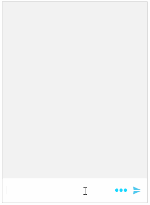

## Environment
 
|Product Version|Product|Author|
|----|----|----|
|2019.2.508|RadChat for WinForms|[Desislava Yordanova](https://www.telerik.com/blogs/author/desislava-yordanova)|
 

## Description

This article demonstrates how to remove a message in **RadChat** by adding a button in each message.



## Solution 

The [ChatFactory]() class provides means for changing the default visual elements and data items in the **RadChat** control. If you need to customize any of the **Chat UI**'s elements or items you can create a descendant of the **ChatFactory** class, override the corresponding methods and replace the default elements with custom ones.

To achieve the illustrated design, we will create a derivative of **TextMessageItemElement** and insert a **RadButtonElement** that will remove the associated message:


#### Custom TextMessageItemElement

````C#

        public RadForm1()
        {
            InitializeComponent();
            
            this.radChat1.Author = new Author(Properties.Resources.bot, "Author");
            this.radChat1.ChatElement.ChatFactory = new CustomChatFactory();
        }

        public class CustomChatFactory : ChatFactory
        {
            public override BaseChatItemElement CreateItemElement(BaseChatDataItem item)
            {
                if (item.GetType() == typeof(TextMessageDataItem))
                {
                    return new CustomTextMessageItemElement();
                }

                return base.CreateItemElement(item);
            }
        }

        public class CustomTextMessageItemElement : TextMessageItemElement
        {
            StackLayoutElement container = new StackLayoutElement();
            LightVisualElement message = new LightVisualElement();

            protected override LightVisualElement CreateMainMessageElement()
            {
                LightVisualElement bubble = base.CreateMainMessageElement();

                container.Orientation = Orientation.Horizontal;
                container.StretchHorizontally = true;
                RadButtonElement removeButton = new RadButtonElement();
                removeButton.Text = "X";
                removeButton.ButtonFillElement.Visibility = ElementVisibility.Collapsed;
                removeButton.StretchVertically = false;
                removeButton.StretchHorizontally = false;
                bubble.Children.Add(removeButton);
                removeButton.Click += removeButton_Click;

                container.Children.Add(message);
                container.Children.Add(removeButton);
                bubble.Children.Add(container);
                return bubble;
            }

            public override void Synchronize()
            {
                base.Synchronize();
                this.MainMessageElement.DrawText = false;
                message.Text = ((ChatTextMessage)this.Data.Message).Message;
            }

            private void removeButton_Click(object sender, EventArgs e)
            {
                RadChat chatUI = this.ElementTree.Control as RadChat;
                chatUI.ChatElement.MessagesViewElement.Items.Remove(this.Data);
            }
        }     
       
````
````VB.NET
    
    Public Sub New()
        InitializeComponent()
        Me.RadChat1.Author = New Author(My.Resources.bot, "Author")
        Me.RadChat1.ChatElement.ChatFactory = New CustomChatFactory()
    End Sub

    Public Class CustomChatFactory
    Inherits ChatFactory

        Public Overrides Function CreateItemElement(ByVal item As BaseChatDataItem) As BaseChatItemElement
            If item.[GetType]() = GetType(TextMessageDataItem) Then
                Return New CustomTextMessageItemElement()
            End If

            Return MyBase.CreateItemElement(item)
        End Function
    End Class

    Public Class CustomTextMessageItemElement
    Inherits TextMessageItemElement
        
        Private container As StackLayoutElement 
        Private message As LightVisualElement

        Protected Overrides Function CreateMainMessageElement() As LightVisualElement
            container = New StackLayoutElement()
            message = New LightVisualElement()          

            Dim bubble As LightVisualElement = MyBase.CreateMainMessageElement()
            container.Orientation = Orientation.Horizontal
            container.StretchHorizontally = True
            Dim removeButton As RadButtonElement = New RadButtonElement()
            removeButton.Text = "X"
            removeButton.ButtonFillElement.Visibility = ElementVisibility.Collapsed
            removeButton.StretchVertically = False
            removeButton.StretchHorizontally = False
            bubble.Children.Add(removeButton)
            AddHandler removeButton.Click, AddressOf removeButton_Click
            container.Children.Add(message)
            container.Children.Add(removeButton)
            bubble.Children.Add(container)
            Return bubble
        End Function

        Public Overrides Sub Synchronize()
            MyBase.Synchronize()
            Me.MainMessageElement.DrawText = False
            message.Text = (CType(Me.Data.Message, ChatTextMessage)).Message
        End Sub

        Private Sub removeButton_Click(ByVal sender As Object, ByVal e As EventArgs)
            Dim chatUI As RadChat = TryCast(Me.ElementTree.Control, RadChat)
            chatUI.ChatElement.MessagesViewElement.Items.Remove(Me.Data)
        End Sub
    End Class
    
````

