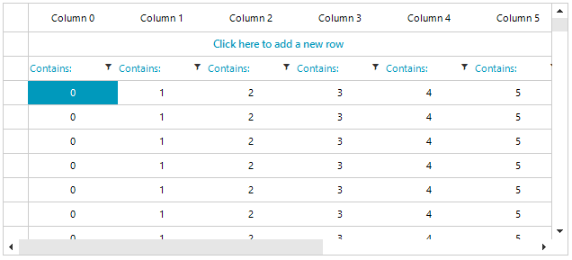

## Environment
 
|Product Version|Product|Author|
|----|----|----|
|2019.3.917|RadVirtualGrid for WinForms|[Desislava Yordanova](https://www.telerik.com/blogs/author/desislava-yordanova)|
 
## Description

**RadVirtualGrid** loads data on demand providing the respective cell's value (even for the header cells) via the **CellValueNeeded** event. Reordering the columns can be achieved by forcing an update and applying a new order for the columns from the external source that is used for the data to be loaded in the grid. 



## Solution 

This tutorial demonstrates a sample approach how to use the standard [OLE drag and drop functionality](https://docs.microsoft.com/en-us/cpp/mfc/drag-and-drop-ole?view=vs-2019) and simulate columns reordering in **RadVirtualGrid**.


````C#

DataTable data;
List<string> visibleColumns = new List<string>();

public RadForm1()
{
    InitializeComponent();

    this.data = GetTable();
    for (int i = 0; i < 10; i++)
    {
        string name = "Column " + i;
        this.visibleColumns.Add(name);
    }

    this.radVirtualGrid1.AllowDrop = true;

    this.radVirtualGrid1.MouseDown += radVirtualGrid1_MouseDown;
    this.radVirtualGrid1.MouseMove += radVirtualGrid1_MouseMove;
    this.radVirtualGrid1.DragEnter += radVirtualGrid1_DragEnter;
    this.radVirtualGrid1.DragDrop += radVirtualGrid1_DragDrop;
    this.radVirtualGrid1.MouseUp += radVirtualGrid1_MouseUp;

    this.radVirtualGrid1.CellValueNeeded += RadVirtualGrid1_CellValueNeeded;
    this.radVirtualGrid1.RowCount = data.Rows.Count;
    this.radVirtualGrid1.ColumnCount = data.Columns.Count;
}

private void radVirtualGrid1_DragEnter(object sender, DragEventArgs e)
{
    e.Effect = DragDropEffects.Move;
}

private void radVirtualGrid1_MouseUp(object sender, MouseEventArgs e)
{
    this.mouseDownPosition = Point.Empty;
}

private void radVirtualGrid1_DragDrop(object sender, DragEventArgs e)
{
    VirtualGridHeaderCellElement source = e.Data.GetData(typeof(VirtualGridHeaderCellElement)) as VirtualGridHeaderCellElement;
    Point mousePosition = this.radVirtualGrid1.VirtualGridElement.ElementTree.Control.PointToClient(Control.MousePosition);
    VirtualGridHeaderCellElement target = this.radVirtualGrid1.ElementTree.GetElementAtPoint(mousePosition) as VirtualGridHeaderCellElement;
    if (target != null)
    {
        int s = visibleColumns.IndexOf(source.Text);
        int t = visibleColumns.IndexOf(target.Text);

        visibleColumns.RemoveAt(s);
        visibleColumns.Insert(t, source.Text);

        foreach (VirtualGridRowElement rowElement in
            this.radVirtualGrid1.VirtualGridElement.TableElement.GetDescendants(delegate(RadElement x) { return x is VirtualGridRowElement; },
                TreeTraversalMode.BreadthFirst))
        {
            rowElement.CellContainer.Children.Clear();
        }
    }
}

private void radVirtualGrid1_MouseMove(object sender, MouseEventArgs e)
{
    if (e.Button == System.Windows.Forms.MouseButtons.Left)
    {
        RadVirtualGrid grid = (RadVirtualGrid)sender;
        VirtualGridHeaderCellElement cell = grid.ElementTree.GetElementAtPoint(e.Location) as VirtualGridHeaderCellElement;
        if (cell != null)
        {
            if (this.ShouldBeginDrag(this.mouseDownPosition, e.Location))
            {
                if (cell != null)
                {
                    this.isDragging = true;
                    grid.DoDragDrop(cell, DragDropEffects.Move);
                }
            }
        }
    }
}

private Point mouseDownPosition;
private bool isDragging;

private void radVirtualGrid1_MouseDown(object sender, MouseEventArgs e)
{
    this.mouseDownPosition = e.Location;
}

private bool ShouldBeginDrag(Point current, Point capture)
{
    Size dragSize = SystemInformation.DragSize;
    Rectangle dragRect = new Rectangle(capture.X - dragSize.Width / 2,
        capture.Y - dragSize.Height / 2, dragSize.Width, dragSize.Height);
    return !dragRect.Contains(current);
}

private void RadVirtualGrid1_CellValueNeeded(object sender, Telerik.WinControls.UI.VirtualGridCellValueNeededEventArgs e)
{
    if (e.ColumnIndex < 0 || e.ColumnIndex >= radVirtualGrid1.ColumnCount)
        return;

    if (e.RowIndex == RadVirtualGrid.HeaderRowIndex)
    {
        e.Value = data.Columns[this.visibleColumns[e.ColumnIndex]];
    }

    if (e.RowIndex < 0)
    {
        return;
    }

    var row = data.Rows[e.RowIndex];
    e.Value = row[this.visibleColumns[e.ColumnIndex]];
}

static DataTable GetTable()
{
    DataTable table = new DataTable();
    for (int i = 0; i < 10; i++)
    {
        table.Columns.Add("Column " + i, typeof(int));
    }

    for (int i = 0; i < 100; i++)
    {
        table.Rows.Add(new object[] { 0, 1, 2, 3, 4, 5, 6, 7, 8, 9 });
    }

    return table;
}

        
````
````VB.NET

Private data As DataTable
Private visibleColumns As List(Of String) = New List(Of String)()

Public Sub New()
    InitializeComponent()
    Me.data = GetTable()

    For i As Integer = 0 To 10 - 1
        Dim name As String = "Column " & i
        Me.visibleColumns.Add(name)
    Next

    Me.RadVirtualGrid1.AllowDrop = True
    AddHandler Me.RadVirtualGrid1.MouseDown, AddressOf radVirtualGrid1_MouseDown
    AddHandler Me.RadVirtualGrid1.MouseMove, AddressOf radVirtualGrid1_MouseMove
    AddHandler Me.RadVirtualGrid1.DragEnter, AddressOf radVirtualGrid1_DragEnter
    AddHandler Me.RadVirtualGrid1.DragDrop, AddressOf radVirtualGrid1_DragDrop
    AddHandler Me.RadVirtualGrid1.MouseUp, AddressOf radVirtualGrid1_MouseUp
    AddHandler Me.RadVirtualGrid1.CellValueNeeded, AddressOf RadVirtualGrid1_CellValueNeeded
    Me.RadVirtualGrid1.RowCount = data.Rows.Count
    Me.RadVirtualGrid1.ColumnCount = data.Columns.Count
End Sub

Private Sub radVirtualGrid1_DragEnter(ByVal sender As Object, ByVal e As DragEventArgs)
    e.Effect = DragDropEffects.Move
End Sub

Private Sub radVirtualGrid1_MouseUp(ByVal sender As Object, ByVal e As MouseEventArgs)
    Me.mouseDownPosition = Point.Empty
End Sub

Private Sub radVirtualGrid1_DragDrop(ByVal sender As Object, ByVal e As DragEventArgs)
    Dim source As VirtualGridHeaderCellElement = TryCast(e.Data.GetData(GetType(VirtualGridHeaderCellElement)), VirtualGridHeaderCellElement)
    Dim mousePosition As Point = Me.RadVirtualGrid1.VirtualGridElement.ElementTree.Control.PointToClient(Control.MousePosition)
    Dim target As VirtualGridHeaderCellElement = TryCast(Me.RadVirtualGrid1.ElementTree.GetElementAtPoint(mousePosition), VirtualGridHeaderCellElement)

    If target IsNot Nothing Then
        Dim s As Integer = visibleColumns.IndexOf(source.Text)
        Dim t As Integer = visibleColumns.IndexOf(target.Text)
        visibleColumns.RemoveAt(s)
        visibleColumns.Insert(t, source.Text)

        For Each rowElement As VirtualGridRowElement In Me.RadVirtualGrid1.VirtualGridElement.TableElement.GetDescendants(Function(x As RadElement) _
                                                                        TypeOf x Is VirtualGridRowElement, TreeTraversalMode.BreadthFirst)
            rowElement.CellContainer.Children.Clear()
        Next
    End If
End Sub

Private Sub radVirtualGrid1_MouseMove(ByVal sender As Object, ByVal e As MouseEventArgs)
    If e.Button = System.Windows.Forms.MouseButtons.Left Then
        Dim grid As RadVirtualGrid = CType(sender, RadVirtualGrid)
        Dim cell As VirtualGridHeaderCellElement = TryCast(grid.ElementTree.GetElementAtPoint(e.Location), VirtualGridHeaderCellElement)

        If cell IsNot Nothing Then

            If Me.ShouldBeginDrag(Me.mouseDownPosition, e.Location) Then

                If cell IsNot Nothing Then
                    Me.isDragging = True
                    grid.DoDragDrop(cell, DragDropEffects.Move)
                End If
            End If
        End If
    End If
End Sub

Private mouseDownPosition As Point
Private isDragging As Boolean

Private Sub radVirtualGrid1_MouseDown(ByVal sender As Object, ByVal e As MouseEventArgs)
    Me.mouseDownPosition = e.Location
End Sub

Private Function ShouldBeginDrag(ByVal current As Point, ByVal capture As Point) As Boolean
    Dim dragSize As Size = SystemInformation.DragSize
    Dim dragRect As Rectangle = New Rectangle(capture.X - dragSize.Width / 2, capture.Y - dragSize.Height / 2, dragSize.Width, dragSize.Height)
    Return Not dragRect.Contains(current)
End Function

Private Sub RadVirtualGrid1_CellValueNeeded(ByVal sender As Object, ByVal e As Telerik.WinControls.UI.VirtualGridCellValueNeededEventArgs)
    If e.ColumnIndex < 0 OrElse e.ColumnIndex >= RadVirtualGrid1.ColumnCount Then Return

    If e.RowIndex = RadVirtualGrid.HeaderRowIndex Then
        e.Value = data.Columns(Me.visibleColumns(e.ColumnIndex))
    End If

    If e.RowIndex < 0 Then
        Return
    End If

    Dim row = data.Rows(e.RowIndex)
    e.Value = row(Me.visibleColumns(e.ColumnIndex))
End Sub

Private Shared Function GetTable() As DataTable
    Dim table As DataTable = New DataTable()

    For i As Integer = 0 To 10 - 1
        table.Columns.Add("Column " & i, GetType(Integer))
    Next

    For i As Integer = 0 To 100 - 1
        table.Rows.Add(New Object() {0, 1, 2, 3, 4, 5, 6, 7, 8, 9})
    Next

    Return table
End Function
    

```` 
 


    
   
  
    
 
