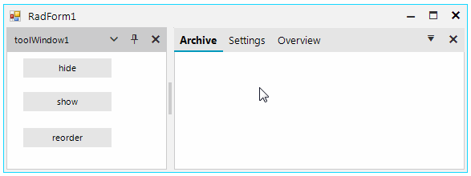

## Environment
 
|Product Version|Product|Author|
|----|----|----|
|2019.1.219|RadDock for WinForms|[Desislava Yordanova](https://www.telerik.com/blogs/author/desislava-yordanova)|
 

## Description

When you add/show a new document, it is placed considering the RadDock.DocumentManager.**DocumentInsertOrder** property. The default value is DockWindowInsertOrder.*InFront*. Hence, the documents are placed in front. In other words, when you make visible a **DocumentWindow**, it is located at first position. Then, when you make visible each next **DocumentWindow**, it is placed in front of the previously added/shown window. This behavior is by design. 

## Solution

You can change the order of the tabbed documents by using the DocumentTabStrip.Controls.**SetChildIndex** method passing the desired window and index. Here is a sample code snippet which result is illustrated below:



#### Reordering tabs

````C#

        private void radButton1_Click(object sender, EventArgs e)
        {
            this.documentWindowArchive.CloseAction = Telerik.WinControls.UI.Docking.DockWindowCloseAction.Hide;
            this.documentWindowOverview.CloseAction = Telerik.WinControls.UI.Docking.DockWindowCloseAction.Hide;

            this.documentWindowArchive.DockState = Telerik.WinControls.UI.Docking.DockState.Hidden;
            this.documentWindowOverview.DockState = Telerik.WinControls.UI.Docking.DockState.Hidden;
        }

        private void radButton2_Click(object sender, EventArgs e)
        {
            this.documentWindowArchive.DockState = Telerik.WinControls.UI.Docking.DockState.TabbedDocument;
            this.documentWindowOverview.DockState = Telerik.WinControls.UI.Docking.DockState.TabbedDocument;
        }

        private void radButton3_Click(object sender, EventArgs e)
        {
            this.documentTabStrip1.Controls.SetChildIndex(this.documentWindowArchive, 0); 
            this.documentTabStrip1.Controls.SetChildIndex(this.documentWindowOverview, 2);
        }
       
````
````VB.NET

    Private Sub RadButton1_Click(sender As Object, e As EventArgs) Handles RadButton1.Click
        Me.documentWindowArchive.CloseAction = Telerik.WinControls.UI.Docking.DockWindowCloseAction.Hide
        Me.documentWindowOverview.CloseAction = Telerik.WinControls.UI.Docking.DockWindowCloseAction.Hide
        Me.documentWindowArchive.DockState = Telerik.WinControls.UI.Docking.DockState.Hidden
        Me.documentWindowOverview.DockState = Telerik.WinControls.UI.Docking.DockState.Hidden
    End Sub

    Private Sub RadButton2_Click(sender As Object, e As EventArgs) Handles RadButton2.Click
        Me.documentWindowArchive.DockState = Telerik.WinControls.UI.Docking.DockState.TabbedDocument
        Me.documentWindowOverview.DockState = Telerik.WinControls.UI.Docking.DockState.TabbedDocument
    End Sub

    Private Sub RadButton3_Click(sender As Object, e As EventArgs) Handles RadButton3.Click
        Me.DocumentTabStrip1.Controls.SetChildIndex(Me.documentWindowArchive, 0)
        Me.DocumentTabStrip1.Controls.SetChildIndex(Me.documentWindowOverview, 2)
    End Sub
      

````


