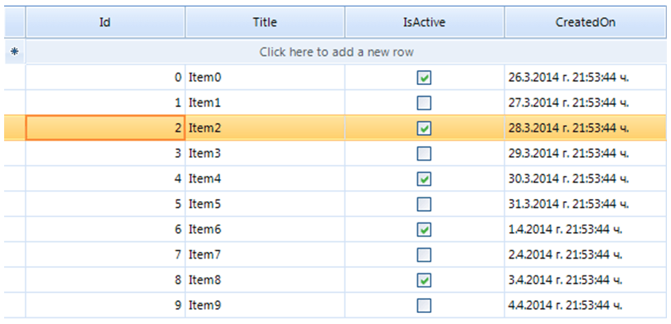
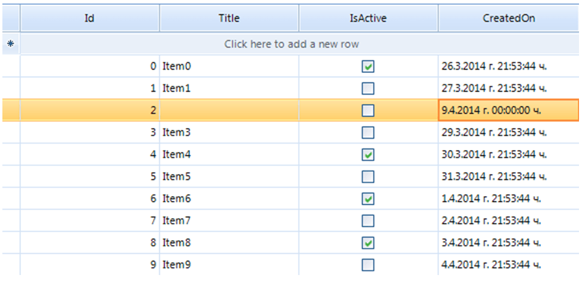
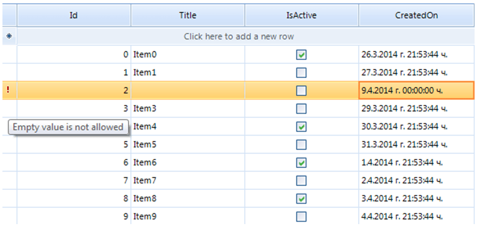
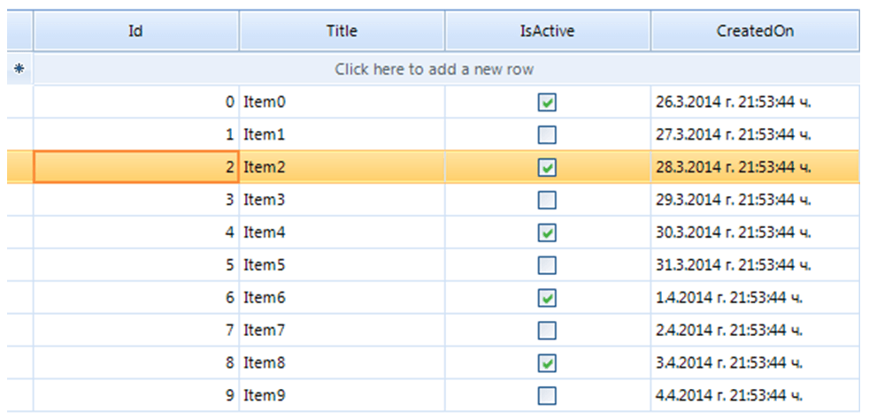

|Date Posted|Product|Author|
|----|----|----|
|March 28, 2014|RadGridView for WinForms|[Desislava Yordanova](https://www.telerik.com/blogs/author/desislava-yordanova)|

## Problem
 
When **RadGridView** is in bound mode, modifying a certain cell, automatically updates the **DataBoundItem**, which is the desired by design behavior. RadGridView provides a convenient way to realize data validation before it is committed to the underlying data source.  
   
## Solution  
   
To achieve data validation prior the row is committed, you can handle the **CellValidating** event, which is raised by the control when the current cell changes or when it goes out of edit mode. Canceling this event prevents the user from exiting the cell until a valid value is entered or the edit process is canceled (via Esc key). The **DataBoundItem** will be updated only if the cell is validated.   
   
However, the user may prefer to validate all the data cells in a row at once. This scenario can be achieved by using the **RowValidating** event, which is fired when the user tries to change the current row (changing to another row or when the control loses focus). Note that only the **CellValidating** event can keep the editor active,when the validation fails and it does not allow the user to exit the cell until a valid value is filled. However, pressing the Esc key in this situation will revert the initial value of the cell and it will close the editor. Thus, the user can continue. The **RowValidating** event has a slightly different behavior. When the validation fails, the editor is closed, but the user cannot change the current row in the grid until a valid cell value is entered. In this situation the editor is not kept active when the validation fails and pressing the Esc key does not revert the changes as the editor is already closed. This functionality can be easily implemented by handling the **PreviewKeyDown** event, which will revert the row changes after pressing the Esc key.   
   
Let's assume that the RadGridView is bound to a list of custom objects. We have subscribed to the **RowValidating** event in order to perform data validation on row level.
 
````C#
private void radGridView1_RowValidating(object sender, RowValidatingEventArgs e)
{
    e.Row.ErrorText = string.Empty;
    if (e.Row is GridViewDataRowInfo)
    {
        if (e.Row.Cells[1].Value == null || String.IsNullOrEmpty(e.Row.Cells[1].Value.ToString()))
        {
            e.Row.ErrorText = "Empty value is not allowed";
            e.Cancel = true;
        }
    }
}

````
````VB.NET
Private Sub radGridView1_RowValidating(sender As Object, e AsRowValidatingEventArgs)
    e.Row.ErrorText = String.Empty
    If TypeOf e.Row Is GridViewDataRowInfo Then
        If e.Row.Cells(1).Value Is NothingOrElse[String].IsNullOrEmpty(e.Row.Cells(1).Value.ToString())Then
            e.Row.ErrorText = "Empty value is not allowed"
            e.Cancel = True
        End If
    End If
End Sub

````

If the user enters empty string for a specific cell and tries to navigate to another row, the validation fails and the **ErrorText **is displayed on the corresponding row. At this point the user is not allowed to cancel the performed changes, pressing the Esc key.   
   
To achieve this, we will have to subscribe to the **PreviewKeyDown **event:

````C#
//Cell index as a Key, cell value as Value
Dictionary<int, object> initialValues;
  
private void radGridView1_PreviewKeyDown(object sender, PreviewKeyDownEventArgs e)
{
    if (this.radGridView1.CurrentRow is GridViewDataRowInfo && e.KeyData == Keys.Escape)
    {
        //revert the previous cell value which is stored in advance.
        if (this.radGridView1.ActiveEditor == null&&this.radGridView1.Tag == "RowNotValidated")
        {
            foreach (KeyValuePair<int, object> cell ininitialValues)
            {
                this.radGridView1.CurrentRow.Cells[cell.Key].Value = cell.Value;
            }
            this.radGridView1.CurrentRow.ErrorText =string.Empty;
        }
    }
}

````
````VB.NET
'Cell index as a Key, cell value as Value
Dim initialValues As Dictionary(Of Integer, Object)
  
Private Sub radGridView1_PreviewKeyDown(sender As Object, e AsPreviewKeyDownEventArgs)
    If TypeOf Me.radGridView1.CurrentRow IsGridViewDataRowInfoAndAlso e.KeyData = Keys.Escape Then
        'revert the previous cell value which is stored in advance.
        If Me.radGridView1.ActiveEditor Is NothingAndAlsoMe.radGridView1.Tag = "RowNotValidated" Then
            For Each cell As KeyValuePair(Of Integer,Object)In initialValues
                Me.radGridView1.CurrentRow.Cells(cell.Key).Value = cell.Value
            Next
            Me.radGridView1.CurrentRow.ErrorText =String.Empty
        End If
    End If
End Sub

````
   
In the **RowValidating** event it is necessary to add the following code line, after cancelling the event:   
   
````C#
this.radGridView1.Tag = "RowNotValidated";

````
````VB.NET
Me.RadGridView1.Tag = "RowNotValidated"

````  
 
This will mark that validation as unsuccessful. You can use the **CurrentRowChanged **event to make a new instance of the dictionary, in which the initial row data is stored:
  
````C#
private void radGridView1_CurrentRowChanged(object sender, CurrentRowChangedEventArgs e)
{
    if (e.CurrentRow != null)
    {
        initialValues = new Dictionary<int, object>();
    }
}

````
````VB.NET
Private Sub radGridView1_CurrentRowChanged(sender As Object, eAs CurrentRowChangedEventArgs)
    If e.CurrentRow IsNot Nothing Then
        initialValues = New Dictionary(Of Integer, Object)()
    End If
End Sub

```` 
 
The **CellValidating **event is used to extract the initial row data:
 
````C#
private void radGridView1_CellValidating(object sender, CellValidatingEventArgs e)
{
    if (this.radGridView1.CurrentCell != null)
    {
        int cellIndex = e.ColumnIndex;
        object initialCellValue = e.Row.Cells[cellIndex].Value;
        if (!initialValues.ContainsKey(cellIndex))
        {
            initialValues.Add(cellIndex, initialCellValue);
        }
    }
}

````
````VB.NET
Private Sub radGridView1_CellValidating(sender As Object, e AsCellValidatingEventArgs)
    If Me.RadGridView1.CurrentCell IsNot Nothing Then
        Dim cellIndex As Integer = e.ColumnIndex
        Dim initialCellValue As Object = e.Row.Cells(cellIndex).Value
        If Not initialValues.ContainsKey(cellIndex) Then
            initialValues.Add(cellIndex, initialCellValue)
        End If
    End If
End Sub

````

When the row is successfully validated, the RadGridView.Tag property is cleared:

````C#
private void radGridView1_RowValidated(object sender, RowValidatedEventArgs e)
{
    this.radGridView1.Tag = null;
}

````
````VB.NET
Private Sub radGridView1_CurrentRowChanged(sender As Object, eAs CurrentRowChangedEventArgs)
    If e.CurrentRow IsNot Nothing Then
        initialValues = New Dictionary(Of Integer, Object)()
    End If
End Sub

````

Now we are ready to follow the steps:

1\. Initial row state:



2\. Perform some changes:



3\. Try to navigate to the next row:



4\. After implementing the custom row behavior, pressing the Esc key should cancel the performed row changes:



>note A complete solution in C# and VB.NET can be found [here](https://github.com/telerik/winforms-sdk/tree/master/GridView/RestoreRowValues).


