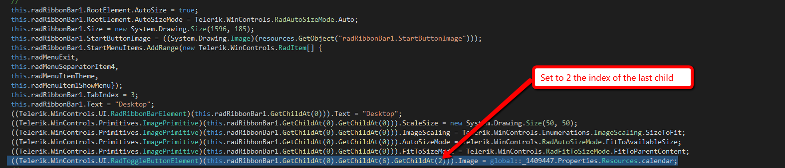

## Environment
 
|Product Version|Product|Author|
|----|----|----|
|2019.2.508|RadRibbonBar for WinForms|[Dimitar Karamfilov](https://www.telerik.com/blogs/author/dimitar-karamfilov)|

## Description
 
RadRibbonBar - Changed the element hierarchy. Because of the recently introduced[Simplified Layout]() feature we added RadToggleSwitchElement and LightVisualElement children to the Buttons Container with indexes 0 and 1. This change resulted in the following hierarchy change: RadToggleButtonElement (RibbonBarExpandButton) index changed from 0 to 2; RadImageButtonElement (RibbonBarHelpButton) index changed from 1 to 3; RadMDIControlsItem (MDI control box) index changed from 2 to 4. 

## Solution

Open the designer and change the index of the last child element.

Here are the other examples of this:

If you have edited any of the elements listed above in design time and you get Designer exception you should edit Designer.cs manually.
For example if you had changed FillPrimitive BackColor of RibbonBarExpandButton you will have similar code in Design.cs as:
((Telerik.WinControls.Primitives.FillPrimitive)(this.richTextEditorRibbonBar1.GetChildAt(0).GetChildAt(6).GetChildAt(0).GetChildAt(0))).BackColor2 = System.Drawing.Color.Red;

In order to avoid exceptions in the Designer.cs you should change the index of RibbonBarExpandButton from 0 to 2 as follows:
((Telerik.WinControls.Primitives.FillPrimitive)(this.richTextEditorRibbonBar1.GetChildAt(0).GetChildAt(6).GetChildAt(2).GetChildAt(0))).BackColor2 = System.Drawing.Color.Red;

Same logic applies if you have made changes programmatically. Using the same example with changing RibbonBarExpandButton FillPrimitive Back Color programmatically you will get exception with the following code:
RadToggleButtonElement toggleElement = this.richTextEditorRibbonBar1.RibbonBarElement.ButtonsContainer.Children[0] as RadToggleButtonElement;

In order to avoid the exception it should be changed as follows:
RadToggleButtonElement toggleElement = this.richTextEditorRibbonBar1.RibbonBarElement.ButtonsContainer.Children[2] as RadToggleButtonElement;

