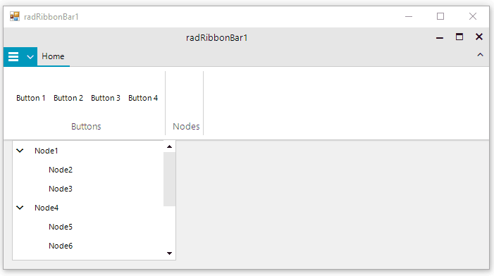

## Environment
 
|Product Version|Product|Author|
|----|----|----|
|2022.2.510|RadRibbonBar for WinForms|[Dinko Krastev](https://www.telerik.com/blogs/author/dinko-krastev)|



## Solution

To add Drag-Drop between these two controls, we are going to use their drag-drop service: __RadDragDropService__ and __TreeViewDragDropService__. We need to subscribe to their PreviewDragOver and PreviewDragDrop events and in their event handler we will convert the drag element. Important part here is that we need to allow the drag operation on both controls and their elements by using the __AllowDrag__ property. The following code demonstrate this approach.

````C#

public partial class RibbonTreeForm : Form
{
    private RadDragDropService ribbonDragDropService = new RadDragDropService();

    public RibbonTreeForm()
    {
        InitializeComponent();

        this.radTreeView1.AllowDragDrop = true;

        TreeViewDragDropService dragDropService = this.radTreeView1.TreeViewElement.DragDropService;
        dragDropService.PreviewDragOver += this.OnTreeViewDragDropServicePreviewDragOver;
        dragDropService.PreviewDragDrop += this.OnTreeViewDragDropServicePreviewDragDrop;

        this.radRibbonBar1.MouseDown += this.OnRadRibbonBarMouseDown;
        ribbonDragDropService.PreviewDragOver += this.OnRadRibbonDragDropServicePreviewDragOver;
        ribbonDragDropService.PreviewDragDrop += this.OnRadRibbonDragDropServicePreviewDragDrop;

        this.radRibbonBarGroup1.AllowDrop = true;
        this.radRibbonBarGroup2.AllowDrop = true;

        this.button1.AllowDrag = true;
        this.button2.AllowDrag = true;
        this.button3.AllowDrag = true;
        this.button4.AllowDrag = true;
    }

    private void OnRadRibbonDragDropServicePreviewDragOver(object sender, RadDragOverEventArgs e)
    {
        if (e.HitTarget is RadTreeViewElement || e.HitTarget is TreeNodeElement)
        {
            e.CanDrop = true;
        }
    }

    private void OnRadRibbonDragDropServicePreviewDragDrop(object sender, RadDropEventArgs e)
    {
        RadTreeViewElement treeViewElement = e.HitTarget as RadTreeViewElement;
        TreeNodeElement nodeElement = e.HitTarget as TreeNodeElement;

        RadButtonElement button = e.DragInstance as RadButtonElement;
        RadTreeNodeCollection nodes = null;

        if (treeViewElement != null)
        {
            nodes = treeViewElement.Nodes;
        }
        else if (nodeElement != null)
        {
            nodes = nodeElement.Data.Nodes;
            nodeElement.Data.Expand();
        }

        if (nodes != null)
        {
            nodes.Add(new RadTreeNode(button.Text));
            button.Parent.Children.Remove(button);
        }

    }

    private void OnRadRibbonBarMouseDown(object sender, MouseEventArgs e)
    {
        if (e.Button == MouseButtons.Left)
        {
            RadButtonElement button = this.radRibbonBar1.ElementTree.GetElementAtPoint(e.Location) as RadButtonElement;

            if (button != null && button.FindAncestor<RadRibbonBarGroup>() != null)
            {
                ribbonDragDropService.Start(button);
            }
        }
    }

    private void OnTreeViewDragDropServicePreviewDragDrop(object sender, Telerik.WinControls.RadDropEventArgs e)
    {
        RadRibbonBarGroup ribbonBarGroup = e.HitTarget as RadRibbonBarGroup;

        if (ribbonBarGroup != null)
        {
            TreeNodeElement draggedNode = e.DragInstance as TreeNodeElement;
            RadButtonElement button = new RadButtonElement(draggedNode.Data.Text);
            button.AllowDrag = true;
            ribbonBarGroup.Items.Add(button);
            draggedNode.Data.Remove();
            e.Handled = true;
        }
    }

    private void OnTreeViewDragDropServicePreviewDragOver(object sender, Telerik.WinControls.RadDragOverEventArgs e)
    {
        RadRibbonBarGroup ribbonBarGroup = e.HitTarget as RadRibbonBarGroup;

        if (ribbonBarGroup != null)
        {
            e.CanDrop = true;
        }
    }
}

````
````VB.NET

Partial Public Class RibbonTreeForm
    Inherits Form

    Private ribbonDragDropService As RadDragDropService = New RadDragDropService()

    Public Sub New()
        InitializeComponent()
        Me.radTreeView1.AllowDragDrop = True
        Dim dragDropService As TreeViewDragDropService = Me.radTreeView1.TreeViewElement.DragDropService
        dragDropService.PreviewDragOver, AddressOf Me.OnTreeViewDragDropServicePreviewDragOver
        dragDropService.PreviewDragDrop, AddressOf Me.OnTreeViewDragDropServicePreviewDragDrop
        Me.radRibbonBar1.MouseDown, AddressOf Me.OnRadRibbonBarMouseDown
        ribbonDragDropService.PreviewDragOver, AddressOf Me.OnRadRibbonDragDropServicePreviewDragOver
        ribbonDragDropService.PreviewDragDrop, AddressOf Me.OnRadRibbonDragDropServicePreviewDragDrop
        Me.radRibbonBarGroup1.AllowDrop = True
        Me.radRibbonBarGroup2.AllowDrop = True
        Me.button1.AllowDrag = True
        Me.button2.AllowDrag = True
        Me.button3.AllowDrag = True
        Me.button4.AllowDrag = True
    End Sub

    Private Sub OnRadRibbonDragDropServicePreviewDragOver(ByVal sender As Object, ByVal e As RadDragOverEventArgs)
        If TypeOf e.HitTarget Is RadTreeViewElement OrElse TypeOf e.HitTarget Is TreeNodeElement Then
            e.CanDrop = True
        End If
    End Sub

    Private Sub OnRadRibbonDragDropServicePreviewDragDrop(ByVal sender As Object, ByVal e As RadDropEventArgs)
        Dim treeViewElement As RadTreeViewElement = TryCast(e.HitTarget, RadTreeViewElement)
        Dim nodeElement As TreeNodeElement = TryCast(e.HitTarget, TreeNodeElement)
        Dim button As RadButtonElement = TryCast(e.DragInstance, RadButtonElement)
        Dim nodes As RadTreeNodeCollection = Nothing

        If treeViewElement IsNot Nothing Then
            nodes = treeViewElement.Nodes
        ElseIf nodeElement IsNot Nothing Then
            nodes = nodeElement.Data.Nodes
            nodeElement.Data.Expand()
        End If

        If nodes IsNot Nothing Then
            nodes.Add(New RadTreeNode(button.Text))
            button.Parent.Children.Remove(button)
        End If
    End Sub

    Private Sub OnRadRibbonBarMouseDown(ByVal sender As Object, ByVal e As MouseEventArgs)
        If e.Button = MouseButtons.Left Then
            Dim button As RadButtonElement = TryCast(Me.radRibbonBar1.ElementTree.GetElementAtPoint(e.Location), RadButtonElement)

            If button IsNot Nothing AndAlso button.FindAncestor(Of RadRibbonBarGroup)() IsNot Nothing Then
                ribbonDragDropService.Start(button)
            End If
        End If
    End Sub

    Private Sub OnTreeViewDragDropServicePreviewDragDrop(ByVal sender As Object, ByVal e As Telerik.WinControls.RadDropEventArgs)
        Dim ribbonBarGroup As RadRibbonBarGroup = TryCast(e.HitTarget, RadRibbonBarGroup)

        If ribbonBarGroup IsNot Nothing Then
            Dim draggedNode As TreeNodeElement = TryCast(e.DragInstance, TreeNodeElement)
            Dim button As RadButtonElement = New RadButtonElement(draggedNode.Data.Text)
            button.AllowDrag = True
            ribbonBarGroup.Items.Add(button)
            draggedNode.Data.Remove()
            e.Handled = True
        End If
    End Sub

    Private Sub OnTreeViewDragDropServicePreviewDragOver(ByVal sender As Object, ByVal e As Telerik.WinControls.RadDragOverEventArgs)
        Dim ribbonBarGroup As RadRibbonBarGroup = TryCast(e.HitTarget, RadRibbonBarGroup)

        If ribbonBarGroup IsNot Nothing Then
            e.CanDrop = True
        End If
    End Sub
End Class


````

{{endregion}} 


