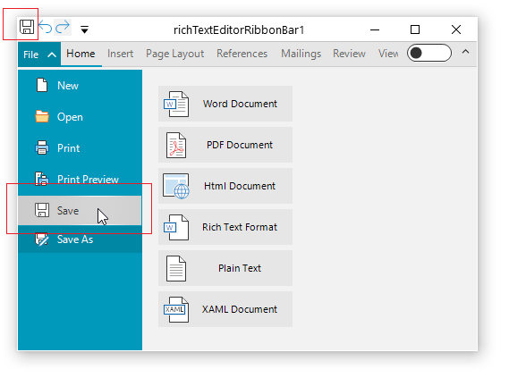

## Environment
 
|Product Version|Product|Author|
|----|----|----|
|2022.1.222|RadRichTextEditor for WinForms|[Desislava Yordanova](https://www.telerik.com/blogs/author/desislava-yordanova)|


## Description

This article demonstrates a sample approach how to implement custom save logic in [RichTextEditorRibbonBar](). 



## Solution

Create a derivative of the **RichTextEditorRibbonBar** class and override the **ButtonSave_Click** and the **BackstageButtonSave_Click**


````C#  

        public class MyRichTextEditorRibbonBar : RichTextEditorRibbonBar
        {
            protected override void ButtonSave_Click(object sender, EventArgs e)
            {

                //TODO your custom save logic here

                this.BackstageControl.HidePopup();

                SaveCommand command = new SaveCommand(this.AssociatedRichTextEditor.RichTextBoxElement, this.OpenedFileName);
                this.ExecuteCommand(command);
                this.OpenedFileName = command.FileName;
            } 
            protected override void BackstageButtonSave_Click(object sender, EventArgs e)
            {
                //TODO here you can put your custom logic

                if (this.IsDesignMode || this.AssociatedRichTextEditor == null)
                {
                    return;
                }

                SaveCommand command = new SaveCommand(this.AssociatedRichTextEditor.RichTextBoxElement, this.OpenedFileName);
                this.ExecuteCommand(command);
                this.OpenedFileName = command.FileName;
                this.backstageView.Hide();
            }
             
        }  

````
````VB.NET

    Public Class MyRichTextEditorRibbonBar
        Inherits RichTextEditorRibbonBar

        Protected Overrides Sub ButtonSave_Click(ByVal sender As Object, ByVal e As EventArgs)
            Me.BackstageControl.HidePopup()
            Dim command As SaveCommand = New SaveCommand(Me.AssociatedRichTextEditor.RichTextBoxElement, Me.OpenedFileName)
            Me.ExecuteCommand(command)
            Me.OpenedFileName = command.FileName
        End Sub

        Protected Overrides Sub BackstageButtonSave_Click(ByVal sender As Object, ByVal e As EventArgs)
            If Me.IsDesignMode OrElse Me.AssociatedRichTextEditor Is Nothing Then
                Return
            End If

            Dim command As SaveCommand = New SaveCommand(Me.AssociatedRichTextEditor.RichTextBoxElement, Me.OpenedFileName)
            Me.ExecuteCommand(command)
            Me.OpenedFileName = command.FileName
            Me.backstageView.Hide()
        End Sub
    End Class

````

# See Also

* [Ribbon UI]() 