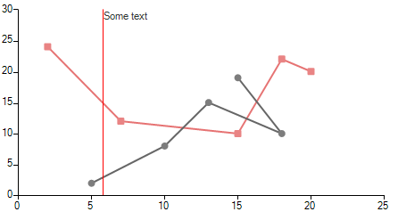
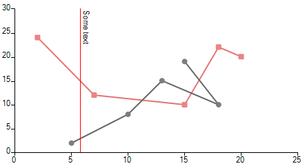
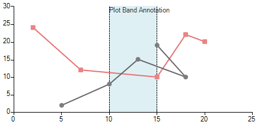
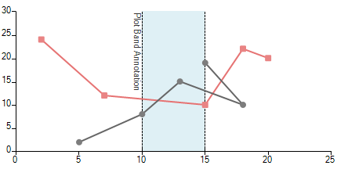

## Environment
 
|Product Version|Product|Author|
|----|----|----|
|2020.2.616|RadChartView for WinForms|[Desislava Yordanova](https://www.telerik.com/blogs/author/desislava-yordanova)|
 
## Description

**RadChartView** supports different [annotation]() types. A common requirement is to rotate the label that the annotation shows:

>caption Default annotation's label



The desired orientation is to rotate the label so that multiple labels won't overlap if there are many annotations added to the chart:

>caption Rotated annotation's label



## Solution 

Before populating **RadChartView** with data, it is necessary to subscribe to the **CreateRenderer** event and replace the default renderer with a custom one which is a derivative of [CartesianRenderer]().
 
You can control how the labels of the annotations are rendered by overriding the **InitializeAnnotations** method and replacing the respective **DrawPart** method according to the used annotation type.

You can find below a sample code snippet demonstrating how to replace the default **CartesianGridLineAnnotationDrawPart** and achieve the illustrated result from the above screenshot: 

#### Rotate the label of a CartesianGridLineAnnotation

````C#
public RadForm1()
{
    InitializeComponent();

    this.radChartView1.CreateRenderer += radChartView1_CreateRenderer;

    ScatterLineSeries scatterSeries = new ScatterLineSeries();
    scatterSeries.DataPoints.Add(new ScatterDataPoint(15, 19));
    scatterSeries.DataPoints.Add(new ScatterDataPoint(18, 10));
    scatterSeries.DataPoints.Add(new ScatterDataPoint(13, 15));
    scatterSeries.DataPoints.Add(new ScatterDataPoint(10, 8));
    scatterSeries.DataPoints.Add(new ScatterDataPoint(5, 2));
    scatterSeries.PointSize = new SizeF(8, 8);
    this.radChartView1.Series.Add(scatterSeries);
    ScatterLineSeries scatterSeries2 = new ScatterLineSeries();
    scatterSeries2.DataPoints.Add(new ScatterDataPoint(2, 24));
    scatterSeries2.DataPoints.Add(new ScatterDataPoint(7, 12));
    scatterSeries2.DataPoints.Add(new ScatterDataPoint(15, 10));
    scatterSeries2.DataPoints.Add(new ScatterDataPoint(18, 22));
    scatterSeries2.DataPoints.Add(new ScatterDataPoint(20, 20));
    scatterSeries2.Shape = new RoundRectShape(1);
    scatterSeries2.PointSize = new SizeF(8, 8);
    this.radChartView1.Series.Add(scatterSeries2);
    
    CartesianGridLineAnnotation annotation1 = new CartesianGridLineAnnotation();
    annotation1.Axis = this.radChartView1.Axes[0] as CartesianAxis;
    annotation1.Value = 5.8;
    annotation1.Label = "Some text";
    annotation1.DrawMode = AnnotationDrawMode.AboveSeries;
    annotation1.BorderColor = Color.Red;
    annotation1.BorderDashStyle = DashStyle.Solid;
    annotation1.BorderWidth = 1;
    this.radChartView1.Annotations.Add(annotation1);
}

private void radChartView1_CreateRenderer(object sender, ChartViewCreateRendererEventArgs e)
{
    e.Renderer = new CustomRenderer(e.Area as CartesianArea);
}

public class CustomRenderer : CartesianRenderer
{
    public CustomRenderer(CartesianArea area) : base(area)
    {
    }

    protected override void InitializeAnnotations(AnnotationDrawMode drawMode)
    {
        for (int i = 0; i < this.Area.Annotations.Count; i++)
        {
            if (this.Area.Annotations[i] is CartesianGridLineAnnotation && this.Area.Annotations[i].DrawMode == drawMode)
            {
                this.DrawParts.Add(new CustomCartesianGridLineAnnotationDrawPart(this.Area.Annotations[i] as CartesianGridLineAnnotation, this));
            }
        }
    }
}

public class CustomCartesianGridLineAnnotationDrawPart : CartesianGridLineAnnotationDrawPart
{
    public CustomCartesianGridLineAnnotationDrawPart(CartesianGridLineAnnotation element, CartesianRenderer renderer) : base(element, renderer)
    {
    }

    public override void Draw()
    {
        FieldInfo fi = typeof(CartesianGridLineAnnotation).GetField("model", BindingFlags.Instance | BindingFlags.NonPublic);
        ChartAnnotationModel model = fi.GetValue(this.Element) as ChartAnnotationModel;
        RectangleF rect = ChartRenderer.ToRectangleF(model.LayoutSlot);
        rect.Offset(this.ViewportOffsetX, this.ViewportOffsetY);

        Graphics graphics = this.Renderer.Surface as Graphics;
        RadGdiGraphics radGraphics = new RadGdiGraphics(graphics);

        Rectangle clipRect = ChartRenderer.ToRectangle(this.Element.View.GetArea<CartesianArea>().AreaModel.PlotArea.LayoutSlot);
        clipRect.Offset((int)this.ViewportOffsetX, (int)this.ViewportOffsetY);
        graphics.SetClip(clipRect);

        GraphicsPath path = new GraphicsPath();
        path.AddLine(rect.Location, new PointF(rect.Right, rect.Bottom));

        BorderPrimitiveImpl border = new BorderPrimitiveImpl(this.Element, null);
        border.PaintBorder(radGraphics, null, path, rect);

        rect.Size = graphics.MeasureString(this.Element.Label, this.Element.Font);
        rect.Offset(this.Element.PositonOffset.Width + 1, this.Element.PositonOffset.Height + 1);

        TextParams tp = new TextParams();
        tp.textOrientation = Orientation.Vertical;
        tp.font = this.Element.Font;
        tp.foreColor = this.Element.ForeColor;
        tp.paintingRectangle = new RectangleF(rect.X, rect.Y, rect.Height, rect.Width);
        tp.text = this.Element.Label;
 
        FillPrimitiveImpl fill = new FillPrimitiveImpl(this.Element, null);
        fill.PaintFill(radGraphics, null, rect);

        radGraphics.DrawString(tp, new SizeF(rect.Height, rect.Width));
    }
}
 
 
````
````VB.NET
Public Sub New()
    InitializeComponent()
    AddHandler Me.RadChartView1.CreateRenderer, AddressOf radChartView1_CreateRenderer
    Dim scatterSeries As ScatterLineSeries = New ScatterLineSeries()
    scatterSeries.DataPoints.Add(New ScatterDataPoint(15, 19))
    scatterSeries.DataPoints.Add(New ScatterDataPoint(18, 10))
    scatterSeries.DataPoints.Add(New ScatterDataPoint(13, 15))
    scatterSeries.DataPoints.Add(New ScatterDataPoint(10, 8))
    scatterSeries.DataPoints.Add(New ScatterDataPoint(5, 2))
    scatterSeries.PointSize = New SizeF(8, 8)
    Me.RadChartView1.Series.Add(scatterSeries)
    Dim scatterSeries2 As ScatterLineSeries = New ScatterLineSeries()
    scatterSeries2.DataPoints.Add(New ScatterDataPoint(2, 24))
    scatterSeries2.DataPoints.Add(New ScatterDataPoint(7, 12))
    scatterSeries2.DataPoints.Add(New ScatterDataPoint(15, 10))
    scatterSeries2.DataPoints.Add(New ScatterDataPoint(18, 22))
    scatterSeries2.DataPoints.Add(New ScatterDataPoint(20, 20))
    scatterSeries2.Shape = New RoundRectShape(1)
    scatterSeries2.PointSize = New SizeF(8, 8)
    Me.RadChartView1.Series.Add(scatterSeries2)
    Dim annotation1 As CartesianGridLineAnnotation = New CartesianGridLineAnnotation()
    annotation1.Axis = TryCast(Me.RadChartView1.Axes(0), CartesianAxis)
    annotation1.Value = 5.8
    annotation1.Label = "Some text"
    annotation1.DrawMode = AnnotationDrawMode.AboveSeries
    annotation1.BorderColor = Color.Red
    annotation1.BorderDashStyle = DashStyle.Solid
    annotation1.BorderWidth = 1
    Me.RadChartView1.Annotations.Add(annotation1)
End Sub

Private Sub radChartView1_CreateRenderer(ByVal sender As Object, ByVal e As ChartViewCreateRendererEventArgs)
    e.Renderer = New CustomRenderer(TryCast(e.Area, CartesianArea))
End Sub

Public Class CustomRenderer
    Inherits CartesianRenderer

    Public Sub New(ByVal area As CartesianArea)
        MyBase.New(area)
    End Sub

    Protected Overrides Sub InitializeAnnotations(ByVal drawMode As AnnotationDrawMode)
        For i As Integer = 0 To Me.Area.Annotations.Count - 1

            If TypeOf Me.Area.Annotations(i) Is CartesianGridLineAnnotation AndAlso Me.Area.Annotations(i).DrawMode = drawMode Then
                Me.DrawParts.Add(New CustomCartesianGridLineAnnotationDrawPart(TryCast(Me.Area.Annotations(i), CartesianGridLineAnnotation), Me))
            End If
        Next
    End Sub
End Class

Public Class CustomCartesianGridLineAnnotationDrawPart
    Inherits CartesianGridLineAnnotationDrawPart

    Public Sub New(ByVal element As CartesianGridLineAnnotation, ByVal renderer As CartesianRenderer)
        MyBase.New(element, renderer)
    End Sub

    Public Overrides Sub Draw()
        Dim fi As FieldInfo = GetType(CartesianGridLineAnnotation).GetField("model", BindingFlags.Instance Or BindingFlags.NonPublic)
        Dim model As ChartAnnotationModel = TryCast(fi.GetValue(Me.Element), ChartAnnotationModel)
        Dim rect As RectangleF = ChartRenderer.ToRectangleF(model.LayoutSlot)
        rect.Offset(Me.ViewportOffsetX, Me.ViewportOffsetY)
        Dim graphics As Graphics = TryCast(Me.Renderer.Surface, Graphics)
        Dim radGraphics As RadGdiGraphics = New RadGdiGraphics(graphics)
        Dim clipRect As Rectangle = ChartRenderer.ToRectangle(Me.Element.View.GetArea(Of CartesianArea)().AreaModel.PlotArea.LayoutSlot)
        clipRect.Offset(CInt(Me.ViewportOffsetX), CInt(Me.ViewportOffsetY))
        graphics.SetClip(clipRect)
        Dim path As GraphicsPath = New GraphicsPath()
        path.AddLine(rect.Location, New PointF(rect.Right, rect.Bottom))
        Dim border As BorderPrimitiveImpl = New BorderPrimitiveImpl(Me.Element, Nothing)
        border.PaintBorder(radGraphics, Nothing, path, rect)
        rect.Size = graphics.MeasureString(Me.Element.Label, Me.Element.Font)
        rect.Offset(Me.Element.PositonOffset.Width + 1, Me.Element.PositonOffset.Height + 1)
        Dim tp As TextParams = New TextParams()
        tp.textOrientation = Orientation.Vertical
        tp.font = Me.Element.Font
        tp.foreColor = Me.Element.ForeColor
        tp.paintingRectangle = New RectangleF(rect.X, rect.Y, rect.Height, rect.Width)
        tp.text = Me.Element.Label
        Dim fill As FillPrimitiveImpl = New FillPrimitiveImpl(Me.Element, Nothing)
        fill.PaintFill(radGraphics, Nothing, rect)
        radGraphics.DrawString(tp, New SizeF(rect.Height, rect.Width))
    End Sub
End Class
  

````
 
In a similar way you can rotate the label for the **CartesianPlotBandAnnotation** as well.

>caption Default annotation's label



>caption Rotated annotation's label



#### Rotate the label of a CartesianPlotBandAnnotation

````C#
public RadForm1()
{
    InitializeComponent();
    this.radChartView1.CreateRenderer += radChartView1_CreateRenderer;

    ScatterLineSeries scatterSeries = new ScatterLineSeries();
    scatterSeries.DataPoints.Add(new ScatterDataPoint(15, 19));
    scatterSeries.DataPoints.Add(new ScatterDataPoint(18, 10));
    scatterSeries.DataPoints.Add(new ScatterDataPoint(13, 15));
    scatterSeries.DataPoints.Add(new ScatterDataPoint(10, 8));
    scatterSeries.DataPoints.Add(new ScatterDataPoint(5, 2));
    scatterSeries.PointSize = new SizeF(8, 8);
    this.radChartView1.Series.Add(scatterSeries);
    ScatterLineSeries scatterSeries2 = new ScatterLineSeries();
    scatterSeries2.DataPoints.Add(new ScatterDataPoint(2, 24));
    scatterSeries2.DataPoints.Add(new ScatterDataPoint(7, 12));
    scatterSeries2.DataPoints.Add(new ScatterDataPoint(15, 10));
    scatterSeries2.DataPoints.Add(new ScatterDataPoint(18, 22));
    scatterSeries2.DataPoints.Add(new ScatterDataPoint(20, 20));
    scatterSeries2.Shape = new RoundRectShape(1);
    scatterSeries2.PointSize = new SizeF(8, 8);
    this.radChartView1.Series.Add(scatterSeries2);

    CartesianPlotBandAnnotation annotation1 = new CartesianPlotBandAnnotation();
    annotation1.Axis = this.radChartView1.Axes[0] as CartesianAxis;
    annotation1.DrawMode = AnnotationDrawMode.BelowSeries;
    annotation1.Label = "Plot Band Annotation";
    annotation1.From = 10;
    annotation1.To = 15;
    annotation1.BackColor = Color.FromArgb(100, Color.LightBlue);
    annotation1.BorderColor = Color.Black;
    annotation1.BorderWidth = 1;
    this.radChartView1.Annotations.Add(annotation1);
}

void radChartView1_CreateRenderer(object sender, ChartViewCreateRendererEventArgs e)
        {
            e.Renderer = new CustomRenderer(e.Area as CartesianArea);
        }

public class CustomRenderer : CartesianRenderer
{
    public CustomRenderer(CartesianArea area) : base(area)
            {
            }

    protected override void InitializeAnnotations(AnnotationDrawMode drawMode)
    {
        for (int i = 0; i < this.Area.Annotations.Count; i++)
        {
            if (this.Area.Annotations[i] is CartesianPlotBandAnnotation && this.Area.Annotations[i].DrawMode == drawMode)
            {
                this.DrawParts.Add(new CustomCartesianPlotBandAnnotationDrawPart(this.Area.Annotations[i] as CartesianPlotBandAnnotation, this));
            }
        }
    }
}

public class CustomCartesianPlotBandAnnotationDrawPart : CartesianPlotBandAnnotationDrawPart
{ 
    public CustomCartesianPlotBandAnnotationDrawPart(CartesianPlotBandAnnotation element, CartesianRenderer renderer) : base(element, renderer)
            {
            }

    public override void Draw()
    {
        Graphics graphics = this.Renderer.Surface as Graphics;
        RadGdiGraphics radGraphics = new RadGdiGraphics(graphics);
        FieldInfo fi = typeof(CartesianPlotBandAnnotation).GetField("model", BindingFlags.Instance | BindingFlags.NonPublic);
        ChartAnnotationModel model = fi.GetValue(this.Element) as ChartAnnotationModel;
        if (this.Element.ClipToPlotArea)
        {
            Rectangle plotArea = ChartRenderer.ToRectangle(this.Element.View.GetArea<CartesianArea>().AreaModel.PlotArea.LayoutSlot);
            plotArea.Offset((int)this.ViewportOffsetX, (int)this.ViewportOffsetY);
            graphics.SetClip(plotArea);
        }

        RectangleF rect = ChartRenderer.ToRectangleF(model.LayoutSlot);
        rect.Offset(this.ViewportOffsetX, this.ViewportOffsetY);

        GraphicsPath path = new GraphicsPath();
        path.AddRectangle(rect);

        FillPrimitiveImpl fill = new FillPrimitiveImpl(this.Element, null);
        fill.PaintFill(radGraphics, path, rect);

        CartesianArea area = this.Element.View.GetArea<CartesianArea>();
        path = new GraphicsPath();

        if ((area.Orientation == Orientation.Vertical && this.Element.Axis.AxisType == Telerik.Charting.AxisType.First) ||
            (area.Orientation == Orientation.Horizontal && this.Element.Axis.AxisType == Telerik.Charting.AxisType.Second))
        {
            path.AddLine(rect.X, rect.Y, rect.X, rect.Bottom);
            path.CloseFigure();
            path.AddLine(rect.Right, rect.Y, rect.Right, rect.Bottom);
            path.CloseFigure();
        }
        else
        {
            path.AddLine(rect.X, rect.Y, rect.Right, rect.Y);
            path.CloseFigure();
            path.AddLine(rect.X, rect.Bottom, rect.Right, rect.Bottom);
            path.CloseFigure();
        }

        BorderPrimitiveImpl border = new BorderPrimitiveImpl(this.Element, null);
        border.PaintBorder(radGraphics, null, path, rect);

        rect.Offset(this.Element.PositonOffset.Width, this.Element.PositonOffset.Height);

        TextParams tp = new TextParams();
        tp.textOrientation = Orientation.Vertical;
        tp.font = this.Element.Font;
        tp.foreColor = this.Element.ForeColor;
        tp.paintingRectangle = new RectangleF(rect.X - rect.Height, rect.Y, rect.Height, rect.Height);
        tp.text = this.Element.Label;

        radGraphics.DrawString(tp, new SizeF(rect.Height, rect.Width));

        if (this.Element.ClipToPlotArea)
        {
            graphics.ResetClip();
        }
    }
}

 
 
````
````VB.NET
Public Sub New()
    InitializeComponent()
    AddHandler Me.RadChartView1.CreateRenderer, AddressOf radChartView1_CreateRenderer
    Dim scatterSeries As ScatterLineSeries = New ScatterLineSeries()
    scatterSeries.DataPoints.Add(New ScatterDataPoint(15, 19))
    scatterSeries.DataPoints.Add(New ScatterDataPoint(18, 10))
    scatterSeries.DataPoints.Add(New ScatterDataPoint(13, 15))
    scatterSeries.DataPoints.Add(New ScatterDataPoint(10, 8))
    scatterSeries.DataPoints.Add(New ScatterDataPoint(5, 2))
    scatterSeries.PointSize = New SizeF(8, 8)
    Me.RadChartView1.Series.Add(scatterSeries)
    Dim scatterSeries2 As ScatterLineSeries = New ScatterLineSeries()
    scatterSeries2.DataPoints.Add(New ScatterDataPoint(2, 24))
    scatterSeries2.DataPoints.Add(New ScatterDataPoint(7, 12))
    scatterSeries2.DataPoints.Add(New ScatterDataPoint(15, 10))
    scatterSeries2.DataPoints.Add(New ScatterDataPoint(18, 22))
    scatterSeries2.DataPoints.Add(New ScatterDataPoint(20, 20))
    scatterSeries2.Shape = New RoundRectShape(1)
    scatterSeries2.PointSize = New SizeF(8, 8)
    Me.RadChartView1.Series.Add(scatterSeries2)
    Dim annotation1 As CartesianPlotBandAnnotation = New CartesianPlotBandAnnotation()
    annotation1.Axis = TryCast(Me.RadChartView1.Axes(0), CartesianAxis)
    annotation1.DrawMode = AnnotationDrawMode.BelowSeries
    annotation1.Label = "Plot Band Annotation"
    annotation1.From = 10
    annotation1.[To] = 15
    annotation1.BackColor = Color.FromArgb(100, Color.LightBlue)
    annotation1.BorderColor = Color.Black
    annotation1.BorderWidth = 1
    Me.RadChartView1.Annotations.Add(annotation1)
End Sub

Private Sub radChartView1_CreateRenderer(ByVal sender As Object, ByVal e As ChartViewCreateRendererEventArgs)
    e.Renderer = New CustomRenderer(TryCast(e.Area, CartesianArea))
End Sub

Public Class CustomRenderer
    Inherits CartesianRenderer

    Public Sub New(ByVal area As CartesianArea)
        MyBase.New(area)
    End Sub

    Protected Overrides Sub InitializeAnnotations(ByVal drawMode As AnnotationDrawMode)
        For i As Integer = 0 To Me.Area.Annotations.Count - 1

            If TypeOf Me.Area.Annotations(i) Is CartesianPlotBandAnnotation AndAlso Me.Area.Annotations(i).DrawMode = drawMode Then
                Me.DrawParts.Add(New CustomCartesianPlotBandAnnotationDrawPart(TryCast(Me.Area.Annotations(i), CartesianPlotBandAnnotation), Me))
            End If
        Next
    End Sub
End Class

Public Class CustomCartesianPlotBandAnnotationDrawPart
    Inherits CartesianPlotBandAnnotationDrawPart

    Public Sub New(ByVal element As CartesianPlotBandAnnotation, ByVal renderer As CartesianRenderer)
        MyBase.New(element, renderer)
    End Sub

    Public Overrides Sub Draw()
        Dim graphics As Graphics = TryCast(Me.Renderer.Surface, Graphics)
        Dim radGraphics As RadGdiGraphics = New RadGdiGraphics(graphics)
        Dim fi As FieldInfo = GetType(CartesianPlotBandAnnotation).GetField("model", BindingFlags.Instance Or BindingFlags.NonPublic)
        Dim model As ChartAnnotationModel = TryCast(fi.GetValue(Me.Element), ChartAnnotationModel)

        If Me.Element.ClipToPlotArea Then
            Dim plotArea As Rectangle = ChartRenderer.ToRectangle(Me.Element.View.GetArea(Of CartesianArea)().AreaModel.PlotArea.LayoutSlot)
            plotArea.Offset(CInt(Me.ViewportOffsetX), CInt(Me.ViewportOffsetY))
            graphics.SetClip(plotArea)
        End If

        Dim rect As RectangleF = ChartRenderer.ToRectangleF(model.LayoutSlot)
        rect.Offset(Me.ViewportOffsetX, Me.ViewportOffsetY)
        Dim path As GraphicsPath = New GraphicsPath()
        path.AddRectangle(rect)
        Dim fill As FillPrimitiveImpl = New FillPrimitiveImpl(Me.Element, Nothing)
        fill.PaintFill(radGraphics, path, rect)
        Dim area As CartesianArea = Me.Element.View.GetArea(Of CartesianArea)()
        path = New GraphicsPath()

        If (area.Orientation = Orientation.Vertical AndAlso Me.Element.Axis.AxisType = Telerik.Charting.AxisType.First) OrElse
            (area.Orientation = Orientation.Horizontal AndAlso Me.Element.Axis.AxisType = Telerik.Charting.AxisType.Second) Then
            path.AddLine(rect.X, rect.Y, rect.X, rect.Bottom)
            path.CloseFigure()
            path.AddLine(rect.Right, rect.Y, rect.Right, rect.Bottom)
            path.CloseFigure()
        Else
            path.AddLine(rect.X, rect.Y, rect.Right, rect.Y)
            path.CloseFigure()
            path.AddLine(rect.X, rect.Bottom, rect.Right, rect.Bottom)
            path.CloseFigure()
        End If

        Dim border As BorderPrimitiveImpl = New BorderPrimitiveImpl(Me.Element, Nothing)
        border.PaintBorder(radGraphics, Nothing, path, rect)
        rect.Offset(Me.Element.PositonOffset.Width, Me.Element.PositonOffset.Height)
        Dim tp As TextParams = New TextParams()
        tp.textOrientation = Orientation.Vertical
        tp.font = Me.Element.Font
        tp.foreColor = Me.Element.ForeColor
        tp.paintingRectangle = New RectangleF(rect.X - rect.Height, rect.Y, rect.Height, rect.Height)
        tp.text = Me.Element.Label
        radGraphics.DrawString(tp, New SizeF(rect.Height, rect.Width))

        If Me.Element.ClipToPlotArea Then
            graphics.ResetClip()
        End If
    End Sub
End Class
  

````

>caution
Note that this is just a sample approach and it may not cover all possible cases. Feel free to modify and extend the example in a way which suits your custom requirement best.
 

# See Also

* [Annotations]() 
* [Grid Line]()
* [Plot Band]()

