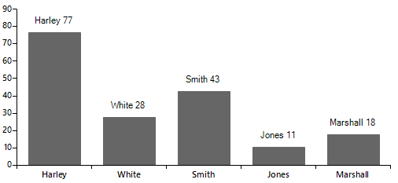
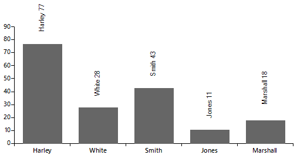

## Environment
 
|Product Version|Product|Author|
|----|----|----|
|2022.2.622|RadChartView for WinForms|[Desislava Yordanova](https://www.telerik.com/blogs/author/desislava-yordanova)|


## Description

The article aims to demonstrate a sample approach how to rotate the labels for the BarSeries. Consider the following example:

````C#  

public RadForm1()
{
    InitializeComponent();
    this.radChartView1.LabelFormatting += RadChartView1_LabelFormatting;
    Telerik.WinControls.UI.BarSeries barSeries = new Telerik.WinControls.UI.BarSeries("Performance", "RepresentativeName");
    barSeries.ShowLabels = true;
    barSeries.DataPoints.Add(new CategoricalDataPoint(77, "Harley"));
    barSeries.DataPoints.Add(new CategoricalDataPoint(28, "White"));
    barSeries.DataPoints.Add(new CategoricalDataPoint(43, "Smith"));
    barSeries.DataPoints.Add(new CategoricalDataPoint(11, "Jones"));
    barSeries.DataPoints.Add(new CategoricalDataPoint(18, "Marshall"));
    this.radChartView1.Series.Add(barSeries);
}

private void RadChartView1_LabelFormatting(object sender, ChartViewLabelFormattingEventArgs e)
{
    CategoricalDataPoint categoricalDataPoint = e.LabelElement.DataPoint as CategoricalDataPoint;
    e.LabelElement.Text = categoricalDataPoint.Category + " " + categoricalDataPoint.Value;
}
        
````
````VB.NET

Sub New()
    InitializeComponent()

    AddHandler Me.RadChartView1.LabelFormatting, AddressOf RadChartView1_LabelFormatting
    Dim barSeries As New Telerik.WinControls.UI.BarSeries("Performance", "RepresentativeName")
    barSeries.ShowLabels = True
    barSeries.DataPoints.Add(New CategoricalDataPoint(77, "Harley"))
    barSeries.DataPoints.Add(New CategoricalDataPoint(28, "White"))
    barSeries.DataPoints.Add(New CategoricalDataPoint(43, "Smith"))
    barSeries.DataPoints.Add(New CategoricalDataPoint(11, "Jones"))
    barSeries.DataPoints.Add(New CategoricalDataPoint(18, "Marshall"))
    Me.RadChartView1.Series.Add(barSeries)


End Sub

Private Sub RadChartView1_LabelFormatting(sender As Object, e As ChartViewLabelFormattingEventArgs)
    Dim categoricalDataPoint As CategoricalDataPoint = TryCast(e.LabelElement.DataPoint, CategoricalDataPoint)
    e.LabelElement.Text = categoricalDataPoint.Category & " " & categoricalDataPoint.Value
End Sub

````

>caption Default BarSeries' labels




## Solution

In order to rotate the labels for the bar elements, it is necessary to use a [custom renderer]() and implement our own **BarLabelElementDrawPart**:

>caution Make sure that you subscribe to the **CreateRenderer** event before populating the chart with data.
 
````C#  

private void RadChartView1_CreateRenderer(object sender, ChartViewCreateRendererEventArgs e)
{
    e.Renderer = new CustomCartesianRenderer(e.Area as CartesianArea);
}

public class CustomCartesianRenderer : CartesianRenderer
{
    public CustomCartesianRenderer(CartesianArea area)
        : base(area)
    {
    }
    protected override void InitializeSeriesLabels()
    {
        base.InitializeSeriesLabels();


        for (int i = 0; i <= this.DrawParts.Count - 1; i++)
        {
            BarLabelElementDrawPart labelPart = this.DrawParts[i] as BarLabelElementDrawPart;
            if (labelPart != null)
                this.DrawParts[i] = new CustomBarLabelElementDrawPart((BarSeries)labelPart.Element, this);
        }
    }
}

public class CustomBarLabelElementDrawPart : BarLabelElementDrawPart
{
    public CustomBarLabelElementDrawPart(BarSeries series, IChartRenderer renderer)
        : base(series, renderer)
    {
    }

    public override void Draw()
    {
        Graphics graphics = this.Renderer.Surface as Graphics;

        RadGdiGraphics radGraphics = new RadGdiGraphics(graphics);

        foreach (DataPointElement dataPointElement in this.Element.Children)
        {
            CategoricalDataPoint categoricalDataPoint = dataPointElement.DataPoint as CategoricalDataPoint;
            RadRect slot = categoricalDataPoint.LayoutSlot;
            RectangleF barBounds = new RectangleF(System.Convert.ToSingle((this.OffsetX + slot.X)), 
                System.Convert.ToSingle((this.OffsetY + slot.Y)), System.Convert.ToSingle(slot.Width), System.Convert.ToSingle(slot.Height));
            float realHeight = barBounds.Height * dataPointElement.HeightAspectRatio;
            barBounds.Y += barBounds.Height - realHeight;
            barBounds.Height = realHeight;
            barBounds = this.AdjustBarDataPointBounds(dataPointElement, barBounds);
            barBounds.Width = Math.Max(barBounds.Width, 1.0F);
            object state = radGraphics.SaveState();
            int horizontalTranslate = System.Convert.ToInt32((barBounds.X + barBounds.Width / (double)2));
            int verticalTranslate = System.Convert.ToInt32((barBounds.Y + barBounds.Height / (double)2));
            float angle = System.Convert.ToSingle(this.Element.LabelRotationAngle) % 360.0F;

            if (angle != 0)
            {
                radGraphics.TranslateTransform(horizontalTranslate, verticalTranslate);
                radGraphics.RotateTransform(angle);
                radGraphics.TranslateTransform(-horizontalTranslate, -verticalTranslate);
            }

            var labelText = categoricalDataPoint.Category + " " + categoricalDataPoint.Value;

            SizeF desiredSize = graphics.MeasureString(labelText, dataPointElement.Font);
            FillPrimitiveImpl fill = new FillPrimitiveImpl(dataPointElement, null);
            fill.PaintFill(radGraphics, 0, System.Drawing.Size.Empty, barBounds);
            BorderPrimitiveImpl border = new BorderPrimitiveImpl(dataPointElement, null);
            border.PaintBorder(radGraphics, 0, System.Drawing.Size.Empty, barBounds);
            StringFormat format = new StringFormat();
            format.Alignment = StringAlignment.Center;

            RectangleF labelRect = new RectangleF(new PointF(barBounds.X + dataPointElement.Padding.Left + 
                (barBounds.Width - desiredSize.Width) / 2, barBounds.Y - desiredSize.Width), new SizeF(desiredSize.Width, desiredSize.Height));

            horizontalTranslate = System.Convert.ToInt32((labelRect.X + labelRect.Width / (double)2));
            verticalTranslate = System.Convert.ToInt32((labelRect.Y + labelRect.Height / (double)2));

            radGraphics.TranslateTransform(horizontalTranslate, verticalTranslate);
            radGraphics.RotateTransform(-90);
            radGraphics.TranslateTransform(-horizontalTranslate, -verticalTranslate);

            graphics.DrawString(labelText, dataPointElement.Font, Brushes.Black, labelRect, format);
            if (angle != 0)
                radGraphics.ResetTransform();

            radGraphics.RestoreState(state);
        }
    }

    private RectangleF AdjustBarDataPointBounds(DataPointElement point, RectangleF bounds)
    {
        RectangleF barBounds = bounds;

        if (point.BorderBoxStyle == BorderBoxStyle.SingleBorder || point.BorderBoxStyle == BorderBoxStyle.OuterInnerBorders)
        {
            barBounds.X += point.BorderWidth - System.Convert.ToInt32(((point.BorderWidth - 1.0F) / (double)2.0F));
            barBounds.Width -= point.BorderWidth;
            barBounds.Y += point.BorderWidth - System.Convert.ToInt32(((point.BorderWidth - 1.0F) / (double)2.0F));
            barBounds.Height -= point.BorderWidth;
        }
        else if (point.BorderBoxStyle == BorderBoxStyle.FourBorders)
        {
            barBounds.Y += 1;
            barBounds.Height -= 1;
            barBounds.X += 1;
            barBounds.Width -= 1;
        }

        if (((CartesianRenderer)this.Renderer).Area.Orientation == System.Windows.Forms.Orientation.Horizontal)
            barBounds.X -= 1;

        return barBounds;
    }
}
         
````
````VB.NET

Private Sub RadChartView1_CreateRenderer(sender As Object, e As ChartViewCreateRendererEventArgs) Handles RadChartView1.CreateRenderer
    e.Renderer = New CustomCartesianRenderer(TryCast(e.Area, CartesianArea))

End Sub

Public Class CustomCartesianRenderer
    Inherits CartesianRenderer

    Public Sub New(ByVal area As CartesianArea)
        MyBase.New(area)
    End Sub
    Protected Overrides Sub InitializeSeriesLabels()
        MyBase.InitializeSeriesLabels()


        For i As Integer = 0 To Me.DrawParts.Count - 1
            Dim labelPart As BarLabelElementDrawPart = TryCast(Me.DrawParts(i), BarLabelElementDrawPart)
            If labelPart IsNot Nothing Then

                Me.DrawParts(i) = New CustomBarLabelElementDrawPart(CType(labelPart.Element, BarSeries), Me)
            End If
        Next
    End Sub
End Class

Public Class CustomBarLabelElementDrawPart
    Inherits BarLabelElementDrawPart

    Public Sub New(ByVal series As BarSeries, ByVal renderer As IChartRenderer)
        MyBase.New(series, renderer)
    End Sub

    Public Overrides Sub Draw()
        Dim graphics As Graphics = TryCast(Me.Renderer.Surface, Graphics)

        Dim radGraphics As RadGdiGraphics = New RadGdiGraphics(graphics)

        For Each dataPointElement As DataPointElement In Me.Element.Children
            Dim categoricalDataPoint As CategoricalDataPoint = TryCast(dataPointElement.DataPoint, CategoricalDataPoint) 
            Dim slot As RadRect = categoricalDataPoint.LayoutSlot
            Dim barBounds As RectangleF = New RectangleF(CSng((Me.OffsetX + slot.X)), CSng((Me.OffsetY + slot.Y)), CSng(slot.Width), CSng(slot.Height))
            Dim realHeight As Single = barBounds.Height * dataPointElement.HeightAspectRatio
            barBounds.Y += barBounds.Height - realHeight
            barBounds.Height = realHeight
            barBounds = Me.AdjustBarDataPointBounds(dataPointElement, barBounds)
            barBounds.Width = Math.Max(barBounds.Width, 1.0F)
            Dim state As Object = radGraphics.SaveState()
            Dim horizontalTranslate As Integer = CInt((barBounds.X + barBounds.Width / 2))
            Dim verticalTranslate As Integer = CInt((barBounds.Y + barBounds.Height / 2))
            Dim angle As Single = CSng(Me.Element.LabelRotationAngle) Mod 360.0F

            If angle <> 0 Then
                radGraphics.TranslateTransform(horizontalTranslate, verticalTranslate)
                radGraphics.RotateTransform(angle)
                radGraphics.TranslateTransform(-horizontalTranslate, -verticalTranslate)
            End If

            Dim labelText = categoricalDataPoint.Category & " " & categoricalDataPoint.Value

            Dim desiredSize As SizeF = graphics.MeasureString(labelText, dataPointElement.Font)
            Dim fill As FillPrimitiveImpl = New FillPrimitiveImpl(dataPointElement, Nothing)
            fill.PaintFill(radGraphics, 0, System.Drawing.Size.Empty, barBounds)
            Dim border As BorderPrimitiveImpl = New BorderPrimitiveImpl(dataPointElement, Nothing)
            border.PaintBorder(radGraphics, 0, System.Drawing.Size.Empty, barBounds) 
            Dim format As StringFormat = New StringFormat()
            format.Alignment = StringAlignment.Center

            Dim labelRect As New RectangleF(New PointF(barBounds.X + dataPointElement.Padding.Left + (barBounds.Width - desiredSize.Width) / 2,
                                                       barBounds.Y - desiredSize.Width),
                                            New SizeF(desiredSize.Width, desiredSize.Height))

            horizontalTranslate = CInt((labelRect.X + labelRect.Width / 2))
            verticalTranslate = CInt((labelRect.Y + labelRect.Height / 2))

            radGraphics.TranslateTransform(horizontalTranslate, verticalTranslate)
            radGraphics.RotateTransform(-90)
            radGraphics.TranslateTransform(-horizontalTranslate, -verticalTranslate)

            graphics.DrawString(labelText, dataPointElement.Font, Brushes.Black, labelRect, format) 
            If angle <> 0 Then
                radGraphics.ResetTransform()
            End If

            radGraphics.RestoreState(state)
        Next 
    End Sub

    Private Function AdjustBarDataPointBounds(ByVal point As DataPointElement, ByVal bounds As RectangleF) As RectangleF
        Dim barBounds As RectangleF = bounds

        If point.BorderBoxStyle = BorderBoxStyle.SingleBorder OrElse point.BorderBoxStyle = BorderBoxStyle.OuterInnerBorders Then
            barBounds.X += point.BorderWidth - CInt(((point.BorderWidth - 1.0F) / 2.0F))
            barBounds.Width -= point.BorderWidth
            barBounds.Y += point.BorderWidth - CInt(((point.BorderWidth - 1.0F) / 2.0F))
            barBounds.Height -= point.BorderWidth
        ElseIf point.BorderBoxStyle = BorderBoxStyle.FourBorders Then
            barBounds.Y += 1
            barBounds.Height -= 1
            barBounds.X += 1
            barBounds.Width -= 1
        End If

        If (CType(Me.Renderer, CartesianRenderer)).Area.Orientation = System.Windows.Forms.Orientation.Horizontal Then
            barBounds.X -= 1
        End If

        Return barBounds
    End Function 
End Class

````

>caption Rotated BarSeries' labels



# See Also

* [BarSeries]()
* [Custom Rendering]()
