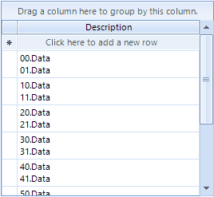
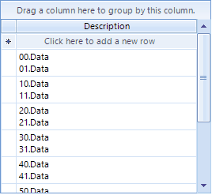
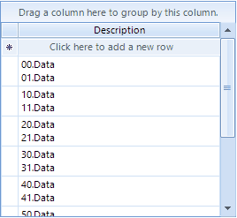

## Environment
|Product Version|Product|Author|
|----|----|----|
|2021.2.511|RadGridView|[Desislava Yordanova](https://www.telerik.com/blogs/author/desislava-yordanova)|

## Description

The RadGridView.**AutoSizeRows** property controls whether row's height in a **RadGridView** will expand for multiline cell text if the column is wrapped. However, note that when a cell is in edit mode and you are typing in the editor, this value is not committed to the cell yet. That is why the row's height is not updated until you commit the editor's value: 
 


## Solution

This solution demonstrates how to disable the rows auto sizing when the editor is activated and the row's height is adjusted by the **MinHeight** property in order to ensure that the whole multiline text inside the editor is visible: 




````C#

public RadForm1()
{
    InitializeComponent();

    GridViewTextBoxColumn textColumn = new GridViewTextBoxColumn("Description");
    this.radGridView1.Columns.Add(textColumn);
    textColumn.WrapText = true;
    this.radGridView1.AutoSizeRows = true;
    this.radGridView1.AutoSizeColumnsMode = GridViewAutoSizeColumnsMode.Fill;

    this.radGridView1.BeginUpdate();
    for (int i = 0; i < 10; i++)
    {
        this.radGridView1.Rows.Add(i + "0.Data" + Environment.NewLine + i + "1.Data");
    }
    this.radGridView1.EndUpdate();

    this.radGridView1.CellEditorInitialized += radGridView1_CellEditorInitialized;
    this.radGridView1.CellEndEdit += radGridView1_CellEndEdit;
}

private void radGridView1_CellEndEdit(object sender, GridViewCellEventArgs e)
{
    this.radGridView1.AutoSizeRows = true;
}

private void radGridView1_CellEditorInitialized(object sender, GridViewCellEventArgs e)
{
    this.radGridView1.AutoSizeRows = false;
    RadTextBoxEditor tbEditor = e.ActiveEditor as RadTextBoxEditor;
    if (tbEditor != null)
    {
        tbEditor.Multiline = true;
        tbEditor.AcceptsReturn = true;
        RadTextBoxEditorElement el = tbEditor.EditorElement as RadTextBoxEditorElement;
        if (el != null)
        {
            if (textHeight == -1)
            {
                using (Graphics g = el.TextBoxItem.TextBoxControl.CreateGraphics())
                {
                    textHeight = TextRenderer.MeasureText(g, el.TextBoxItem.HostedControl.Text.Substring(0,el.Text.IndexOf(Environment.NewLine)), el.TextBoxItem.HostedControl.Font).Height;
                }
            }
            el.TextBoxItem.TextBoxControl.TextChanged -= TextBoxControl_TextChanged;
            el.TextBoxItem.TextBoxControl.TextChanged += TextBoxControl_TextChanged;

            this.radGridView1.CurrentRow.MinHeight = this.radGridView1.CurrentRow.Height = ( el.TextBoxItem.TextBoxControl.Lines.Length+1)* textHeight;
        }
    }
}

int textHeight = -1;

private void TextBoxControl_TextChanged(object sender, EventArgs e)
{
    HostedTextBoxBase tb = sender as HostedTextBoxBase;
    if (tb != null)
    {
        this.radGridView1.CurrentRow.MinHeight = this.radGridView1.CurrentRow.Height=( tb.Lines.Length+1)* textHeight;
    }
}


````
````VB.NET

Public Sub New()
    InitializeComponent()
    Dim textColumn As GridViewTextBoxColumn = New GridViewTextBoxColumn("Description")
    Me.RadGridView1.Columns.Add(textColumn)
    textColumn.WrapText = True
    Me.RadGridView1.AutoSizeRows = True
    Me.RadGridView1.AutoSizeColumnsMode = GridViewAutoSizeColumnsMode.Fill
    Me.RadGridView1.BeginUpdate()

    For i As Integer = 0 To 10 - 1
        Me.RadGridView1.Rows.Add(i & "0.Data" & Environment.NewLine & i & "1.Data")
    Next

    Me.RadGridView1.EndUpdate()
    AddHandler Me.RadGridView1.CellEditorInitialized, AddressOf radGridView1_CellEditorInitialized
    AddHandler Me.RadGridView1.CellEndEdit, AddressOf radGridView1_CellEndEdit
End Sub

Private Sub radGridView1_CellEndEdit(ByVal sender As Object, ByVal e As GridViewCellEventArgs)
    Me.RadGridView1.AutoSizeRows = True
End Sub

Private Sub radGridView1_CellEditorInitialized(ByVal sender As Object, ByVal e As GridViewCellEventArgs)
    Me.RadGridView1.AutoSizeRows = False
    Dim tbEditor As RadTextBoxEditor = TryCast(e.ActiveEditor, RadTextBoxEditor)

    If tbEditor IsNot Nothing Then
        tbEditor.Multiline = True
        tbEditor.AcceptsReturn = True
        Dim el As RadTextBoxEditorElement = TryCast(tbEditor.EditorElement, RadTextBoxEditorElement)

        If el IsNot Nothing Then

            If textHeight = -1 Then

                Using g As Graphics = el.TextBoxItem.TextBoxControl.CreateGraphics()
                    textHeight = TextRenderer.MeasureText(g, el.TextBoxItem.HostedControl.Text.Substring(0, _
                        el.Text.IndexOf(Environment.NewLine)), el.TextBoxItem.HostedControl.Font).Height
                End Using
            End If

            RemoveHandler el.TextBoxItem.TextBoxControl.TextChanged, AddressOf TextBoxControl_TextChanged
            AddHandler el.TextBoxItem.TextBoxControl.TextChanged, AddressOf TextBoxControl_TextChanged

            Me.RadGridView1.CurrentRow.MinHeight = (el.TextBoxItem.TextBoxControl.Lines.Length + 1) * textHeight
            Me.RadGridView1.CurrentRow.Height = (el.TextBoxItem.TextBoxControl.Lines.Length + 1) * textHeight
        End If
    End If
End Sub

Private textHeight As Integer = -1

Private Sub TextBoxControl_TextChanged(ByVal sender As Object, ByVal e As EventArgs)
    Dim tb As HostedTextBoxBase = TryCast(sender, HostedTextBoxBase)

    If tb IsNot Nothing Then
        Me.RadGridView1.CurrentRow.MinHeight = (tb.Lines.Length + 1) * textHeight
        Me.RadGridView1.CurrentRow.Height = (tb.Lines.Length + 1) * textHeight
    End If
End Sub

````

However, if there is not any specific validation logic and it is not a problem to commit the editor's value immediately after typing, it is possible to use a very simple solution by handling the **ValueChanging** event that RadGridView offers and updating the cell's value accordingly. Thus, you can keep the rows autositing enabled:



````C#
public RadForm1()
{
    InitializeComponent();

    GridViewTextBoxColumn textColumn = new GridViewTextBoxColumn("Description");
    this.radGridView1.Columns.Add(textColumn);
    textColumn.WrapText = true;
    this.radGridView1.AutoSizeRows = true;
    this.radGridView1.AutoSizeColumnsMode = GridViewAutoSizeColumnsMode.Fill;

    this.radGridView1.BeginUpdate();
    for (int i = 0; i < 10; i++)
    {
        this.radGridView1.Rows.Add(i + "0.Data" + Environment.NewLine + i + "1.Data");
    }
    this.radGridView1.EndUpdate();

    this.radGridView1.CellEditorInitialized += radGridView1_CellEditorInitialized;

    this.radGridView1.ValueChanging += radGridView1_ValueChanging;
}

private void radGridView1_ValueChanging(object sender, ValueChangingEventArgs e)
{
    this.radGridView1.CurrentCell.Value = e.NewValue;
}

private void radGridView1_CellEditorInitialized(object sender, GridViewCellEventArgs e)
{
    RadTextBoxEditor tbEditor = e.ActiveEditor as RadTextBoxEditor;
    if (tbEditor != null)
    {
        tbEditor.Multiline = true;
        tbEditor.AcceptsReturn = true;
    }
}

````
````VB.NET
Public Sub New()
    InitializeComponent()
    Dim textColumn As GridViewTextBoxColumn = New GridViewTextBoxColumn("Description")
    Me.radGridView1.Columns.Add(textColumn)
    textColumn.WrapText = True
    Me.radGridView1.AutoSizeRows = True
    Me.radGridView1.AutoSizeColumnsMode = GridViewAutoSizeColumnsMode.Fill
    Me.radGridView1.BeginUpdate()

    For i As Integer = 0 To 10 - 1
        Me.RadGridView1.Rows.Add(i & "0.Data" & Environment.NewLine & i & "1.Data")
    Next

    Me.radGridView1.EndUpdate()
    AddHandler Me.RadGridView1.CellEditorInitialized, AddressOf radGridView1_CellEditorInitialized
    AddHandler Me.RadGridView1.ValueChanging, AddressOf radGridView1_ValueChanging
End Sub

Private Sub radGridView1_ValueChanging(ByVal sender As Object, ByVal e As ValueChangingEventArgs)
    Me.radGridView1.CurrentCell.Value = e.NewValue
End Sub

Private Sub radGridView1_CellEditorInitialized(ByVal sender As Object, ByVal e As GridViewCellEventArgs)
    Dim tbEditor As RadTextBoxEditor = TryCast(e.ActiveEditor, RadTextBoxEditor)

    If tbEditor IsNot Nothing Then
        tbEditor.Multiline = True
        tbEditor.AcceptsReturn = True
    End If
End Sub

````

# See Also

* [Resizing rows]()

