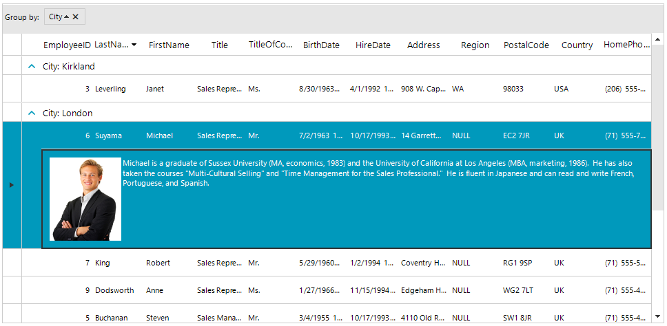

## Environment
 
|Product Version|Product|Author|
|----|----|----|
|2023.2.718|RadGridView for WinForms|[Desislava Yordanova](https://www.telerik.com/blogs/author/desislava-yordanova)|
 

## Description

This tutorial demonstrates a sample approach how to achieve row details functionality in RadGridView: 

 

## Solution 

A complete solution providing a C# and VB.NET project is available [here](https://github.com/telerik/winforms-sdk/tree/master/GridView/RowDetailsInGridView).

# See Also

* [Grouping]()
* [Summary Rows]() 

