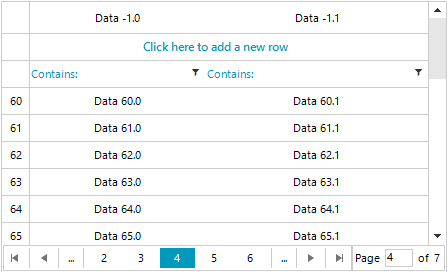

## Environment
 
|Product Version|Product|Author|
|----|----|----|
|2020.1.113|RadVirtualGrid for WinForms|[Desislava Yordanova](https://www.telerik.com/blogs/author/desislava-yordanova)|
 
## Description

This article shows how to display row numbers in **RadVirtualGrid**.



## Solution 

It is necessary to handle the **CellFormatting** event and show the **RowIndex** in the row header:
 

````C#
 
        public RadForm1()
        {
            InitializeComponent();

            this.radVirtualGrid1.RowCount = 130;
            this.radVirtualGrid1.ColumnCount = 2;
            this.radVirtualGrid1.CellValueNeeded += radVirtualGrid1_CellValueNeeded;
            this.radVirtualGrid1.CellFormatting += radVirtualGrid1_CellFormatting;
            this.radVirtualGrid1.EnablePaging = true;
            this.radVirtualGrid1.PageSize = 20;
        }
        
        private void radVirtualGrid1_CellFormatting(object sender, VirtualGridCellElementEventArgs e)
        {
            if (e.CellElement.ColumnIndex < 0 && e.CellElement.RowIndex > -1)
            {
                e.CellElement.DrawText = true; 
                e.CellElement.Text = e.CellElement.RowIndex.ToString();
            }
            else
            {
                e.CellElement.ResetValue(LightVisualElement.DrawTextProperty, ValueResetFlags.Local);
            }
        }

        private void radVirtualGrid1_CellValueNeeded(object sender, VirtualGridCellValueNeededEventArgs e)
        {
            e.Value = "Data " + e.RowIndex + "." + e.ColumnIndex;
        }
        
````
````VB.NET

 Public Sub New()
    InitializeComponent()
    Me.RadVirtualGrid1.RowCount = 130
    Me.RadVirtualGrid1.ColumnCount = 2
    AddHandler Me.RadVirtualGrid1.CellValueNeeded, AddressOf radVirtualGrid1_CellValueNeeded
    AddHandler Me.RadVirtualGrid1.CellFormatting, AddressOf radVirtualGrid1_CellFormatting
    Me.RadVirtualGrid1.EnablePaging = True
    Me.RadVirtualGrid1.PageSize = 20
End Sub

Private Sub radVirtualGrid1_CellFormatting(ByVal sender As Object, ByVal e As VirtualGridCellElementEventArgs)
    If e.CellElement.ColumnIndex < 0 AndAlso e.CellElement.RowIndex > -1 Then
        e.CellElement.DrawText = True
        e.CellElement.Text = e.CellElement.RowIndex.ToString()
    Else
        e.CellElement.ResetValue(LightVisualElement.DrawTextProperty, ValueResetFlags.Local)
    End If
End Sub

Private Sub radVirtualGrid1_CellValueNeeded(ByVal sender As Object, ByVal e As VirtualGridCellValueNeededEventArgs)
    e.Value = "Data " & e.RowIndex & "." & e.ColumnIndex
End Sub


```` 


    
   
  
    
 
