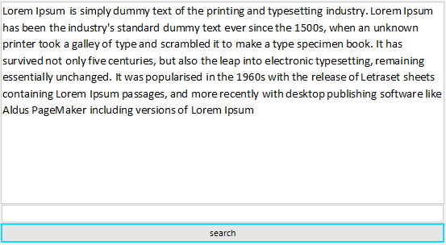

## Environment
 
|Product Version|Product|Author|
|----|----|----|
|2022.1.222|RadRichTextEditor for WinForms|[Desislava Yordanova](https://www.telerik.com/blogs/author/desislava-yordanova)|


## Description

This article demonstrates a sample approach how to search for a certain text in the rich-text document and highlight the find matches:
 


## Solution

The example contains a **RadRichTextEditor** for displaying the rich-text content, a **RadTextBox** for the search pattern and a RadButton to trigger the highlight action.

We will use [DocumentTextSearch]() for finding all the **TextRanges** that match the search pattern. For each found range we will make a [selection]() and highlight the selection with red forecolor and yellow background:

````C#     
       
public Form1()
{
    InitializeComponent();
    IDocumentFormatProvider provider = new DocxFormatProvider();
    using (FileStream stream = new FileStream(@"..\..\..\sample.docx", FileMode.Open))
    {
        this.radRichTextEditor1.Document = provider.Import(stream);
    }

    this.radRichTextEditor1.LayoutMode = DocumentLayoutMode.Flow; 
}

private void radButton1_Click(object sender, EventArgs e)
{
    string textToReplace= this.radTextBox1.Text;
     
    DocumentTextSearch search = new DocumentTextSearch(this.radRichTextEditor1.Document);
    IEnumerable<TextRange> foundRanges = search.FindAll(this.radTextBox1.Text);
    if (textToReplace != string.Empty)
    {
        foreach (var textRange in foundRanges)
        {
            this.radRichTextEditor1.Document.Selection.Clear();
            this.radRichTextEditor1.Document.Selection.AddSelectionStart(textRange.StartPosition);
            this.radRichTextEditor1.Document.Selection.AddSelectionEnd(textRange.EndPosition);
            string selectedText = this.radRichTextEditor1.Document.Selection.GetSelectedText();
            this.radRichTextEditor1.ChangeTextHighlightColor(Color.Yellow);
            this.radRichTextEditor1.ChangeTextForeColor(Color.Red);
        }
        this.radRichTextEditor1.Document.Selection.Clear();
    }
}

````
````VB.NET

Sub New() 
    InitializeComponent()

    Dim provider As IDocumentFormatProvider = New DocxFormatProvider()

    Using stream As FileStream = New FileStream("..\..\sample.docx", FileMode.Open)
        Me.RadRichTextEditor1.Document = provider.Import(stream)
    End Using

    Me.RadRichTextEditor1.LayoutMode = DocumentLayoutMode.Flow 
End Sub

Private Sub RadButton1_Click(sender As Object, e As EventArgs) Handles RadButton1.Click
    Dim textToReplace As String = Me.RadTextBox1.Text
    Dim search As DocumentTextSearch = New DocumentTextSearch(Me.RadRichTextEditor1.Document)
    Dim foundRanges As IEnumerable(Of TextRange) = search.FindAll(Me.RadTextBox1.Text)

    If textToReplace <> String.Empty Then

        For Each textRange In foundRanges
            Me.RadRichTextEditor1.Document.Selection.Clear()
            Me.RadRichTextEditor1.Document.Selection.AddSelectionStart(textRange.StartPosition)
            Me.RadRichTextEditor1.Document.Selection.AddSelectionEnd(textRange.EndPosition)
            Dim selectedText As String = Me.RadRichTextEditor1.Document.Selection.GetSelectedText()
            Me.RadRichTextEditor1.ChangeTextHighlightColor(Color.Yellow)
            Me.RadRichTextEditor1.ChangeTextForeColor(Color.Red) 
        Next

        Me.RadRichTextEditor1.Document.Selection.Clear()
    End If
End Sub 

````

# See Also

* [Search]()
* [Selection]()