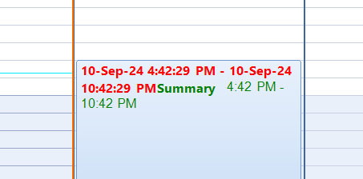

## Environment

|Product Version|Product|Author|
|----|----|----|
|2024.3.806|RadGridView for WinForms|[Dinko Krastev](https://www.telerik.com/blogs/author/dinko-krastev)|

## Description

Customizing the text in the appointment element is possible through the __AppointmentFormatting__ event of the RadScheduler control. Inside the event, you can pass an HTML text format and customize the text per your requirements. However, the time part inside the text is painted on the appointment. This way you can't directly access and customize the font size, color, etc. of the time part.



## Solution

To customize the background and text colors of `AppointmentElement` time range text, a custom appointment element approach is required.

### Implementing a Custom Appointment Element

Create a custom appointment element by extending the `AppointmentElement` class. Override the `CreateAppointmentText` method to customize the text appearance, including the font and color of the time range:

````C#
public partial class CustomAppElement : AppointmentElement
{
    public CustomAppElement(RadScheduler scheduler, SchedulerView view, IEvent appointment) : base(scheduler, view, appointment)
    {
    }

    private Font dateTimeFont = new Font("Arial", 12);
    private Color dateTimeColor = Color.Green;

    protected override string CreateAppointmentText()
    {
        CultureInfo schedulerCulture = this.Scheduler.Culture;
        IEvent app = this.Appointment;
        string newLine = string.Empty;
        string separator = string.Empty;
        if (!string.IsNullOrEmpty(this.AppointmentLocation))
        {
            if (this.Bounds.Height > 36)
                newLine = "<br/>";
            else
                separator = ";";
        }

        var titleFormatter = (new AppointmentTitleFormatterFactory()).Create(View.ViewType);
        object[] params = new object[] {
            this.View.DefaultTimeZone.OffsetTime(app.Start, this.Scheduler.SystemTimeZone),
            this.View.DefaultTimeZone.OffsetTime(app.End, this.Scheduler.SystemTimeZone),
            this.AppointmentSubject + separator,
            this.AppointmentLocation,
            "<span " + this.CreateStyleAttributeByFontAndColor() + ">",
            "</span>",
            "<b>",
            "</b>",
            newLine
        };
        string topText = string.Format(schedulerCulture, titleFormatter.GetTitleFormat(this, this.View, this.Scheduler), params);
        return topText;
    }

    private string CreateStyleAttributeByFontAndColor()
    {
        StringBuilder styleBuilder = new StringBuilder();
        styleBuilder.Append("style=\"");

        styleBuilder.Append("font-family: ");
        styleBuilder.Append(dateTimeFont.FontFamily.Name);
        styleBuilder.Append("; ");
        styleBuilder.Append("font-size: ");
        styleBuilder.Append(dateTimeFont.Size.ToString((IFormatProvider)NumberFormatInfo.InvariantInfo));
        styleBuilder.Append("; ");
        styleBuilder.Append("color: #");
        styleBuilder.Append(this.dateTimeColor.R.ToString("X2"));
        styleBuilder.Append(this.dateTimeColor.G.ToString("X2"));
        styleBuilder.Append(this.dateTimeColor.B.ToString("X2"));
        styleBuilder.Append("\"");
        return styleBuilder.ToString();
    }
}
````

### Applying the Custom Appointment Element

Refer to the [Custom Appointment Element](https://docs.telerik.com/devtools/winforms/controls/scheduler/appointments-and-dialogs/custom-appointment-element) documentation to learn how to replace the default `AppointmentElement` with your custom implementation in the RadScheduler control.

## See Also

- [RadScheduler Overview](https://docs.telerik.com/devtools/winforms/controls/scheduler/overview)
- [Appointment Formatting in RadScheduler](https://docs.telerik.com/devtools/winforms/controls/scheduler/appointments-and-dialogs/appointment-formatting)
- [Custom Appointment Element Documentation](https://docs.telerik.com/devtools/winforms/controls/scheduler/appointments-and-dialogs/custom-appointment-element)
