## Environment
 
|Product Version|Product|Author|
|----|----|----|
|2020.3.1020|RadScheduler for WinForms|[Desislava Yordanova](https://www.telerik.com/blogs/author/desislava-yordanova)|
 
## Description

This tutorial will provide a full guidance for binding **RadScheduler** to a database from a local SQL server. It will cover the following cases:

* Binding **Appointments** and **Resources** to display the relevant events for the currently displayed resources
* Grouping by resources
* Saving the changes made in **RadScheduler** to the SQL server
* Creating recurring appointments and storing any exceptions to the recurrence

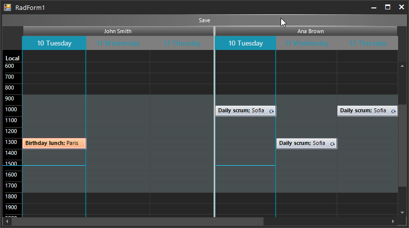

## Solution 

Follow the steps:

1\. Let’s start from scratch with an empty form:


 
2\. Drag a **RadScheduler** from the toolbox and drop it to the form:

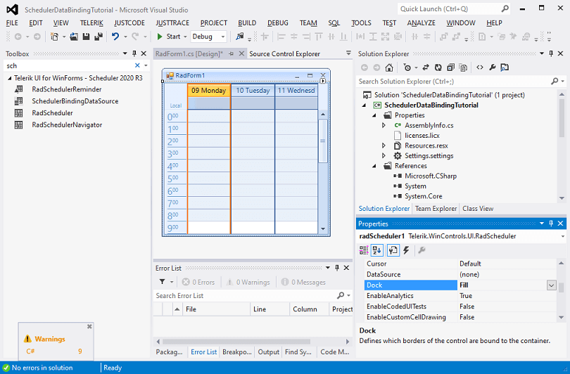

3\. Drag a **SchedulerBindingDataSource** from the toolbox and drop it onto the form:

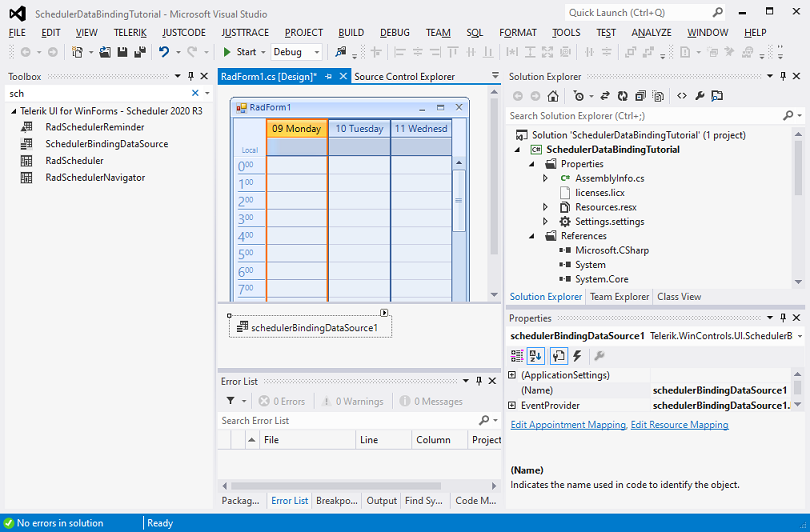

4\. Meanwhile, use the SQL scripts from the online documentation to create a Sample Database in the local SQL server that you have: [Sample Database](). As a result, you will have 3 empty tables:

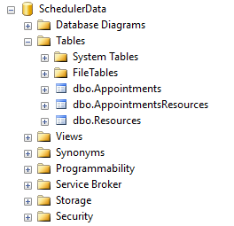

5\. Open the **Smart tag** for the **SchedulerBindingDataSource** and trigger the *Data Source Configuration Wizard* to generate the BindingSources for the three tables from the SQL server:

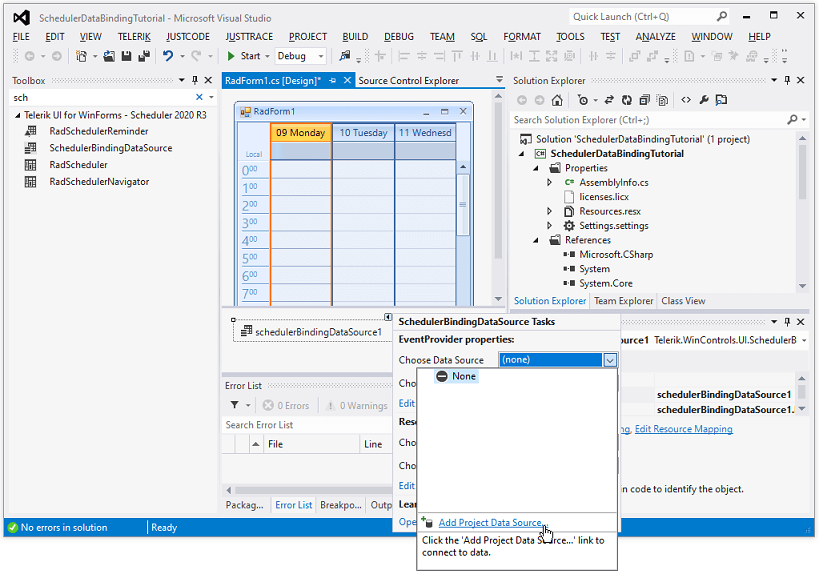

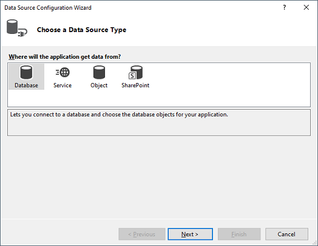

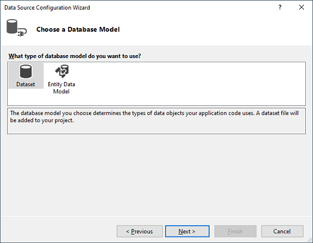

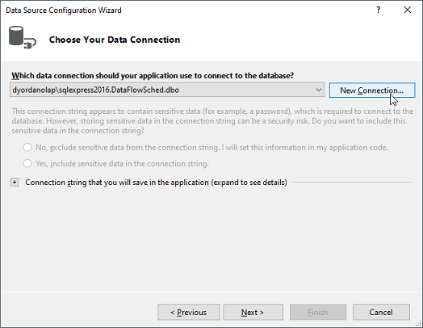

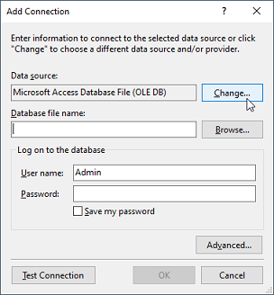

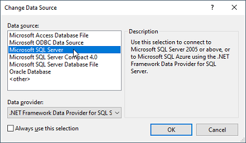

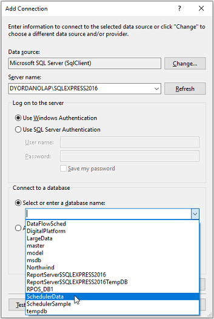

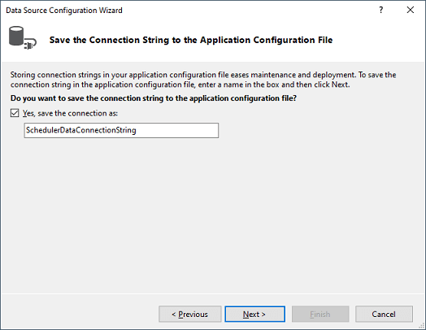

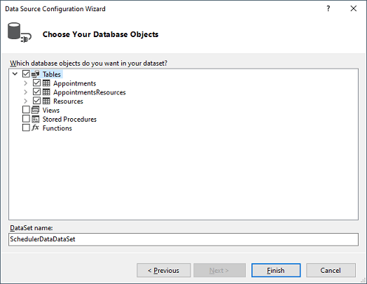

6\. Now, generate the **BindingSources** for each of the tables in the DataSet:

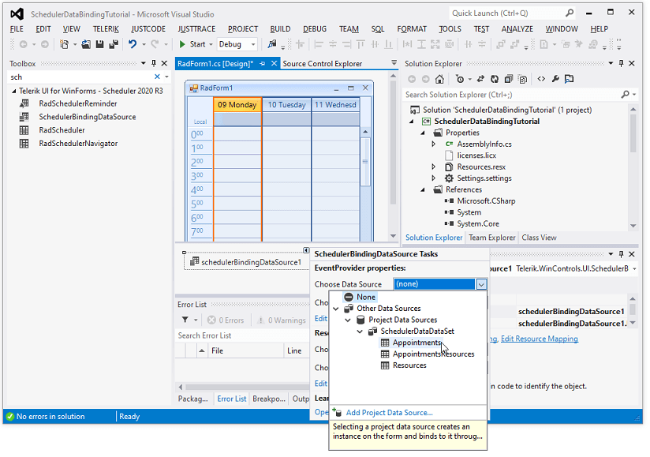

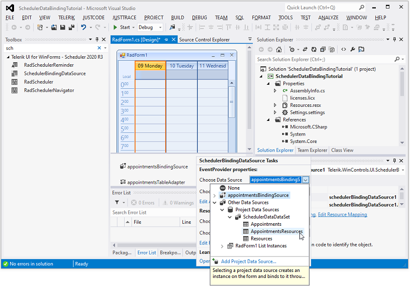

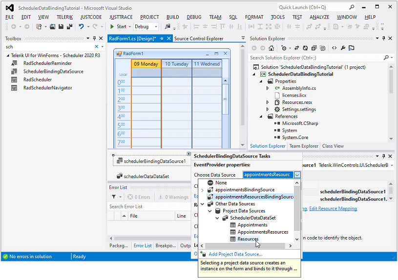

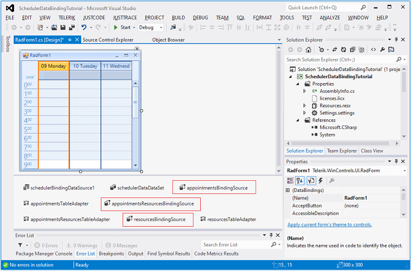


7\. Setup the AppointmentMappingInfo and ResourceMappingInfo in such a way to map the Appointment’s and Resource’s properties with the respective ones from the tables in the SQL server:

#### Setup the data binding

````C#

AppointmentMappingInfo appointmentMappingInfo = new AppointmentMappingInfo();
appointmentMappingInfo.BackgroundId = "BackgroundId";
appointmentMappingInfo.Description = "Description";
appointmentMappingInfo.End = "End";
appointmentMappingInfo.Location = "Location";
appointmentMappingInfo.MasterEventId = "MasterEventId";
appointmentMappingInfo.RecurrenceRule = "RecurrenceRule";
appointmentMappingInfo.ResourceId = "ResourceID";
appointmentMappingInfo.Exceptions = "Appointments_Appointments";
appointmentMappingInfo.Resources = "AppointmentsResources_Appointments";
appointmentMappingInfo.Start = "Start";
appointmentMappingInfo.StatusId = "StatusID";
appointmentMappingInfo.Summary = "Summary";
schedulerBindingDataSource1.EventProvider.Mapping = appointmentMappingInfo;
ResourceMappingInfo resourceMappingInfo = new ResourceMappingInfo();
resourceMappingInfo.Id = "ID";
resourceMappingInfo.Name = "Name";
this.schedulerBindingDataSource1.ResourceProvider.Mapping = resourceMappingInfo;

schedulerBindingDataSource1.ResourceProvider.DataSource = schedulerDataDataSet.Resources;
schedulerBindingDataSource1.EventProvider.DataSource = schedulerDataDataSet.Appointments;
radScheduler1.DataSource = schedulerBindingDataSource1;

this.radScheduler1.GroupType = GroupType.Resource;

````
````VB.NET
	
Dim appointmentMappingInfo As AppointmentMappingInfo = New AppointmentMappingInfo()
appointmentMappingInfo.BackgroundId = "BackgroundId"
appointmentMappingInfo.Description = "Description"
appointmentMappingInfo.[End] = "End"
appointmentMappingInfo.Location = "Location"
appointmentMappingInfo.MasterEventId = "MasterEventId"
appointmentMappingInfo.RecurrenceRule = "RecurrenceRule"
appointmentMappingInfo.ResourceId = "ResourceID"
appointmentMappingInfo.Exceptions = "Appointments_Appointments"
appointmentMappingInfo.Resources = "AppointmentsResources_Appointments"
appointmentMappingInfo.Start = "Start"
appointmentMappingInfo.StatusId = "StatusID"
appointmentMappingInfo.Summary = "Summary"
SchedulerBindingDataSource1.EventProvider.Mapping = appointmentMappingInfo
Dim resourceMappingInfo As ResourceMappingInfo = New ResourceMappingInfo()
resourceMappingInfo.Id = "ID"
resourceMappingInfo.Name = "Name"
Me.SchedulerBindingDataSource1.ResourceProvider.Mapping = resourceMappingInfo
SchedulerBindingDataSource1.ResourceProvider.DataSource = schedulerDataDataSet.Resources
SchedulerBindingDataSource1.EventProvider.DataSource = schedulerDataDataSet.Appointments
RadScheduler1.DataSource = SchedulerBindingDataSource1
Me.RadScheduler1.GroupType = GroupType.Resource

````

8\. The AppointmentMappingInfo.**Resources** property should be set to the relation name between the **Appointments** and **AppointmentResources** table:

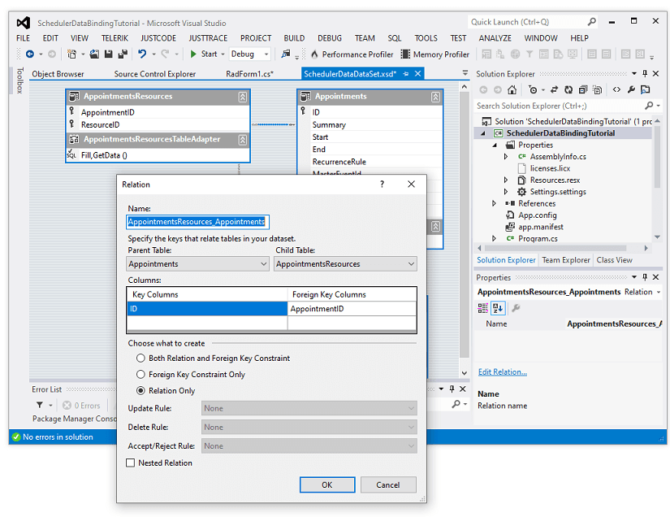

9\. RadScheduler supports [recurring appointments](). When you edit an occurrence, it will create an exception event. It is necessary to create a new relation in the .xsd for the **Appointment** table from its **ID** property to the **MasterEventId** property and set the AppointmentMappingInfo.**Exceptions** field to the name of the relation:

 

10\. The last thing we need to do is to save the changes made in **RadScheduler** to the server. This will be performed in RadButton.**Click** event handler:

#### Save the changes to the database

````C#

private void radButton1_Click(object sender, EventArgs e)
{
    appointmentsResourcesTableAdapter.Adapter.AcceptChangesDuringUpdate = false;
    SchedulerDataDataSet.AppointmentsResourcesDataTable deletedRelationRecords =
        this.schedulerDataDataSet.AppointmentsResources.GetChanges(DataRowState.Deleted)
        as SchedulerDataDataSet.AppointmentsResourcesDataTable;
    SchedulerDataDataSet.AppointmentsResourcesDataTable newRelationRecords =
        this.schedulerDataDataSet.AppointmentsResources.GetChanges(DataRowState.Added)
        as SchedulerDataDataSet.AppointmentsResourcesDataTable;
    SchedulerDataDataSet.AppointmentsResourcesDataTable modifiedRelationRecords =
        this.schedulerDataDataSet.AppointmentsResources.GetChanges(DataRowState.Modified)
        as SchedulerDataDataSet.AppointmentsResourcesDataTable;
    SchedulerDataDataSet.AppointmentsDataTable newAppointmentRecords =
        this.schedulerDataDataSet.Appointments.GetChanges(DataRowState.Added) as SchedulerDataDataSet.AppointmentsDataTable;
    SchedulerDataDataSet.AppointmentsDataTable deletedAppointmentRecords =
        this.schedulerDataDataSet.Appointments.GetChanges(DataRowState.Deleted) as SchedulerDataDataSet.AppointmentsDataTable;
    SchedulerDataDataSet.AppointmentsDataTable modifiedAppointmentRecords =
        this.schedulerDataDataSet.Appointments.GetChanges(DataRowState.Modified) as SchedulerDataDataSet.AppointmentsDataTable;
    try
    {
        if (newAppointmentRecords != null)
        {
            Dictionary<int, int> newAppointmentIds = new Dictionary<int, int>();
            Dictionary<object, int> oldAppointmentIds = new Dictionary<object, int>();
            for (int i = 0; i < newAppointmentRecords.Count; i++)
            {
                oldAppointmentIds.Add(newAppointmentRecords[i], newAppointmentRecords[i].ID);
            }
            appointmentsTableAdapter.Update(newAppointmentRecords);
            for (int i = 0; i < newAppointmentRecords.Count; i++)
            {
                newAppointmentIds.Add(oldAppointmentIds[newAppointmentRecords[i]], newAppointmentRecords[i].ID);
            }
            if (newRelationRecords != null)
            {
                for (int i = 0; i < newRelationRecords.Count; i++)
                {
                    newRelationRecords[i].AppointmentID = newAppointmentIds[newRelationRecords[i].AppointmentID];
                }
            }
        }
        if (deletedRelationRecords != null)
        {
            appointmentsResourcesTableAdapter.Update(deletedRelationRecords);
        }
        if (deletedAppointmentRecords != null)
        {
            appointmentsTableAdapter.Update(deletedAppointmentRecords);
        }
        if (modifiedAppointmentRecords != null)
        {
            appointmentsTableAdapter.Update(modifiedAppointmentRecords);
        }
        if (newRelationRecords != null)
        {
            appointmentsResourcesTableAdapter.Update(newRelationRecords);
        }
        if (modifiedRelationRecords != null)
        {
            appointmentsResourcesTableAdapter.Update(modifiedRelationRecords);
        }
        this.schedulerDataDataSet.AcceptChanges();
    }
    catch (Exception ex)
    {
        MessageBox.Show(string.Format("An error occurred during the update process:\n{0}", ex.Message));
    }
    finally
    {
        if (deletedRelationRecords != null)
        {
            deletedRelationRecords.Dispose();
        }
        if (newRelationRecords != null)
        {
            newRelationRecords.Dispose();
        }
        if (modifiedRelationRecords != null)
        {
            modifiedRelationRecords.Dispose();
        }
    }
}

````
````VB.NET

Private Sub RadButton1_Click(sender As Object, e As EventArgs) Handles RadButton1.Click
    AppointmentsResourcesTableAdapter.Adapter.AcceptChangesDuringUpdate = False
    Dim deletedRelationRecords As SchedulerDataDataSet.AppointmentsResourcesDataTable = _
        TryCast(Me.SchedulerDataDataSet.AppointmentsResources.GetChanges(DataRowState.Deleted), SchedulerDataDataSet.AppointmentsResourcesDataTable)
    Dim newRelationRecords As SchedulerDataDataSet.AppointmentsResourcesDataTable = _
        TryCast(Me.SchedulerDataDataSet.AppointmentsResources.GetChanges(DataRowState.Added), SchedulerDataDataSet.AppointmentsResourcesDataTable)
    Dim modifiedRelationRecords As SchedulerDataDataSet.AppointmentsResourcesDataTable = _
        TryCast(Me.SchedulerDataDataSet.AppointmentsResources.GetChanges(DataRowState.Modified), SchedulerDataDataSet.AppointmentsResourcesDataTable)
    Dim newAppointmentRecords As SchedulerDataDataSet.AppointmentsDataTable = _
        TryCast(Me.SchedulerDataDataSet.Appointments.GetChanges(DataRowState.Added), SchedulerDataDataSet.AppointmentsDataTable)
    Dim deletedAppointmentRecords As SchedulerDataDataSet.AppointmentsDataTable = _
        TryCast(Me.SchedulerDataDataSet.Appointments.GetChanges(DataRowState.Deleted), SchedulerDataDataSet.AppointmentsDataTable)
    Dim modifiedAppointmentRecords As SchedulerDataDataSet.AppointmentsDataTable = _
        TryCast(Me.SchedulerDataDataSet.Appointments.GetChanges(DataRowState.Modified), SchedulerDataDataSet.AppointmentsDataTable)

    Try

        If newAppointmentRecords IsNot Nothing Then
            Dim newAppointmentIds As Dictionary(Of Integer, Integer) = New Dictionary(Of Integer, Integer)()
            Dim oldAppointmentIds As Dictionary(Of Object, Integer) = New Dictionary(Of Object, Integer)()

            For i As Integer = 0 To newAppointmentRecords.Count - 1
                oldAppointmentIds.Add(newAppointmentRecords(i), newAppointmentRecords(i).ID)
            Next

            AppointmentsTableAdapter.Update(newAppointmentRecords)

            For i As Integer = 0 To newAppointmentRecords.Count - 1
                newAppointmentIds.Add(oldAppointmentIds(newAppointmentRecords(i)), newAppointmentRecords(i).ID)
            Next

            If newRelationRecords IsNot Nothing Then

                For i As Integer = 0 To newRelationRecords.Count - 1
                    newRelationRecords(i).AppointmentID = newAppointmentIds(newRelationRecords(i).AppointmentID)
                Next
            End If
        End If

        If deletedRelationRecords IsNot Nothing Then
            AppointmentsResourcesTableAdapter.Update(deletedRelationRecords)
        End If

        If deletedAppointmentRecords IsNot Nothing Then
            AppointmentsTableAdapter.Update(deletedAppointmentRecords)
        End If

        If modifiedAppointmentRecords IsNot Nothing Then
            AppointmentsTableAdapter.Update(modifiedAppointmentRecords)
        End If

        If newRelationRecords IsNot Nothing Then
            AppointmentsResourcesTableAdapter.Update(newRelationRecords)
        End If

        If modifiedRelationRecords IsNot Nothing Then
            AppointmentsResourcesTableAdapter.Update(modifiedRelationRecords)
        End If

        Me.SchedulerDataDataSet.AcceptChanges()
    Catch ex As Exception
        MessageBox.Show(String.Format("An error occurred during the update process:" & vbLf & "{0}", ex.Message))
    Finally

        If deletedRelationRecords IsNot Nothing Then
            deletedRelationRecords.Dispose()
        End If

        If newRelationRecords IsNot Nothing Then
            newRelationRecords.Dispose()
        End If

        If modifiedRelationRecords IsNot Nothing Then
            modifiedRelationRecords.Dispose()
        End If
    End Try
End Sub

````

>note A complete solution providing a C# and VB.NET project is available [here](https://github.com/telerik/winforms-sdk/tree/master/Scheduler/SchedulerDataBindingTutorial).

# See Also

* [Scheduler Mapping]()
* [Working with Resources]()

