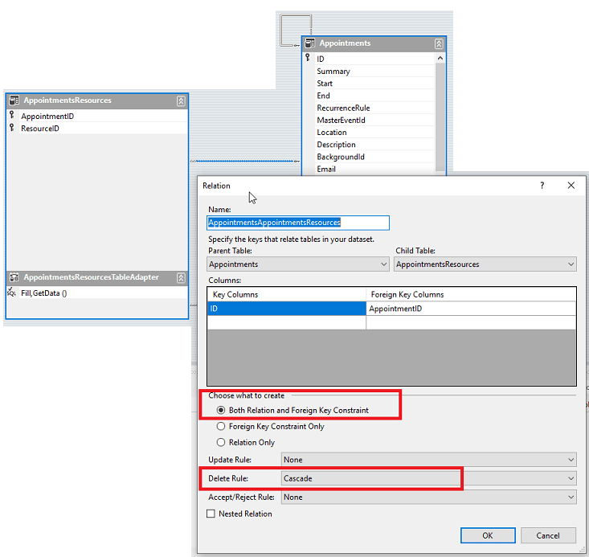

## Environment
 
|Product Version|Product|Author|
|----|----|----|
|2019.2.618|RadScheduler for WinForms|[Desislava Yordanova](https://www.telerik.com/blogs/author/desislava-yordanova)|
 

## Description

A common case is to [bind]() **RadScheduler** to data coming from a data base on the local server. Consider that you have the scheduler grouped by resources. This requires the following three tables defined:

* **Appointments**: stores the events.
* **Resources**: stores the resources.
* **AppointmentsResources**: a middle table managing the N:N relation between the **Appointments** and **Resources** tables. It contains the **AppointmentID** and the **ResourceID**.

The main problem that our customers hit after deleting an appointment for a certain resource is that the appointment is deleted from the **Appointments** table but it is not removed from the middle **AppointmentsResources** table.

## Solution 

Whether the related record from the **AppointmentsResources** table will be deleted depends on how the relation is setup between the **Appointments** and the **AppointmentsResources** tables. It is necessary to open the generated xsd file in your project and update the relation to have a cascade delete rule:

>important If you already have any records in the **AppointmentsResources** table before modifying the relation, it may be necessary to remove all existing records in order to avoid any constraint errors that may occur.

As a result, once an appointment for a resource is deleted, the respective record will be deleted from the **AppointmentsResources** table as well.

# See Also

* [Data Binding Walkthrough]()
* [Scheduler Mapping]() 

    
   
  
    
 
