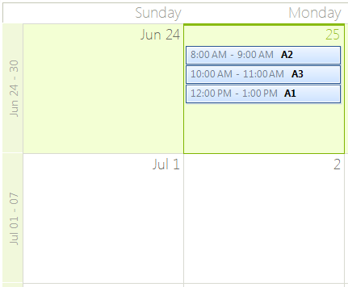
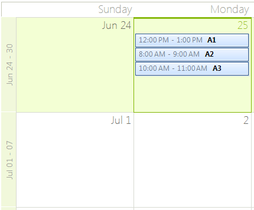

## Environment
<table>
    <tr>
        <td>Product Version</td>
        <td>2018.2.621</td>
    </tr>
    <tr>
        <td>Product</td>
        <td>RadScheduler for WinForms</td>
    </tr>
</table>

## Problem

By design, the [Month View]() in **RadScheduler** stacks the appointments for a certain day considering the start time of the appointments and their duration. Hence, the appointments will be displayed consecutive. If you have a lot of appointments and they don't match the available space, an arrow will be shown at the bottom of the month cell. Thus, when you click it, you will be navigated to a day view displaying the appointments in a better way.  

>caption Figure 1. Default appointments order 



## Solution

You can control how the appointments are ordered in the [Month View]() by implementing a custom **IComparer<AppointmentElement&gt;**. In its **Compare(AppointmentElement x, AppointmentElement y)** method you should return:

* **0** - if **x** is equal to **y**.
* **Less than zero** - **x** precedes **y** in the sort order.
* **Greater than zero** - **x** follows **y** in the sort order.

Then, set the SchedulerMonthViewElement..MonthViewAreaElement.**AppointmentsComparer** property to your custom comparer.

>note Additional information about the **IComparer<T&gt; Interface** is available in the [this](https://msdn.microsoft.com/en-us/library/8ehhxeaf(v=vs.110).aspx) MSDN article.

The following code snippet demonstrates how to order the appointments alphabetically considering their subject:

>caption Figure 2. Custom appointments order 



{{source=..\SamplesCS\KnowledgeBase\SchedulerMonthViewComparer.cs region=MonthViewComparer}} 
{{source=..\SamplesVB\KnowledgeBase\SchedulerMonthViewComparer.vb region=MonthViewComparer}}

````C#
        
public SchedulerMonthViewComparer()
{
    InitializeComponent();
    
    this.radScheduler1.ActiveViewType = SchedulerViewType.Month;
    
    SchedulerMonthViewElement monthViewElement = this.radScheduler1.SchedulerElement.ViewElement as SchedulerMonthViewElement;
    monthViewElement.MonthViewAreaElement.AppointmentsComparer = new MyComparer();
    
    this.radScheduler1.Appointments.Add(new Appointment(DateTime.Today.AddHours(12), TimeSpan.FromHours(1), "A1"));
    this.radScheduler1.Appointments.Add(new Appointment(DateTime.Today.AddHours(8), TimeSpan.FromHours(1), "A2"));
    this.radScheduler1.Appointments.Add(new Appointment(DateTime.Today.AddHours(10), TimeSpan.FromHours(1), "A3"));
}
        
public class MyComparer : IComparer<AppointmentElement>
{
    public int Compare(AppointmentElement x, AppointmentElement y)
    {
        return x.Appointment.Summary.CompareTo(y.Appointment.Summary);
    }
}

````
````VB.NET
Sub New()
    InitializeComponent()
    Me.RadScheduler1.ActiveViewType = SchedulerViewType.Month
    Dim monthViewElement As SchedulerMonthViewElement = TryCast(Me.RadScheduler1.SchedulerElement.ViewElement, SchedulerMonthViewElement)
    monthViewElement.MonthViewAreaElement.AppointmentsComparer = New MyComparer()
    Me.RadScheduler1.Appointments.Add(New Appointment(DateTime.Today.AddHours(12), TimeSpan.FromHours(1), "A1"))
    Me.RadScheduler1.Appointments.Add(New Appointment(DateTime.Today.AddHours(8), TimeSpan.FromHours(1), "A2"))
    Me.RadScheduler1.Appointments.Add(New Appointment(DateTime.Today.AddHours(10), TimeSpan.FromHours(1), "A3"))
End Sub
    
Public Class MyComparer
Implements IComparer(Of AppointmentElement)
    Public Function [Compare](x As AppointmentElement, y As AppointmentElement) As Integer _
    Implements IComparer(Of AppointmentElement).[Compare]
        Return x.Appointment.Summary.CompareTo(y.Appointment.Summary)
    End Function
End Class

````

{{endregion}} 


>note A complete solution providing a C# and VB.NET project is available [here](https://github.com/telerik/winforms-sdk/tree/master/Scheduler/SchedulerMonthViewComparer).
>
# See Also

* [RadScheduler]()
* [Month View]()


