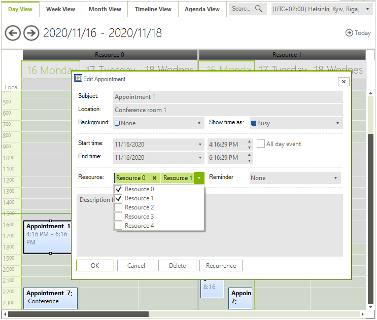
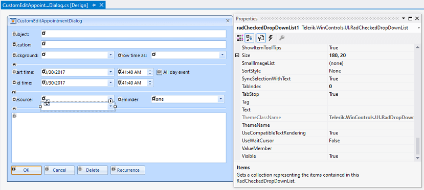

## Environment
 
|Product Version|Product|Author|
|----|----|----|
|2020.3.1020|RadScheduler for WinForms|[Desislava Yordanova](https://www.telerik.com/blogs/author/desislava-yordanova)|
 
## Description

By default, each **Appointment** has two properties: [ResourceId]() and [ResourceIds](). Usually, the **ResourceId** is used when you have only a single resource for the appointment. In case you have multiple resources for an appointment the **ResourceIds** collection is used. However, the current implementation of the **EditAppointmentDialog** uses a **RadDropDownList** for the resource selection. Thus, the user is not allowed to create an appointment and assign two resources to it. It can be achieved only programmatically. 

This is a common scenario when creating a meeting and you have at least two participants.



## Solution 

A possible solution would be to replace the resources **RadDropDownList** with a **RadCheckedDropDownList**. Thus, the user will be able to select multiple resources. We will follow the demonstrated approach in this article in order to add the **RadCheckedDropDownList**: [Adding a Custom Field to the EditAppointment Dialog]().

1\. Create a derivative of **EditAppointmentDialog** and add a **RadCheckedDropDownList** just next to the default resources **RadDropDownList**:



Use the following code:
 
#### Custom EditAppointmentDialog

````C#

public partial class CustomEditAppointmentDialog : EditAppointmentDialog
{
    public CustomEditAppointmentDialog()
    {
        InitializeComponent();
    }

    protected override void LoadSettingsFromEvent(Telerik.WinControls.UI.IEvent sourceEvent)
    {
        base.LoadSettingsFromEvent(sourceEvent);

        foreach (EventId resourceId in sourceEvent.ResourceIds)
        {
            foreach (RadCheckedListDataItem item in this.radCheckedDropDownList1.Items)
            {
                if (((EventId)item.Value).KeyValue.Equals(resourceId.KeyValue))
                {
                    item.Checked = true;
                }
            }
        }
    }

    protected override void ApplySettingsToEvent(Telerik.WinControls.UI.IEvent targetEvent)
    {
        base.ApplySettingsToEvent(targetEvent);

        targetEvent.ResourceIds.Clear();
        foreach (RadCheckedListDataItem item in this.radCheckedDropDownList1.Items)
        { 
            if (item.Checked)
            {
                targetEvent.ResourceIds.Add(item.Value as EventId);
            }
        }
    }

    protected override void LoadResources()
    {
        base.LoadResources();
        this.cmbResource.Visible = false;
        this.radCheckedDropDownList1.Top = this.cmbResource.Top;
        this.radCheckedDropDownList1.Left = this.cmbResource.Left;

        ISchedulerStorage<IResource> resourceStorage = this.SchedulerData.GetResourceStorage();
        foreach (IResource resource in resourceStorage)
        {
            if (resource.Visible)
            {
                RadListDataItem item = new RadListDataItem(resource.Name);
                item.Value = resource.Id;
                this.radCheckedDropDownList1.Items.Add(item);
            }
        }
    }
}

````
````VB.NET
	
Public Class CustomEditAppointmentDialog
    Inherits EditAppointmentDialog
    Protected Overrides Sub LoadSettingsFromEvent(ByVal sourceEvent As Telerik.WinControls.UI.IEvent)
        MyBase.LoadSettingsFromEvent(sourceEvent)

        For Each resourceId As EventId In sourceEvent.ResourceIds

            For Each item As RadCheckedListDataItem In Me.RadCheckedDropDownList1.Items

                If (CType(item.Value, EventId)).KeyValue.Equals(resourceId.KeyValue) Then
                    item.Checked = True
                End If
            Next
        Next
    End Sub

    Protected Overrides Sub ApplySettingsToEvent(ByVal targetEvent As Telerik.WinControls.UI.IEvent)
        MyBase.ApplySettingsToEvent(targetEvent)
        targetEvent.ResourceIds.Clear()

        For Each item As RadCheckedListDataItem In Me.RadCheckedDropDownList1.Items

            If item.Checked Then
                targetEvent.ResourceIds.Add(TryCast(item.Value, EventId))
            End If
        Next
    End Sub

    Protected Overrides Sub LoadResources()
        MyBase.LoadResources()
        Me.cmbResource.Visible = False
        Me.RadCheckedDropDownList1.Top = Me.cmbResource.Top
        Me.RadCheckedDropDownList1.Left = Me.cmbResource.Left
        Dim resourceStorage As ISchedulerStorage(Of IResource) = Me.SchedulerData.GetResourceStorage()

        For Each resource As IResource In resourceStorage

            If resource.Visible Then
                Dim item As RadListDataItem = New RadListDataItem(resource.Name)
                item.Value = resource.Id
                Me.RadCheckedDropDownList1.Items.Add(item)
            End If
        Next
    End Sub
End Class


````

2\. This is how the scheduler is [bound to custom objects]():

>note This example can be adopted to other data binding scenarios as well. However, the main principle is the same. In the **EditAppointmentDialog** you should read the resources from the Appointment and check the relevant resource items in the checked drop down. When you toggle/untoggle a resource item, then you should store the correct data to the Appointment being edited. The **LoadSettingsFromEvent** and **ApplySettingsToEvent** methods are used for this purpose.

````C#

private void SchedulerSetup()
{
    SchedulerBindingDataSource dataSource = new SchedulerBindingDataSource();

    BindingList<CustomResource> resources = new BindingList<CustomResource>();
    for (int i = 0; i < 5; i++)
    {
        CustomResource resource = new CustomResource();
        resource.Id = i;
        resource.Name = "Resource " + i;
        resources.Add(resource);
    }
    ResourceMappingInfo resourceMappingInfo = new ResourceMappingInfo();
    resourceMappingInfo.Name = "Name";
    resourceMappingInfo.Id = "Id";
    dataSource.ResourceProvider.Mapping = resourceMappingInfo;
    dataSource.ResourceProvider.DataSource = resources;

    BindingList<CustomAppointment> appointments = new BindingList<CustomAppointment>();
    for (int i = 0; i < 10; i++)
    {
        if ((i % 2) == 0)
        {
            int appointmentNumber = i + 1;
            CustomAppointment myAppointment =
                new CustomAppointment(
                    DateTime.Now.AddHours(appointmentNumber),
                    DateTime.Now.AddHours(appointmentNumber + 2),
                    "Appointment " + appointmentNumber.ToString(),
                    "Description for Appointment " + appointmentNumber.ToString(),
                    "Conference room " + appointmentNumber.ToString()); 
            myAppointment.Resources.Add(new EventId(resources[i % 3].Id));
            myAppointment.Resources.Add(new EventId(resources[i % 3 + 1].Id));
            appointments.Add(myAppointment);
        }
    }
    AppointmentMappingInfo appointmentMappingInfo = new AppointmentMappingInfo();
    appointmentMappingInfo.Start = "Start";
    appointmentMappingInfo.End = "End";
    appointmentMappingInfo.Summary = "Subject";
    appointmentMappingInfo.Description = "Description";
    appointmentMappingInfo.Location = "Location";
    appointmentMappingInfo.UniqueId = "Id";
    appointmentMappingInfo.Exceptions = "Exceptions";
    appointmentMappingInfo.Resources = "Resources";
    dataSource.EventProvider.Mapping = appointmentMappingInfo;
    dataSource.EventProvider.DataSource = appointments;
   
    this.radScheduler1.DataSource = dataSource;

    this.radScheduler1.GroupType = GroupType.Resource;
}

public class CustomAppointment : INotifyPropertyChanged
{
    private DateTime start = DateTime.Now;
    private DateTime end = DateTime.Now;
    private string subject = string.Empty;
    private string description = string.Empty;
    private string location = string.Empty;
    private Guid id = Guid.NewGuid();
    private List<CustomAppointment> exceptions; 
    private List<EventId> resources = new List<EventId>();

    public CustomAppointment()
    {
    }

    public CustomAppointment(DateTime start, DateTime end, string subject, string description, string location)
    {
        this.start = start;
        this.end = end;
        this.subject = subject;
        this.description = description;
        this.location = location;
        List<CustomAppointment> exceptions = new List<CustomAppointment>();
    }

    public List<CustomAppointment> Exceptions
    {
        get
        {
            return this.exceptions;
        }
        set
        {
            if (this.exceptions != value)
            {
                this.exceptions = value;
                this.OnPropertyChanged("Exceptions");
            }
        }
    }

    public Guid Id
    {
        get
        {
            return this.id;
        }
        set
        {
            if (this.id != value)
            {
                this.id = value;
                this.OnPropertyChanged("Id");
            }
        }
    }

    public DateTime Start
    {
        get
        {
            return this.start;
        }
        set
        {
            if (this.start != value)
            {
                this.start = value;
                this.OnPropertyChanged("Start");
            }
        }
    }

    public DateTime End
    {
        get
        {
            return this.end;
        }
        set
        {
            if (this.end != value)
            {
                this.end = value;
                this.OnPropertyChanged("End");
            }
        }
    }

    public string Subject
    {
        get
        {
            return this.subject;
        }
        set
        {
            if (this.subject != value)
            {
                this.subject = value;
                this.OnPropertyChanged("Subject");
            }
        }
    }

    public string Description
    {
        get
        {
            return this.description;
        }
        set
        {
            if (this.description != value)
            {
                this.description = value;
                this.OnPropertyChanged("Description");
            }
        }
    }

    public string Location
    {
        get
        {
            return this.location;
        }
        set
        {
            if (this.location != value)
            {
                this.location = value;
                this.OnPropertyChanged("Location");
            }
        }
    }

    public List<EventId> Resources
    {
        get
        {
            return this.resources;
        }
        set
        {
            if (this.resources != value)
            {
                this.resources = value;
                this.OnPropertyChanged("Resources");
            }
        }
    }

    public event PropertyChangedEventHandler PropertyChanged;

    protected virtual void OnPropertyChanged(string propertyName)
    {
        if (this.PropertyChanged != null)
        {
            this.PropertyChanged(this, new PropertyChangedEventArgs(propertyName));
        }
    }
}

public class CustomResource : INotifyPropertyChanged
{
    private int id;
    private string name;

    public int Id
    {
        get
        {
            return this.id;
        }
        set
        {
            if (this.id != value)
            {
                this.id = value;
                this.OnPropertyChanged("Id");
            }
        }
    }

    public string Name
    {
        get
        {
            return this.name;
        }
        set
        {
            if (this.name != value)
            {
                this.name = value;
                this.OnPropertyChanged("Name");
            }
        }
    }

    public event PropertyChangedEventHandler PropertyChanged;

    protected virtual void OnPropertyChanged(string propertyName)
    {
        if (this.PropertyChanged != null)
        {
            this.PropertyChanged(this, new PropertyChangedEventArgs(propertyName));
        }
    }
}


````
````VB.NET

Private Sub SchedulerSetup()
    Dim dataSource As SchedulerBindingDataSource = New SchedulerBindingDataSource()
    Dim resources As BindingList(Of CustomResource) = New BindingList(Of CustomResource)()

    For i As Integer = 0 To 5 - 1
        Dim resource As CustomResource = New CustomResource()
        resource.Id = i
        resource.Name = "Resource " & i
        resources.Add(resource)
    Next

    Dim resourceMappingInfo As ResourceMappingInfo = New ResourceMappingInfo()
    resourceMappingInfo.Name = "Name"
    resourceMappingInfo.Id = "Id"
    dataSource.ResourceProvider.Mapping = resourceMappingInfo
    dataSource.ResourceProvider.DataSource = resources
    Dim appointments As BindingList(Of CustomAppointment) = New BindingList(Of CustomAppointment)()

    For i As Integer = 0 To 10 - 1

        If (i Mod 2) = 0 Then
            Dim appointmentNumber As Integer = i + 1
            Dim myAppointment As CustomAppointment = New CustomAppointment(DateTime.Now.AddHours(appointmentNumber), _
                        DateTime.Now.AddHours(appointmentNumber + 2), "Appointment " & appointmentNumber.ToString(), _
                        "Description for Appointment " & appointmentNumber.ToString(), "Conference room " & appointmentNumber.ToString())
            myAppointment.Resources.Add(New EventId(resources(i Mod 3).Id))
            myAppointment.Resources.Add(New EventId(resources(i Mod 3 + 1).Id))
            appointments.Add(myAppointment)
        End If
    Next

    Dim appointmentMappingInfo As AppointmentMappingInfo = New AppointmentMappingInfo()
    appointmentMappingInfo.Start = "Start"
    appointmentMappingInfo.[End] = "End"
    appointmentMappingInfo.Summary = "Subject"
    appointmentMappingInfo.Description = "Description"
    appointmentMappingInfo.Location = "Location"
    appointmentMappingInfo.UniqueId = "Id"
    appointmentMappingInfo.Exceptions = "Exceptions"
    appointmentMappingInfo.Resources = "Resources"
    dataSource.EventProvider.Mapping = appointmentMappingInfo
    dataSource.EventProvider.DataSource = appointments
    Me.RadScheduler1.DataSource = dataSource
    Me.RadScheduler1.GroupType = GroupType.Resource
End Sub

Public Class CustomAppointment
    Implements INotifyPropertyChanged

    Private _start As Date = Date.Now
    Private _end As Date = Date.Now
    Private _subject As String = String.Empty
    Private _description As String = String.Empty
    Private _location As String = String.Empty
    Private _id As Guid = Guid.NewGuid()
    Private _exceptions As List(Of CustomAppointment)
    Private _resources As List(Of EventId) = New List(Of EventId)()

    Public Sub New()
    End Sub

    Public Sub New(ByVal start As DateTime, ByVal [end] As DateTime, ByVal subject As String, ByVal description As String, ByVal location As String)
        Me.Start = start
        Me.[End] = [end]
        Me.Subject = subject
        Me.Description = description
        Me.Location = location
        Dim exceptions As List(Of CustomAppointment) = New List(Of CustomAppointment)()
    End Sub

    Public Property Exceptions As List(Of CustomAppointment)
        Get
            Return Me._exceptions
        End Get
        Set(ByVal value As List(Of CustomAppointment))

            If Not Me._exceptions.Equals(value) Then
                Me._exceptions = value
                Me.OnPropertyChanged("Exceptions")
            End If
        End Set
    End Property

    Public Property Id As Guid
        Get
            Return Me._id
        End Get
        Set(ByVal value As Guid)

            If Me._id <> value Then
                Me._id = value
                Me.OnPropertyChanged("Id")
            End If
        End Set
    End Property

    Public Property Start As DateTime
        Get
            Return Me._start
        End Get
        Set(ByVal value As DateTime)

            If Me._start <> value Then
                Me._start = value
                Me.OnPropertyChanged("Start")
            End If
        End Set
    End Property

    Public Property [End] As DateTime
        Get
            Return Me._end
        End Get
        Set(ByVal value As DateTime)

            If Me._end <> value Then
                Me._end = value
                Me.OnPropertyChanged("End")
            End If
        End Set
    End Property

    Public Property Subject As String
        Get
            Return Me._subject
        End Get
        Set(ByVal value As String)

            If Me._subject <> value Then
                Me._subject = value
                Me.OnPropertyChanged("Subject")
            End If
        End Set
    End Property

    Public Property Description As String
        Get
            Return Me._description
        End Get
        Set(ByVal value As String)

            If Me._description <> value Then
                Me._description = value
                Me.OnPropertyChanged("Description")
            End If
        End Set
    End Property

    Public Property Location As String
        Get
            Return Me._location
        End Get
        Set(ByVal value As String)

            If Me._location <> value Then
                Me._location = value
                Me.OnPropertyChanged("Location")
            End If
        End Set
    End Property

    Public Property Resources As List(Of EventId)
        Get
            Return Me._resources
        End Get
        Set(ByVal value As List(Of EventId))

            If Not Me._resources.Equals(value) Then
                _resources = value
                Me.OnPropertyChanged("Resources")
            End If
        End Set
    End Property

    Public Event PropertyChanged As PropertyChangedEventHandler Implements INotifyPropertyChanged.PropertyChanged
    Protected Overridable Sub OnPropertyChanged(ByVal propertyName As String)
        If Me.PropertyChangedEvent IsNot Nothing Then
            RaiseEvent PropertyChanged(Me, New PropertyChangedEventArgs(propertyName))
        End If
    End Sub
End Class

Public Class CustomResource
    Implements INotifyPropertyChanged
    Private m_id As Integer
    Private m_name As String
    Public Property Id() As Integer
        Get
            Return Me.m_id
        End Get
        Set(value As Integer)
            If Me.m_id <> value Then
                Me.m_id = value
                Me.OnPropertyChanged("Id")
            End If
        End Set
    End Property
    Public Property Name() As String
        Get
            Return Me.m_name
        End Get
        Set(value As String)
            If Me.m_name <> value Then
                Me.m_name = value
                Me.OnPropertyChanged("Name")
            End If
        End Set
    End Property
    Public Event PropertyChanged As PropertyChangedEventHandler Implements INotifyPropertyChanged.PropertyChanged
    Protected Overridable Sub OnPropertyChanged(propertyName As String)
        RaiseEvent PropertyChanged(Me, New PropertyChangedEventArgs(propertyName))
    End Sub
End Class

	
````

3\. Handle the **AppointmentEditDialogShowing** event and replace the default dialog with the custom one:


````C#

private void radScheduler1_AppointmentEditDialogShowing(object sender, AppointmentEditDialogShowingEventArgs e)
{
    e.AppointmentEditDialog = new CustomEditAppointmentDialog();
}

````
````VB.NET
	
Private Sub RadScheduler1_AppointmentEditDialogShowing(sender As Object, e As Telerik.WinControls.UI.AppointmentEditDialogShowingEventArgs)
    e.AppointmentEditDialog = New CustomEditAppointmentDialog()
End Sub

````

# See Also

* [Adding a Custom Field to the EditAppointment Dialog]()
* [Working with Resources]()

