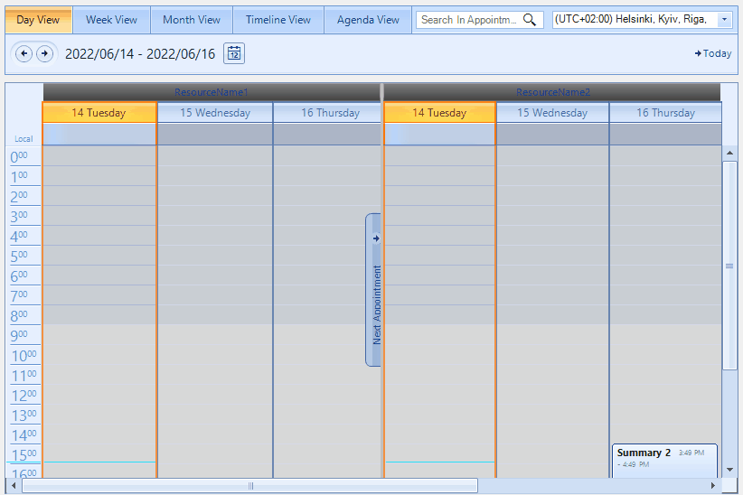

## Environment
|Product Version|Product|Author|
|----|----|----|
|2022.2.511|RadScheduler for WinForms|[Dinko Krastev](https://www.telerik.com/blogs/author/dinko-krastev)|
 

## Description

By default, the columns can't be resized in the RadScheduler. However, such functionality can achieve the desired behavior by manually handling the mouse events of the control and calculating the width while dragging a particular column.

## Solution 

In order to resize the columns, we need to subscribe to the MouseUp, MouseDown, MouseMove, and MouseLeave events of the RadScheduler. In their event handlers, we are going to execute custom logic to handle this scenario.



````C#
public partial class Form1 : Form
{
    private SchedulerBindingDataSource schedulerBindingDataSource;
    private DataSet ds;

    private float minCellWidthInPixels = 50;

    private bool resizingResourceHeader = false;
    private bool resizeStarted = false;
    private bool isResizing = false;
    private bool isResizeAllowed = false;

    private float initialSizeFactor;
    private float initialSizeInPixels;
    private float initialMouseOffset;
    private float initialNextCellFactor;

    private SchedulerDayViewElement dayViewElement;
    private SchedulerMonthViewElement monthViewElement;
    private SchedulerTimelineViewElement timeLineViewElement;

    private SchedulerHeaderCellElement headerCell;
    private SchedulerHeaderCellElement nextHeaderCell;

    private SchedulerResourceHeaderCellElement resourceHeaderCell;
    private SchedulerResourceHeaderCellElement resourceNextCell;

    public Form1()
    {
        InitializeComponent();
            
        this.ds = new DataSet();
        this.schedulerBindingDataSource = new SchedulerBindingDataSource();

        this.radSchedulerNavigator1.AssociatedScheduler = this.radScheduler1;

        this.radScheduler1.ActiveViewChanged += RadScheduler1_ActiveViewChanged;

        this.radScheduler1.MouseUp += radScheduler1_MouseUp;
        this.radScheduler1.MouseDown += radScheduler1_MouseDown;
        this.radScheduler1.MouseMove += radScheduler1_MouseMove;
        this.radScheduler1.MouseLeave += radScheduler1_MouseLeave;
    }

    private void RadScheduler1_ActiveViewChanged(object sender, SchedulerViewChangedEventArgs e)
    {
        if (e.NewView.ViewType == SchedulerViewType.Month)
        {
            if (this.radScheduler1.GroupType == GroupType.Resource)
            {
                SchedulerMonthViewGroupedByResourceElement view = (SchedulerMonthViewGroupedByResourceElement)this.radScheduler1.ViewElement;
                IList<SchedulerMonthViewElement> childMonthElements = view.GetChildViewElements();
                foreach (SchedulerMonthViewElement childMonthElement in childMonthElements)
                {
                    foreach (var item in childMonthElement.MonthViewAreaElement.CellElements)
                    {
                        item.FindDescendant<SchedulerHeaderCellElement>().ShouldHandleMouseInput = true;
                    }
                }
            }
            else
            {
                SchedulerMonthViewElement view = (SchedulerMonthViewElement)this.radScheduler1.ViewElement;
                foreach (var item in view.MonthViewAreaElement.CellElements)
                {
                    item.FindDescendant<SchedulerHeaderCellElement>().ShouldHandleMouseInput = true;
                }
            }
        }
    }

    protected override void OnLoad(EventArgs e)
    {
        base.OnLoad(e);

        DataTable appointments = new DataTable("Appointments");
        appointments.Columns.Add("Id", typeof(int));
        appointments.Columns.Add("Start", typeof(DateTime));
        appointments.Columns.Add("End", typeof(DateTime));
        appointments.Columns.Add("Description", typeof(string));
        appointments.Columns.Add("Summary", typeof(string));
        for (int i = 1; i <= 100; i++)
        {
            appointments.Rows.Add(new object[] { i, DateTime.Now.AddDays(i), DateTime.Now.AddDays(i).AddHours(1), "Description " + i, "Summary " + i });
        }

        DataTable resources = new DataTable("Resources");
        resources.Columns.Add("Id", typeof(int));
        resources.Columns.Add("ResourceName", typeof(string));
        for (int i = 1; i <= 3; i++)
        {
            resources.Rows.Add(new object[] { i, "ResourceName" + i });
        }

        DataTable appointmentsResources = new DataTable("AppointmentsResources");
        appointmentsResources.Columns.Add("AppointmentId", typeof(int));
        appointmentsResources.Columns.Add("ResourceId", typeof(int));
        for (int i = 1; i < appointments.Rows.Count; i++)
        {
            appointmentsResources.Rows.Add(new object[] { appointments.Rows[i]["Id"], i % 2 == 0 ? 1 : 2 });
        }

        this.ds.Tables.AddRange(new DataTable[] { appointments, resources, appointmentsResources });
        this.ds.Relations.Add("Appointment_AppointmentsResources", this.ds.Tables["Appointments"].Columns["Id"], this.ds.Tables["AppointmentsResources"].Columns["AppointmentId"]);

        AppointmentMappingInfo appointmentMappingInfo = new AppointmentMappingInfo();
        appointmentMappingInfo.Start = "Start";
        appointmentMappingInfo.End = "End";
        appointmentMappingInfo.Description = "Description";
        appointmentMappingInfo.ResourceId = "ResourceId";
        appointmentMappingInfo.Resources = "Appointment_AppointmentsResources";
        appointmentMappingInfo.Summary = "Summary";
        this.schedulerBindingDataSource.EventProvider.Mapping = appointmentMappingInfo;

        ResourceMappingInfo resourceMappingInfo = new ResourceMappingInfo();
        resourceMappingInfo.Id = "Id";
        resourceMappingInfo.Name = "ResourceName";
        this.schedulerBindingDataSource.ResourceProvider.Mapping = resourceMappingInfo;

        schedulerBindingDataSource.ResourceProvider.DataMember = "Resources";
        schedulerBindingDataSource.ResourceProvider.DataSource = this.ds;

        schedulerBindingDataSource.EventProvider.DataMember = "Appointments";
        schedulerBindingDataSource.EventProvider.DataSource = this.ds;

        this.radScheduler1.DataSource = this.schedulerBindingDataSource;
        this.radScheduler1.GroupType = GroupType.Resource;
        this.radScheduler1.ActiveView.ResourcesPerView = 2;

        this.schedulerBindingDataSource.Rebind();
    }

    void radScheduler1_MouseDown(object sender, MouseEventArgs e)
    {
        if (isResizeAllowed)
        {
            isResizing = true;
            this.radScheduler1.Capture = true;
        }
    }

    void radScheduler1_MouseLeave(object sender, EventArgs e)
    {
        this.ResizeEnded();
    }

    void radScheduler1_MouseUp(object sender, MouseEventArgs e)
    {
        this.ResizeEnded();
    }

    private void ResizeEnded()
    {
        this.radScheduler1.Capture = false;
        resizeStarted = false;
        isResizing = false;
        dayViewElement = null;
        resourceHeaderCell = null;
        headerCell = null;
    }

    void radScheduler1_MouseMove(object sender, MouseEventArgs e)
    {
        if (isResizing)
        {
            Point mousePosition = Control.MousePosition;
            Point mouseLocation = this.PointToClient(mousePosition);

            if (resizingResourceHeader)
            {
                this.ResizeGroupedByResourcesViewElement(mouseLocation);
            }
            else
            {
                this.ResizeViewElementColumns(mouseLocation);
            }
        }
        else
        {
            this.CheckIsResizeAllowed(e);
        }
    }

    private void CheckIsResizeAllowed(MouseEventArgs e)
    {
        headerCell = this.radScheduler1.ElementTree.GetElementAtPoint(e.Location) as SchedulerHeaderCellElement;
        resourceHeaderCell = this.radScheduler1.ElementTree.GetElementAtPoint(e.Location) as SchedulerResourceHeaderCellElement;

        if (headerCell != null || resourceHeaderCell != null)
        {
            resizingResourceHeader = headerCell == null;
            Point mousePosition = Control.MousePosition;
            Point mouseLocation = this.PointToClient(mousePosition);
            RectangleF rect = resizingResourceHeader ? resourceHeaderCell.ControlBoundingRectangle : headerCell.ControlBoundingRectangle;

            TimelineGroupingByResourcesElement timelineViewGroupedElement = this.radScheduler1.ViewElement as TimelineGroupingByResourcesElement;
            if (timelineViewGroupedElement != null && resourceHeaderCell != null)
            {
                float variationRange = 10;
                float mouseYTopRange = e.Location.Y - variationRange;
                float mouseYBottomRange = e.Location.Y + variationRange;
                float rectBottomY = rect.Y + rect.Height;

                if (rectBottomY >= mouseYTopRange && rectBottomY <= mouseYBottomRange)
                {
                    Cursor.Current = Cursors.SizeNS;
                    isResizeAllowed = true;
                }
                else
                {
                    Cursor.Current = Cursors.Default;
                    isResizeAllowed = false;
                }
            }
            else
            {
                float variationRange = 20;
                float mouseXLeftRange = mouseLocation.X - variationRange;
                float mouseXRightRange = mouseLocation.X + variationRange;
                float rectRightX = rect.X + rect.Width;

                if (rectRightX >= mouseXLeftRange && rectRightX <= mouseXRightRange)
                {
                    if (headerCell != null && !(headerCell.Parent is MonthViewVerticalHeader || headerCell.Parent is MonthViewHeader) ||
                        resourceHeaderCell != null)
                    {
                        Cursor.Current = Cursors.SizeWE;
                        isResizeAllowed = true;
                    }
                        
                }
                else
                {
                    Cursor.Current = Cursors.Default;
                    isResizeAllowed = false;
                }
            }
        }
    }

    private void ResizeViewElementColumns(Point mouseLocation)
    {
        if (headerCell == null)
        {
            return;
        }

        TimeSpan span = TimeSpan.MinValue;
        int column = -1;
        int nextIndex = -1;
        SchedulerViewElement element;

        switch (this.radScheduler1.ActiveViewType)
        {
            case SchedulerViewType.Day:
            case SchedulerViewType.Week:
            case SchedulerViewType.WorkWeek:
                dayViewElement = headerCell.FindAncestor<SchedulerDayViewElement>();
                column = dayViewElement.GetColumnForDate(headerCell.Date);
                element = dayViewElement;
                break;
            case SchedulerViewType.Month:
                monthViewElement = headerCell.FindAncestor<SchedulerMonthViewElement>();
                span = headerCell.Date - headerCell.View.StartDate;
                int weekCount = monthViewElement.GetMonthView().WeekDaysCount;
                column = (int)span.TotalDays - (int)span.TotalDays / weekCount * weekCount;
                element = monthViewElement;
                break;
            case SchedulerViewType.Timeline:
                timeLineViewElement = headerCell.FindAncestor<SchedulerTimelineViewElement>();
                span = headerCell.Date - headerCell.View.StartDate;
                column = (int)span.TotalDays;
                element = timeLineViewElement;
                break;
        }

        if (column < 0)
        {
            return;
        }

        if (!resizeStarted)
        {
            switch (this.radScheduler1.ActiveViewType)
            {
                case SchedulerViewType.Day:
                case SchedulerViewType.Week:
                case SchedulerViewType.WorkWeek:
                    nextHeaderCell = dayViewElement.GetCellAtPosition(0, column + 1) as SchedulerHeaderCellElement;
                    initialSizeFactor = dayViewElement.GetColumnWidth(column);
                    if (nextHeaderCell != null)
                    {
                        initialNextCellFactor = dayViewElement.GetColumnWidth(column + 1);
                    }
                    break;
                case SchedulerViewType.Month:
                    initialSizeFactor = monthViewElement.GetColumnWidth(column);
                    nextIndex = column + 1;
                    if (nextIndex < monthViewElement.Header.CellElements.Count - 1)
                    {
                        nextHeaderCell = monthViewElement.Header.CellElements[nextIndex] as SchedulerHeaderCellElement;
                        initialNextCellFactor = monthViewElement.GetColumnWidth(nextIndex);
                    }
                    break;
                case SchedulerViewType.Timeline:
                    initialSizeFactor = timeLineViewElement.GetColumnWidth(column);
                    nextIndex = column + 1;
                    if (nextIndex < timeLineViewElement.Header.CellElements.Count - 1)
                    {
                        nextHeaderCell = timeLineViewElement.Header.CellElements[nextIndex] as SchedulerHeaderCellElement;
                        initialNextCellFactor = timeLineViewElement.GetColumnWidth(nextIndex);
                    }
                    break;
            }

            resizeStarted = true;
            initialMouseOffset = mouseLocation.X;
            initialSizeInPixels = headerCell.ControlBoundingRectangle.Width;
        }
        else
        {
            float currentMouseXLocation = mouseLocation.X;
            float difference = currentMouseXLocation - initialMouseOffset;
            float newColumnWidthInPixels = initialSizeInPixels + difference;
            float newWidthFactor = initialSizeFactor * (newColumnWidthInPixels / initialSizeInPixels);

            if (newColumnWidthInPixels <= minCellWidthInPixels ||
                (nextHeaderCell != null && nextHeaderCell.ControlBoundingRectangle.Width <= minCellWidthInPixels && currentMouseXLocation >= nextHeaderCell.ControlBoundingRectangle.X))
            {
                return;
            }

            float newNextCellWidthFactor = 0;
            if (nextHeaderCell != null)
            {
                newNextCellWidthFactor = initialSizeFactor + initialNextCellFactor - newWidthFactor;
                float newNextCellWidth = newColumnWidthInPixels * (newNextCellWidthFactor / newWidthFactor);
                if (newNextCellWidth <= minCellWidthInPixels)
                {
                    return;
                }
            }

            switch (this.radScheduler1.ActiveViewType)
            {
                case SchedulerViewType.Day:
                case SchedulerViewType.Week:
                case SchedulerViewType.WorkWeek:
                    dayViewElement.SetColumnWidth(column, newWidthFactor);
                    if (nextHeaderCell != null)
                    {
                        dayViewElement.SetColumnWidth(column + 1, newNextCellWidthFactor);
                    }
                    break;
                case SchedulerViewType.Month:
                    monthViewElement.SetColumnWidth(column, newWidthFactor);
                    if (nextHeaderCell != null)
                    {
                        monthViewElement.SetColumnWidth(column + 1, newNextCellWidthFactor);
                    }
                    break;
                case SchedulerViewType.Timeline:
                    IList<SchedulerTimelineViewElement> childTimelineElements = new List<SchedulerTimelineViewElement>() { timeLineViewElement };
                    TimelineGroupingByResourcesElement timelineViewGroupedElement = this.radScheduler1.ViewElement as TimelineGroupingByResourcesElement;
                    if (timelineViewGroupedElement != null)
                    {
                        childTimelineElements = timelineViewGroupedElement.GetChildViewElements();
                    }

                    foreach (SchedulerTimelineViewElement childTimelineElement in childTimelineElements)
                    {
                        childTimelineElement.SetColumnWidth(column, newWidthFactor);
                        if (nextHeaderCell != null)
                        {
                            childTimelineElement.SetColumnWidth(column + 1, newNextCellWidthFactor);
                        }
                    }
                    break;
            }
        }
    }

    private void ResizeGroupedByResourcesViewElement(Point mouseLocation)
    {
        if (resourceHeaderCell == null)
        {
            return;
        }

        int column = this.radScheduler1.Resources.IndexOf(this.radScheduler1.Resources.GetById(resourceHeaderCell.ResourceId));
        column -= ((SchedulerViewGroupedByResourceElementBase)this.radScheduler1.ViewElement).ResourceStartIndex;

        if (column < 0)
        {
            return;
        }

        if (!resizeStarted)
        {
            if (column < this.radScheduler1.ActiveView.ResourcesPerView)
            {
                int resourceNextCellIndex = int.Parse(resourceHeaderCell.ResourceId.KeyValue.ToString()) + 1;
                resourceNextCell = this.GetResourceHeaderCellByResourceId(resourceNextCellIndex);
            }

            resizeStarted = true;
            TimelineGroupingByResourcesElement timelineViewGroupedElement = this.radScheduler1.ViewElement as TimelineGroupingByResourcesElement;
            if (timelineViewGroupedElement != null)
            {
                initialMouseOffset = mouseLocation.Y;
                initialSizeInPixels = resourceHeaderCell.ControlBoundingRectangle.Height;
            }
            else
            {
                initialMouseOffset = mouseLocation.X;
                initialSizeInPixels = resourceHeaderCell.ControlBoundingRectangle.Width;
            }

            initialSizeFactor = ((SchedulerViewGroupedByResourceElementBase)this.radScheduler1.ViewElement).GetResourceSize(column);
            if (resourceNextCell != null)
            {
                initialNextCellFactor = ((SchedulerViewGroupedByResourceElementBase)this.radScheduler1.ViewElement).GetResourceSize(column + 1);
            }
        }
        else
        {
            float currentMouseOffset = -1;
            float boundingRectangleSize = -1;
            float boundingRectangleOffset = -1;
            TimelineGroupingByResourcesElement timelineViewGroupedElement = this.radScheduler1.ViewElement as TimelineGroupingByResourcesElement;
            if (timelineViewGroupedElement != null)
            {
                currentMouseOffset = mouseLocation.Y;
                boundingRectangleSize = resourceNextCell.ControlBoundingRectangle.Height;
                boundingRectangleOffset = resourceNextCell.ControlBoundingRectangle.Y;
            }
            else
            {
                currentMouseOffset = mouseLocation.X;
                boundingRectangleSize = resourceNextCell.ControlBoundingRectangle.Width;
                boundingRectangleOffset = resourceNextCell.ControlBoundingRectangle.X;
            }

            float difference = currentMouseOffset - initialMouseOffset;

            // You can reduce the resize lag by (un)commenting the following code.
            if (difference % 2 != 0)
            {
                return;
            }

            float newColumnWidthInPixels = initialSizeInPixels + difference;
            float newWidthFactor = initialSizeFactor * (newColumnWidthInPixels / initialSizeInPixels);

            if (newColumnWidthInPixels <= minCellWidthInPixels ||
                (resourceNextCell != null && boundingRectangleSize <= minCellWidthInPixels && currentMouseOffset >= boundingRectangleOffset))
            {
                return;
            }

            float newNextCellWidthFactor = 0;
            if (resourceNextCell != null)
            {
                newNextCellWidthFactor = initialSizeFactor + initialNextCellFactor - newWidthFactor;
                float newNextCellWidth = newColumnWidthInPixels * (newNextCellWidthFactor / newWidthFactor);
                if (newNextCellWidth <= minCellWidthInPixels)
                {
                    return;
                }
            }

                ((SchedulerViewGroupedByResourceElementBase)this.radScheduler1.ViewElement).SetResourceSize(column, newWidthFactor);

            if (resourceNextCell != null)
            {
                ((SchedulerViewGroupedByResourceElementBase)this.radScheduler1.ViewElement).SetResourceSize(column + 1, newNextCellWidthFactor);
            }
        }
    }

    private SchedulerResourceHeaderCellElement GetResourceHeaderCellByResourceId(int resourceId)
    {
        foreach (var item in ((SchedulerViewGroupedByResourceElementBase)this.radScheduler1.ViewElement).ResourcesHeader.Children)
        {
            SchedulerResourceHeaderCellElement resourcesHeaderCellElement = item as SchedulerResourceHeaderCellElement;
            if (resourcesHeaderCellElement != null)
            {
                int resourceIndex = int.Parse(resourcesHeaderCellElement.ResourceId.KeyValue.ToString());
                if (resourceIndex == resourceId)
                {
                    return resourcesHeaderCellElement;
                }
            }
        }

        return null;
    }
}
         
       
````
````VB.NET
    
Partial Public Class Form1
    Inherits Form

    Private schedulerBindingDataSource As SchedulerBindingDataSource
    Private ds As DataSet
    Private minCellWidthInPixels As Single = 50
    Private resizingResourceHeader As Boolean = False
    Private resizeStarted As Boolean = False
    Private isResizing As Boolean = False
    Private isResizeAllowed As Boolean = False
    Private initialSizeFactor As Single
    Private initialSizeInPixels As Single
    Private initialMouseOffset As Single
    Private initialNextCellFactor As Single
    Private dayViewElement As SchedulerDayViewElement
    Private monthViewElement As SchedulerMonthViewElement
    Private timeLineViewElement As SchedulerTimelineViewElement
    Private headerCell As SchedulerHeaderCellElement
    Private nextHeaderCell As SchedulerHeaderCellElement
    Private resourceHeaderCell As SchedulerResourceHeaderCellElement
    Private resourceNextCell As SchedulerResourceHeaderCellElement

    Public Sub New()
        InitializeComponent()
        Me.ds = New DataSet()
        Me.schedulerBindingDataSource = New SchedulerBindingDataSource()
        Me.radSchedulerNavigator1.AssociatedScheduler = Me.RadScheduler1
        AddHandler Me.RadScheduler1.ActiveViewChanged, AddressOf RadScheduler1_ActiveViewChanged
        AddHandler Me.RadScheduler1.MouseUp, AddressOf radScheduler1_MouseUp
        AddHandler Me.RadScheduler1.MouseDown, AddressOf radScheduler1_MouseDown
        AddHandler Me.RadScheduler1.MouseMove, AddressOf radScheduler1_MouseMove
        AddHandler Me.RadScheduler1.MouseLeave, AddressOf radScheduler1_MouseLeave
    End Sub

    Private Sub RadScheduler1_ActiveViewChanged(ByVal sender As Object, ByVal e As SchedulerViewChangedEventArgs)
        If e.NewView.ViewType = SchedulerViewType.Month Then

            If Me.RadScheduler1.GroupType = GroupType.Resource Then
                Dim view As SchedulerMonthViewGroupedByResourceElement = CType(Me.RadScheduler1.ViewElement, SchedulerMonthViewGroupedByResourceElement)
                Dim childMonthElements As IList(Of SchedulerMonthViewElement) = view.GetChildViewElements()

                For Each childMonthElement As SchedulerMonthViewElement In childMonthElements

                    For Each item In childMonthElement.MonthViewAreaElement.CellElements
                        item.FindDescendant(Of SchedulerHeaderCellElement)().ShouldHandleMouseInput = True
                    Next
                Next
            Else
                Dim view As SchedulerMonthViewElement = CType(Me.RadScheduler1.ViewElement, SchedulerMonthViewElement)

                For Each item In view.MonthViewAreaElement.CellElements
                    item.FindDescendant(Of SchedulerHeaderCellElement)().ShouldHandleMouseInput = True
                Next
            End If
        End If
    End Sub

    Protected Overrides Sub OnLoad(ByVal e As EventArgs)
        MyBase.OnLoad(e)
        Dim appointments As DataTable = New DataTable("Appointments")
        appointments.Columns.Add("Id", GetType(Integer))
        appointments.Columns.Add("Start", GetType(DateTime))
        appointments.Columns.Add("End", GetType(DateTime))
        appointments.Columns.Add("Description", GetType(String))
        appointments.Columns.Add("Summary", GetType(String))

        For i As Integer = 1 To 100
            appointments.Rows.Add(New Object() {i, DateTime.Now.AddDays(i), DateTime.Now.AddDays(i).AddHours(1), "Description " & i, "Summary " & i})
        Next

        Dim resources As DataTable = New DataTable("Resources")
        resources.Columns.Add("Id", GetType(Integer))
        resources.Columns.Add("ResourceName", GetType(String))

        For i As Integer = 1 To 3
            resources.Rows.Add(New Object() {i, "ResourceName" & i})
        Next

        Dim appointmentsResources As DataTable = New DataTable("AppointmentsResources")
        appointmentsResources.Columns.Add("AppointmentId", GetType(Integer))
        appointmentsResources.Columns.Add("ResourceId", GetType(Integer))

        For i As Integer = 1 To appointments.Rows.Count - 1
            appointmentsResources.Rows.Add(New Object() {appointments.Rows(i)("Id"), If(i Mod 2 = 0, 1, 2)})
        Next

        Me.ds.Tables.AddRange(New DataTable() {appointments, resources, appointmentsResources})
        Me.ds.Relations.Add("Appointment_AppointmentsResources", Me.ds.Tables("Appointments").Columns("Id"), Me.ds.Tables("AppointmentsResources").Columns("AppointmentId"))
        Dim appointmentMappingInfo As AppointmentMappingInfo = New AppointmentMappingInfo()
        appointmentMappingInfo.Start = "Start"
        appointmentMappingInfo.[End] = "End"
        appointmentMappingInfo.Description = "Description"
        appointmentMappingInfo.ResourceId = "ResourceId"
        appointmentMappingInfo.Resources = "Appointment_AppointmentsResources"
        appointmentMappingInfo.Summary = "Summary"
        Me.schedulerBindingDataSource.EventProvider.Mapping = appointmentMappingInfo
        Dim resourceMappingInfo As ResourceMappingInfo = New ResourceMappingInfo()
        resourceMappingInfo.Id = "Id"
        resourceMappingInfo.Name = "ResourceName"
        Me.schedulerBindingDataSource.ResourceProvider.Mapping = resourceMappingInfo
        schedulerBindingDataSource.ResourceProvider.DataMember = "Resources"
        schedulerBindingDataSource.ResourceProvider.DataSource = Me.ds
        schedulerBindingDataSource.EventProvider.DataMember = "Appointments"
        schedulerBindingDataSource.EventProvider.DataSource = Me.ds
        Me.RadScheduler1.DataSource = Me.schedulerBindingDataSource
        Me.RadScheduler1.GroupType = GroupType.Resource
        Me.RadScheduler1.ActiveView.ResourcesPerView = 2
        Me.schedulerBindingDataSource.Rebind()
    End Sub

    Private Sub radScheduler1_MouseDown(ByVal sender As Object, ByVal e As MouseEventArgs)
        If isResizeAllowed Then
            isResizing = True
            Me.RadScheduler1.Capture = True
        End If
    End Sub

    Private Sub radScheduler1_MouseLeave(ByVal sender As Object, ByVal e As EventArgs)
        Me.ResizeEnded()
    End Sub

    Private Sub radScheduler1_MouseUp(ByVal sender As Object, ByVal e As MouseEventArgs)
        Me.ResizeEnded()
    End Sub

    Private Sub ResizeEnded()
        Me.RadScheduler1.Capture = False
        resizeStarted = False
        isResizing = False
        dayViewElement = Nothing
        resourceHeaderCell = Nothing
        headerCell = Nothing
    End Sub

    Private Sub radScheduler1_MouseMove(ByVal sender As Object, ByVal e As MouseEventArgs)
        If isResizing Then
            Dim mousePosition As Point = Control.MousePosition
            Dim mouseLocation As Point = Me.PointToClient(mousePosition)

            If resizingResourceHeader Then
                Me.ResizeGroupedByResourcesViewElement(mouseLocation)
            Else
                Me.ResizeViewElementColumns(mouseLocation)
            End If
        Else
            Me.CheckIsResizeAllowed(e)
        End If
    End Sub

    Private Sub CheckIsResizeAllowed(ByVal e As MouseEventArgs)
        headerCell = TryCast(Me.RadScheduler1.ElementTree.GetElementAtPoint(e.Location), SchedulerHeaderCellElement)
        resourceHeaderCell = TryCast(Me.RadScheduler1.ElementTree.GetElementAtPoint(e.Location), SchedulerResourceHeaderCellElement)

        If headerCell IsNot Nothing OrElse resourceHeaderCell IsNot Nothing Then
            resizingResourceHeader = headerCell Is Nothing
            Dim mousePosition As Point = Control.MousePosition
            Dim mouseLocation As Point = Me.PointToClient(mousePosition)
            Dim rect As RectangleF = If(resizingResourceHeader, resourceHeaderCell.ControlBoundingRectangle, headerCell.ControlBoundingRectangle)
            Dim timelineViewGroupedElement As TimelineGroupingByResourcesElement = TryCast(Me.RadScheduler1.ViewElement, TimelineGroupingByResourcesElement)

            If timelineViewGroupedElement IsNot Nothing AndAlso resourceHeaderCell IsNot Nothing Then
                Dim variationRange As Single = 10
                Dim mouseYTopRange As Single = e.Location.Y - variationRange
                Dim mouseYBottomRange As Single = e.Location.Y + variationRange
                Dim rectBottomY As Single = rect.Y + rect.Height

                If rectBottomY >= mouseYTopRange AndAlso rectBottomY <= mouseYBottomRange Then
                    Cursor.Current = Cursors.SizeNS
                    isResizeAllowed = True
                Else
                    Cursor.Current = Cursors.[Default]
                    isResizeAllowed = False
                End If
            Else
                Dim variationRange As Single = 20
                Dim mouseXLeftRange As Single = mouseLocation.X - variationRange
                Dim mouseXRightRange As Single = mouseLocation.X + variationRange
                Dim rectRightX As Single = rect.X + rect.Width

                If rectRightX >= mouseXLeftRange AndAlso rectRightX <= mouseXRightRange Then

                    If headerCell IsNot Nothing AndAlso Not (TypeOf headerCell.Parent Is MonthViewVerticalHeader OrElse TypeOf headerCell.Parent Is MonthViewHeader) OrElse resourceHeaderCell IsNot Nothing Then
                        Cursor.Current = Cursors.SizeWE
                        isResizeAllowed = True
                    End If
                Else
                    Cursor.Current = Cursors.[Default]
                    isResizeAllowed = False
                End If
            End If
        End If
    End Sub

    Private Sub ResizeViewElementColumns(ByVal mouseLocation As Point)
        If headerCell Is Nothing Then
            Return
        End If

        Dim span As TimeSpan = TimeSpan.MinValue
        Dim column As Integer = -1
        Dim nextIndex As Integer = -1
        Dim element As SchedulerViewElement

        Select Case Me.RadScheduler1.ActiveViewType
            Case SchedulerViewType.Day, SchedulerViewType.Week, SchedulerViewType.WorkWeek
                dayViewElement = headerCell.FindAncestor(Of SchedulerDayViewElement)()
                column = dayViewElement.GetColumnForDate(headerCell.Date)
                element = dayViewElement
            Case SchedulerViewType.Month
                monthViewElement = headerCell.FindAncestor(Of SchedulerMonthViewElement)()
                span = headerCell.Date - headerCell.View.StartDate
                Dim weekCount As Integer = monthViewElement.GetMonthView().WeekDaysCount
                column = CInt(span.TotalDays) - CInt(span.TotalDays) / weekCount * weekCount
                element = monthViewElement
            Case SchedulerViewType.Timeline
                timeLineViewElement = headerCell.FindAncestor(Of SchedulerTimelineViewElement)()
                span = headerCell.Date - headerCell.View.StartDate
                column = CInt(span.TotalDays)
                element = timeLineViewElement
        End Select

        If column < 0 Then
            Return
        End If

        If Not resizeStarted Then

            Select Case Me.RadScheduler1.ActiveViewType
                Case SchedulerViewType.Day, SchedulerViewType.Week, SchedulerViewType.WorkWeek
                    nextHeaderCell = TryCast(dayViewElement.GetCellAtPosition(0, column + 1), SchedulerHeaderCellElement)
                    initialSizeFactor = dayViewElement.GetColumnWidth(column)

                    If nextHeaderCell IsNot Nothing Then
                        initialNextCellFactor = dayViewElement.GetColumnWidth(column + 1)
                    End If

                Case SchedulerViewType.Month
                    initialSizeFactor = monthViewElement.GetColumnWidth(column)
                    nextIndex = column + 1

                    If nextIndex < monthViewElement.Header.CellElements.Count - 1 Then
                        nextHeaderCell = TryCast(monthViewElement.Header.CellElements(nextIndex), SchedulerHeaderCellElement)
                        initialNextCellFactor = monthViewElement.GetColumnWidth(nextIndex)
                    End If

                Case SchedulerViewType.Timeline
                    initialSizeFactor = timeLineViewElement.GetColumnWidth(column)
                    nextIndex = column + 1

                    If nextIndex < timeLineViewElement.Header.CellElements.Count - 1 Then
                        nextHeaderCell = TryCast(timeLineViewElement.Header.CellElements(nextIndex), SchedulerHeaderCellElement)
                        initialNextCellFactor = timeLineViewElement.GetColumnWidth(nextIndex)
                    End If
            End Select

            resizeStarted = True
            initialMouseOffset = mouseLocation.X
            initialSizeInPixels = headerCell.ControlBoundingRectangle.Width
        Else
            Dim currentMouseXLocation As Single = mouseLocation.X
            Dim difference As Single = currentMouseXLocation - initialMouseOffset
            Dim newColumnWidthInPixels As Single = initialSizeInPixels + difference
            Dim newWidthFactor As Single = initialSizeFactor * (newColumnWidthInPixels / initialSizeInPixels)

            If newColumnWidthInPixels <= minCellWidthInPixels OrElse (nextHeaderCell IsNot Nothing AndAlso nextHeaderCell.ControlBoundingRectangle.Width <= minCellWidthInPixels AndAlso currentMouseXLocation >= nextHeaderCell.ControlBoundingRectangle.X) Then
                Return
            End If

            Dim newNextCellWidthFactor As Single = 0

            If nextHeaderCell IsNot Nothing Then
                newNextCellWidthFactor = initialSizeFactor + initialNextCellFactor - newWidthFactor
                Dim newNextCellWidth As Single = newColumnWidthInPixels * (newNextCellWidthFactor / newWidthFactor)

                If newNextCellWidth <= minCellWidthInPixels Then
                    Return
                End If
            End If

            Select Case Me.RadScheduler1.ActiveViewType
                Case SchedulerViewType.Day, SchedulerViewType.Week, SchedulerViewType.WorkWeek
                    dayViewElement.SetColumnWidth(column, newWidthFactor)

                    If nextHeaderCell IsNot Nothing Then
                        dayViewElement.SetColumnWidth(column + 1, newNextCellWidthFactor)
                    End If

                Case SchedulerViewType.Month
                    monthViewElement.SetColumnWidth(column, newWidthFactor)

                    If nextHeaderCell IsNot Nothing Then
                        monthViewElement.SetColumnWidth(column + 1, newNextCellWidthFactor)
                    End If

                Case SchedulerViewType.Timeline
                    Dim childTimelineElements As IList(Of SchedulerTimelineViewElement) = New List(Of SchedulerTimelineViewElement)() From {
                        timeLineViewElement
                    }
                    Dim timelineViewGroupedElement As TimelineGroupingByResourcesElement = TryCast(Me.RadScheduler1.ViewElement, TimelineGroupingByResourcesElement)

                    If timelineViewGroupedElement IsNot Nothing Then
                        childTimelineElements = timelineViewGroupedElement.GetChildViewElements()
                    End If

                    For Each childTimelineElement As SchedulerTimelineViewElement In childTimelineElements
                        childTimelineElement.SetColumnWidth(column, newWidthFactor)

                        If nextHeaderCell IsNot Nothing Then
                            childTimelineElement.SetColumnWidth(column + 1, newNextCellWidthFactor)
                        End If
                    Next
            End Select
        End If
    End Sub

    Private Sub ResizeGroupedByResourcesViewElement(ByVal mouseLocation As Point)
        If resourceHeaderCell Is Nothing Then
            Return
        End If

        Dim column As Integer = Me.RadScheduler1.Resources.IndexOf(Me.RadScheduler1.Resources.GetById(resourceHeaderCell.ResourceId))
        column -= (CType(Me.RadScheduler1.ViewElement, SchedulerViewGroupedByResourceElementBase)).ResourceStartIndex

        If column < 0 Then
            Return
        End If

        If Not resizeStarted Then

            If column < Me.RadScheduler1.ActiveView.ResourcesPerView Then
                Dim resourceNextCellIndex As Integer = Integer.Parse(resourceHeaderCell.ResourceId.KeyValue.ToString()) + 1
                resourceNextCell = Me.GetResourceHeaderCellByResourceId(resourceNextCellIndex)
            End If

            resizeStarted = True
            Dim timelineViewGroupedElement As TimelineGroupingByResourcesElement = TryCast(Me.RadScheduler1.ViewElement, TimelineGroupingByResourcesElement)

            If timelineViewGroupedElement IsNot Nothing Then
                initialMouseOffset = mouseLocation.Y
                initialSizeInPixels = resourceHeaderCell.ControlBoundingRectangle.Height
            Else
                initialMouseOffset = mouseLocation.X
                initialSizeInPixels = resourceHeaderCell.ControlBoundingRectangle.Width
            End If

            initialSizeFactor = (CType(Me.RadScheduler1.ViewElement, SchedulerViewGroupedByResourceElementBase)).GetResourceSize(column)

            If resourceNextCell IsNot Nothing Then
                initialNextCellFactor = (CType(Me.RadScheduler1.ViewElement, SchedulerViewGroupedByResourceElementBase)).GetResourceSize(column + 1)
            End If
        Else
            Dim currentMouseOffset As Single = -1
            Dim boundingRectangleSize As Single = -1
            Dim boundingRectangleOffset As Single = -1
            Dim timelineViewGroupedElement As TimelineGroupingByResourcesElement = TryCast(Me.RadScheduler1.ViewElement, TimelineGroupingByResourcesElement)

            If timelineViewGroupedElement IsNot Nothing Then
                currentMouseOffset = mouseLocation.Y
                boundingRectangleSize = resourceNextCell.ControlBoundingRectangle.Height
                boundingRectangleOffset = resourceNextCell.ControlBoundingRectangle.Y
            Else
                currentMouseOffset = mouseLocation.X
                boundingRectangleSize = resourceNextCell.ControlBoundingRectangle.Width
                boundingRectangleOffset = resourceNextCell.ControlBoundingRectangle.X
            End If

            Dim difference As Single = currentMouseOffset - initialMouseOffset

            If difference Mod 2 <> 0 Then
                Return
            End If

            Dim newColumnWidthInPixels As Single = initialSizeInPixels + difference
            Dim newWidthFactor As Single = initialSizeFactor * (newColumnWidthInPixels / initialSizeInPixels)

            If newColumnWidthInPixels <= minCellWidthInPixels OrElse (resourceNextCell IsNot Nothing AndAlso boundingRectangleSize <= minCellWidthInPixels AndAlso currentMouseOffset >= boundingRectangleOffset) Then
                Return
            End If

            Dim newNextCellWidthFactor As Single = 0

            If resourceNextCell IsNot Nothing Then
                newNextCellWidthFactor = initialSizeFactor + initialNextCellFactor - newWidthFactor
                Dim newNextCellWidth As Single = newColumnWidthInPixels * (newNextCellWidthFactor / newWidthFactor)

                If newNextCellWidth <= minCellWidthInPixels Then
                    Return
                End If
            End If

            CType(Me.RadScheduler1.ViewElement, SchedulerViewGroupedByResourceElementBase).SetResourceSize(column, newWidthFactor)

            If resourceNextCell IsNot Nothing Then
                CType(Me.RadScheduler1.ViewElement, SchedulerViewGroupedByResourceElementBase).SetResourceSize(column + 1, newNextCellWidthFactor)
            End If
        End If
    End Sub

    Private Function GetResourceHeaderCellByResourceId(ByVal resourceId As Integer) As SchedulerResourceHeaderCellElement
        For Each item In (CType(Me.RadScheduler1.ViewElement, SchedulerViewGroupedByResourceElementBase)).ResourcesHeader.Children
            Dim resourcesHeaderCellElement As SchedulerResourceHeaderCellElement = TryCast(item, SchedulerResourceHeaderCellElement)

            If resourcesHeaderCellElement IsNot Nothing Then
                Dim resourceIndex As Integer = Integer.Parse(resourcesHeaderCellElement.ResourceId.KeyValue.ToString())

                If resourceIndex = resourceId Then
                    Return resourcesHeaderCellElement
                End If
            End If
        Next

        Return Nothing
    End Function
End Class
	
    
````
  
    
 
