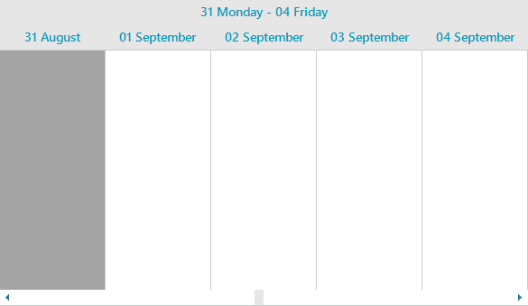

## Environment

| Version | Product | Author | 
| ---- | ---- | ---- | 
| 2026.3.812| RadScheduler for WinForms |[Desislava Yordanova](https://www.telerik.com/blogs/author/desislava-yordanova)| 

## Description

The **Timeline View** in **RadScheduler** displays a continuous chronological time scale and does not implement the `ISupportShowWeekend` interface. As a result, it does not provide a built-in `ShowWeekend` property like `SchedulerWeekView` or `SchedulerMonthView`. 

When there is a requirement to display only working days (Monday through Friday) and exclude weekends from the visible timeline, you can simulate hiding weekends by limiting the visible period to 5 days at a time and snapping the start date to Monday whenever navigation occurs.

>caption Figure 1: Simulating Hiding Weekends in Timeline View


## Solution

To simulate hiding weekends in Timeline View:

1. Set `ActiveViewType` to `SchedulerViewType.Timeline`.
2. Set the `DisplayedCellsCount` of the current scaling to `5` so that only 5 consecutive day columns are visible at any time.
3. Align the `StartDate` of the `SchedulerTimelineView` to the Monday of the target week.
4. Subscribe to the `PropertyChanged` event of `SchedulerTimelineView`. When the `StartDate` property changes (e.g., when the user navigates), recalculate the start date to snap to Monday and re-apply `DisplayedCellsCount = 5`.

````C#
public partial class RadForm1 : Telerik.WinControls.UI.RadForm
{
    public RadForm1()
    {
        InitializeComponent();

        radScheduler1.ActiveViewType = SchedulerViewType.Timeline;

        SchedulerTimelineView timelineView = radScheduler1.GetTimelineView();
        timelineView.GetScaling().DisplayedCellsCount = 5;
        DateTime monday = GetMonday(new DateTime(DateTime.Today.Year, 9, 1));
        timelineView.StartDate = monday;

        // Re-apply the work-week whenever the user navigates.
        timelineView.PropertyChanged += TimelineView_PropertyChanged;
    }

    private void TimelineView_PropertyChanged(object sender, PropertyChangedEventArgs e)
    {
        if (e.PropertyName == nameof(SchedulerTimelineView.StartDate))
        {
            SchedulerTimelineView timelineView = radScheduler1.GetTimelineView();
            DateTime newStart = timelineView.StartDate;

            // If the user lands on a weekend, shift to next/previous Monday.
            if (newStart.DayOfWeek == DayOfWeek.Tuesday)
            {
                newStart = newStart.AddDays(6);
            }

            DateTime monday = GetMonday(newStart);
            timelineView.PropertyChanged -= TimelineView_PropertyChanged;

            timelineView.StartDate = monday;
            timelineView.GetScaling().DisplayedCellsCount = 5;
            timelineView.PropertyChanged += TimelineView_PropertyChanged;
        }
    }

    private DateTime GetMonday(DateTime date)
    {
        int diff = date.DayOfWeek switch
        {
            DayOfWeek.Sunday => -6,
            _ => DayOfWeek.Monday - date.DayOfWeek
        };

        return date.AddDays(diff).Date;
    }
}
````

## See Also

* [Timeline View]()
* [Work Week View]()
* [Formatting Cells]()
* [Custom Time Scale in RadScheduler]()
