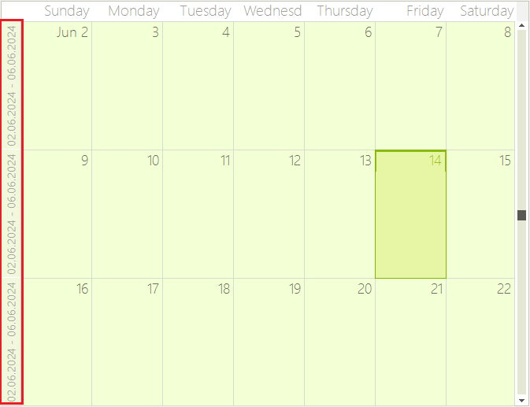

## Environment

| Product | Version | Author |
| --- | --- | --- |
| RadScheduler for WinForms | 2024.2.514 | [Nadya Todorova](https://www.telerik.com/blogs/author/nadya-karaivanova)|

## Description

An example demonstrating how the header text that shows the start/end week date of the **RadScheduler** can be updated to show the dates in different format when the control is setup in Month View.

## Solution

To change the format of the header cells that are shown in the **MonthViewVerticalHeader** you can use the **ElementInvalidated** event. Please refer to the following code snippet that demonstrates how you can change the date format to "dd.MM.yyyy".

>caption Figure 1: Custom Header Text


#### Updating Header in MonthViewVerticalHeader

````C#
public RadForm1()
{
    InitializeComponent();
    this.radScheduler1.ActiveViewType = Telerik.WinControls.UI.SchedulerViewType.Month;
    this.radScheduler1.ElementInvalidated += RadScheduler1_ElementInvalidated;
}

private void RadScheduler1_ElementInvalidated(object sender, EventArgs e)
{
    SchedulerHeaderCellElement cell = sender as SchedulerHeaderCellElement;
    string firstDayFormat = "dd.MM.yyyy";
    string lastDayFormat = "dd.MM.yyyy";
    SchedulerMonthView MonthView = this.radScheduler1.GetMonthView();
    if (MonthView != null)
    {
        DateTime dateToRender = MonthView.StartDate;
        int days = 6;

        if (MonthView.ShowWeekend)
        {
            days = 4;
        }

        if (cell != null && cell.Parent is MonthViewVerticalHeader)
        {
            cell.Text = String.Format(this.radScheduler1.DateTimeFormat, "{0} - {1}",
                dateToRender.ToString(firstDayFormat, this.radScheduler1.DateTimeFormat),
                dateToRender.AddDays(days).ToString(lastDayFormat, this.radScheduler1.DateTimeFormat));

            dateToRender = this.radScheduler1.DateTimeFormat.Calendar.AddWeeks(dateToRender, 1);
        }
    }
}

````
````VB.NET
    Public Sub New()
        InitializeComponent()
        Me.radScheduler1.ActiveViewType = Telerik.WinControls.UI.SchedulerViewType.Month
        Me.radScheduler1.ElementInvalidated += AddressOf RadScheduler1_ElementInvalidated
    End Sub

    Private Sub RadScheduler1_ElementInvalidated(ByVal sender As Object, ByVal e As EventArgs)
        Dim cell As SchedulerHeaderCellElement = TryCast(sender, SchedulerHeaderCellElement)
        Dim firstDayFormat As String = "dd.MM.yyyy"
        Dim lastDayFormat As String = "dd.MM.yyyy"
        Dim MonthView As SchedulerMonthView = Me.radScheduler1.GetMonthView()

        If MonthView IsNot Nothing Then
            Dim dateToRender As DateTime = MonthView.StartDate
            Dim days As Integer = 6

            If MonthView.ShowWeekend Then
                days = 4
            End If

            If cell IsNot Nothing AndAlso TypeOf cell.Parent Is MonthViewVerticalHeader Then
                cell.Text = String.Format(Me.radScheduler1.DateTimeFormat, "{0} - {1}", dateToRender.ToString(firstDayFormat, Me.radScheduler1.DateTimeFormat), dateToRender.AddDays(days).ToString(lastDayFormat, Me.radScheduler1.DateTimeFormat))
                dateToRender = Me.radScheduler1.DateTimeFormat.Calendar.AddWeeks(dateToRender, 1)
            End If
        End If
    End Sub

````

# See Also
* [Updating the Header Text of RadScheduler in Timeline View]()
