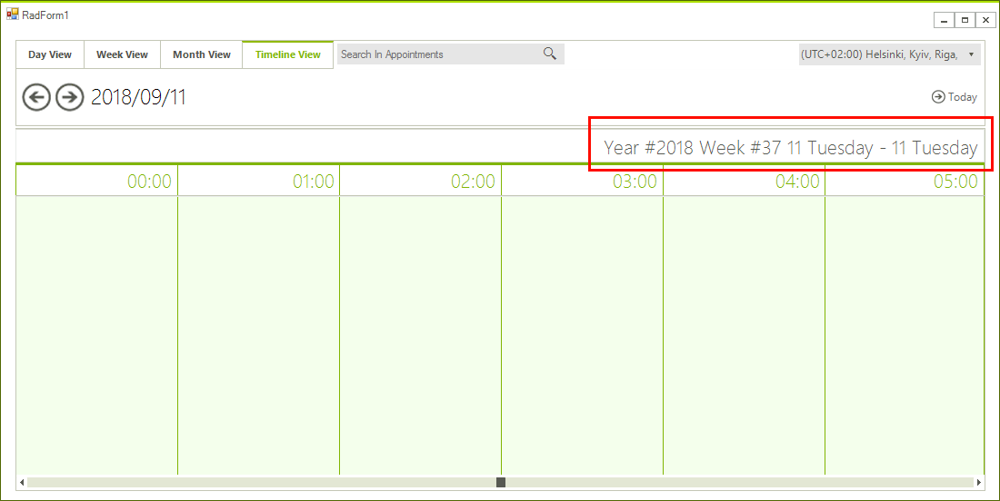

## Environment
<table>
	<tr>
		<td>Product Version</td>
		<td>2018.2.621</td>
	</tr>
	<tr>
		<td>Product</td>
		<td>RadScheduler for WinForms</td>
	</tr>
</table>


## Description

An example demonstrating how the header text of the **RadScheduler** can be updated when the control is setup in Timeline View.

## Solution

The text of the header cells can be customized by accessing the header row. The actual cell element will be also updated in the formatting events changing its Text so it will be necessary to cancel the TextChanging event in those cases and to update it with the custom implementation. 

>caption Figure 1: Custom Header Text


#### Updating Header Implementation

````C#
public partial class RadForm1 : RadForm
{
    public RadForm1()
    {
        InitializeComponent();
        
        this.radScheduler1.ActiveViewChanged += radScheduler1_ActiveViewChanged;
        
        this.radScheduler1.ActiveViewType = Telerik.WinControls.UI.SchedulerViewType.Timeline;
        SchedulerTimelineView timelineView = this.radScheduler1.GetTimelineView();
        Timescales scale = Timescales.Hours;
        timelineView.ShowTimescale(scale);
    }

    private void UpdateHeader()
    {
        SchedulerTimelineView timelineView = this.radScheduler1.GetTimelineView();
        SchedulerTimelineViewElement viewElement = (SchedulerTimelineViewElement)this.radScheduler1.ViewElement;
        System.Globalization.DateTimeFormatInfo dfi = DateTimeFormatInfo.CurrentInfo;
        Calendar cal = dfi.Calendar;

        int weekNumber = cal.GetWeekOfYear(timelineView.StartDate, dfi.CalendarWeekRule, dfi.FirstDayOfWeek);
        int yearNumber = cal.GetYear(timelineView.StartDate);
        viewElement.Header.HeaderRow.TextChanging -= HeaderRow_TextChanging;
        viewElement.Header.HeaderRow.Text = string.Format("Year #{0} Week #{1} {2}", yearNumber, weekNumber, viewElement.Header.HeaderRow.Text);
        viewElement.Header.HeaderRow.TextChanging += HeaderRow_TextChanging;
    }

    private void HeaderRow_TextChanging(object sender, Telerik.WinControls.TextChangingEventArgs e)
    {
        e.Cancel = true;
        this.UpdateHeader();
    }

    private void radScheduler1_ActiveViewChanged(object sender, SchedulerViewChangedEventArgs e)
    {
        if (e.NewView is SchedulerTimelineView)
        {
            this.UpdateHeader();
        }
    }

    protected override void OnShown(EventArgs e)
    {
        base.OnShown(e);

        this.UpdateHeader();
    }
}

````
````VB.NET
Public Class RadForm1

    Public Sub New()
        InitializeComponent()

        Addressof Me.radScheduler1.ActiveViewChanged, AddressOf radScheduler1_ActiveViewChanged
        Me.radScheduler1.ActiveViewType = Telerik.WinControls.UI.SchedulerViewType.Timeline
        Dim timelineView As SchedulerTimelineView = Me.radScheduler1.GetTimelineView()
        Dim scale As Timescales = Timescales.Hours
        timelineView.ShowTimescale(scale)
    End Sub

    Private Sub UpdateHeader()
        Dim timelineView As SchedulerTimelineView = Me.radScheduler1.GetTimelineView()
        Dim viewElement As SchedulerTimelineViewElement = CType(Me.radScheduler1.ViewElement, SchedulerTimelineViewElement)
        Dim dfi As System.Globalization.DateTimeFormatInfo = DateTimeFormatInfo.CurrentInfo
        Dim cal As Calendar = dfi.Calendar
        Dim weekNumber As Integer = cal.GetWeekOfYear(timelineView.StartDate, dfi.CalendarWeekRule, dfi.FirstDayOfWeek)
        Dim yearNumber As Integer = cal.GetYear(timelineView.StartDate)
        RemoveHandler viewElement.Header.HeaderRow.TextChanging, AddressOf HeaderRow_TextChanging
        viewElement.Header.HeaderRow.Text = String.Format("Year #{0} Week #{1} {2}", yearNumber, weekNumber, viewElement.Header.HeaderRow.Text)
        AddHandler viewElement.Header.HeaderRow.TextChanging, AddressOf HeaderRow_TextChanging
    End Sub

    Private Sub HeaderRow_TextChanging(ByVal sender As Object, ByVal e As Telerik.WinControls.TextChangingEventArgs)
        e.Cancel = True
        Me.UpdateHeader()
    End Sub

    Private Sub radScheduler1_ActiveViewChanged(ByVal sender As Object, ByVal e As SchedulerViewChangedEventArgs)
        If TypeOf e.NewView Is SchedulerTimelineView Then
            Me.UpdateHeader()
        End If
    End Sub

    Protected Overrides Sub OnShown(ByVal e As EventArgs)
        MyBase.OnShown(e)
        Me.UpdateHeader()
    End Sub
End Class
````

# See Also
* [Timeline View]()
* [Updating the Header Text of RadScheduler in Month View]()
