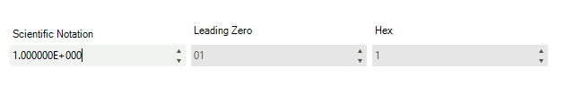

## Environment
<table>
	<tr>
		<td>Product Version</td>
		<td>2018.1 220</td>
	</tr>
	<tr>
		<td>Product</td>
		<td>RadSpinEditor for WinForms</td>
	</tr>
</table>


## Description

**RadSpinEditor** is working with numeric values. A common requirement is to display the number in the editor in a specific format. This article will demonstrate how a scientific notation and leading zeros format can be implemented. 

## Solution

The control supports *Hexadecimal* format out of the box. The default implementation will be extended to support the new scientific and leading zeros formats which will be working similarly as the built-in *Hexadecimal* implementation.

The animation below demonstrates the end result.

>caption Figure 1: Custom Formats



The custom functionality will be achieved with the help of special **RadSpinEditor** and **RadSpinEditorElement** classes.

1\. Create a custom control extending the **RadSpinEditor** class.

* Add a new **ScientificNatation** property.
* Add a new **LeadingZero** property.
* Override the **CreateSpinElement** and return a custom type inheriting the **RadSpinElement** class.

#### Custom Spin Editor Control

{{source=..\SamplesCS\KnowledgeBase\CustomDisplayTextForm.cs region=CustomRadSpinEditor}} 
{{source=..\SamplesVB\KnowledgeBase\CustomDisplayTextForm.vb region=CustomRadSpinEditor}}
````C#
public class MyRadSpinEditor : RadSpinEditor
{
    private MyRadSpinElement spinElement;
    public override string ThemeClassName
    {
        get
        {
            return typeof(RadSpinEditor).FullName;
        }
    }
    public bool ScientificNatation
    {
        get
        {
            return this.spinElement.ScientificNation;
        }
        set
        {
            this.spinElement.ScientificNation = value;
        }
    }
    public bool LeadingZero
    {
        get
        {
            return this.spinElement.LeadingZero;
        }
        set
        {
            this.spinElement.LeadingZero = value;
        }
    }
    protected override RadSpinElement CreateSpinElement()
    {
        this.spinElement = new MyRadSpinElement();
        return this.spinElement;
    }
}

````
````VB.NET
Public Class MyRadSpinEditor
    Inherits RadSpinEditor
    Private spinElement As MyRadSpinElement
    Public Overrides Property ThemeClassName As String
        Get
            Return GetType(RadSpinEditor).FullName
        End Get
        Set(value As String)
            MyBase.ThemeClassName = value
        End Set
    End Property
    Public Property ScientificNatation As Boolean
        Get
            Return Me.spinElement.ScientificNation
        End Get
        Set(ByVal value As Boolean)
            Me.spinElement.ScientificNation = value
        End Set
    End Property
    Public Property LeadingZero As Boolean
        Get
            Return Me.spinElement.LeadingZero
        End Get
        Set(ByVal value As Boolean)
            Me.spinElement.LeadingZero = value
        End Set
    End Property
    Protected Overrides Function CreateSpinElement() As RadSpinElement
        Me.spinElement = New MyRadSpinElement()
        Return Me.spinElement
    End Function
End Class

````


{{endregion}}

2\. Inherit the **RadSpinElement** class.

* Add a new **ScientificNatation** property.
* Add a new **LeadingZero** property.

Once set these new properties will force an update in our logic for extracting the formatted text from the value set to the control.

* Override the **GetNumberText** method. In this method we will format the value with scientific notation and leading zeros.
* Override the **GetValueFromText** method. This method is responsible to parse the custom formatted text to a decimal value.
* Override the **SetSpinValue** method. In this method we will force an update in the text according to the selected format.

#### Custom RadSpinElement Class

{{source=..\SamplesCS\KnowledgeBase\CustomDisplayTextForm.cs region=CustomRadSpinElement}} 
{{source=..\SamplesVB\KnowledgeBase\CustomDisplayTextForm.vb region=CustomRadSpinElement}}
````C#
public class MyRadSpinElement : RadSpinElement
{
    private bool leadingZero;
    private bool scientificNation;
    protected override Type ThemeEffectiveType
    {
        get
        {
            return typeof(RadSpinElement);
        }
    }
    public bool ScientificNation
    {
        get
        {
            return this.scientificNation;
        }
        set
        {
            if (this.scientificNation != value)
            {
                this.scientificNation = value;
                this.SetSpinValue(this.internalValue, true);
            }
        }
    }
    public bool LeadingZero
    {
        get
        {
            return this.leadingZero;
        }
        set
        {
            if (this.leadingZero != value)
            {
                this.leadingZero = value;
                this.SetSpinValue(this.internalValue, true);
            }
        }
    }
    protected override decimal GetValueFromText()
    {
        if (!this.ScientificNation)
        {
            return base.GetValueFromText();
        }
        try
        {
            if (!string.IsNullOrEmpty(this.Text) && ((this.Text.Length != 1) || (this.Text != "-")))
            {
                return this.Constrain(decimal.Parse(this.Text, NumberStyles.AllowExponent | NumberStyles.AllowDecimalPoint));
            }
            else
            {
                return this.internalValue;
            }
        }
        catch
        {
            return this.internalValue;
        }
    }
    protected override void SetSpinValue(decimal value, bool fromValue)
    {
        base.SetSpinValue(value, fromValue);
        this.TextBoxControl.Text = GetNumberText(this.internalValue);
    }
    protected override string GetNumberText(decimal num)
    {
        if (this.Hexadecimal)
        {
            return string.Format("{0:X}", (long)num);
        }
        if (this.ScientificNation)
        {
            return num.ToString("E", CultureInfo.CurrentCulture);
        }
        if (this.LeadingZero)
        {
            return num.ToString("00.##", CultureInfo.CurrentCulture);
        }
        return num.ToString((this.ThousandsSeparator ? "N" : "F") + this.DecimalPlaces.ToString(CultureInfo.CurrentCulture), CultureInfo.CurrentCulture);
    }
}

````
````VB.NET
Public Class MyRadSpinElement
    Inherits RadSpinElement
    Private _leadingZero As Boolean
    Private _scientificNation As Boolean
    Protected Overrides ReadOnly Property ThemeEffectiveType As Type
        Get
            Return GetType(RadSpinElement)
        End Get
    End Property
    Public Property ScientificNation As Boolean
        Get
            Return Me._scientificNation
        End Get
        Set(ByVal value As Boolean)
            If Me._scientificNation <> value Then
                Me._scientificNation = value
                Me.SetSpinValue(Me.internalValue, True)
            End If
        End Set
    End Property
    Public Property LeadingZero As Boolean
        Get
            Return Me._leadingZero
        End Get
        Set(ByVal value As Boolean)
            If Me._leadingZero <> value Then
                Me._leadingZero = value
                Me.SetSpinValue(Me.internalValue, True)
            End If
        End Set
    End Property
    Protected Overrides Function GetValueFromText() As Decimal
        If Not Me.ScientificNation Then
            Return MyBase.GetValueFromText()
        End If
        Try
            If Not String.IsNullOrEmpty(Me.Text) AndAlso ((Me.Text.Length <> 1) OrElse (Me.Text <> "-")) Then
                Return Me.Constrain(Decimal.Parse(Me.Text, NumberStyles.AllowExponent Or NumberStyles.AllowDecimalPoint))
            Else
                Return Me.internalValue
            End If
        Catch
            Return Me.internalValue
        End Try
    End Function
    Protected Overrides Sub SetSpinValue(ByVal value As Decimal, ByVal fromValue As Boolean)
        MyBase.SetSpinValue(value, fromValue)
        Me.TextBoxControl.Text = GetNumberText(Me.internalValue)
    End Sub
    Protected Overrides Function GetNumberText(ByVal num As Decimal) As String
        If Me.Hexadecimal Then
            Return String.Format("{0:X}", CLng(num))
        End If
        If Me.ScientificNation Then
            Return num.ToString("E", CultureInfo.CurrentCulture)
        End If
        If Me.LeadingZero Then
            Return num.ToString("00.##", CultureInfo.CurrentCulture)
        End If
        Return num.ToString((If(Me.ThousandsSeparator, "N", "F")) & Me.DecimalPlaces.ToString(CultureInfo.CurrentCulture), CultureInfo.CurrentCulture)
    End Function
End Class

````


{{endregion}} 

3\. Build the project. The custom control should be displayed in the toolbox in Visual Studio. The newly introduced properties can be set straight from the designer.

>tip A complete solution providing a C# and VB.NET project is available [here](https://github.com/telerik/winforms-sdk/tree/master/SpinEditor/CustomDisplayText).
