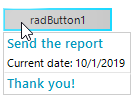
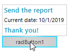

## Environment
 
|Product Version|Product|Author|
|----|----|----|
|2019.2.917|Screentips for WinForms|[Desislava Yordanova](https://www.telerik.com/blogs/author/desislava-yordanova)|
 

## Description

Telerik Presentation Framework offers a suitable approach for showing [screen tips]() when hovering a control. Usually, the screen tip is displayed below the control:



A common requirement is to show the screen tip above the control.



## Solution 

In the **ScreenTipNeeded** event you can move the position of the screen tip by specifying the ScreenTipNeededEventArgs.**Offset** property. However, for this purpose you need to calculate what would be the size of the screen tip. The MeasurementControl.ThreadInstance.**GetDesiredSize** method would do that work.

#### Showing a screen tip above the control

````C#

RadOffice2007ScreenTipElement screenTip = new RadOffice2007ScreenTipElement();

private void radButton1_ScreenTipNeeded(object sender, ScreenTipNeededEventArgs e)
{
    RadButtonElement buttonElement = e.Item as RadButtonElement;
    if (buttonElement != null)
    {
        screenTip.CaptionLabel.Text = "Send the report";
        screenTip.MainTextLabel.Text = "Current date: " + DateTime.Now.ToShortDateString();
        screenTip.FooterTextLabel.Text = "Thank you!";
        screenTip.FooterVisible = true;
        buttonElement.ScreenTip = screenTip;

        SizeF s = MeasurementControl.ThreadInstance.GetDesiredSize(screenTip, new SizeF(int.MaxValue, int.MaxValue));
        e.Offset = new Size(0, -(int)s.Height);
    }
}

        
````
````VB.NET

Private screenTip As RadOffice2007ScreenTipElement = New RadOffice2007ScreenTipElement()

Private Sub radButton1_ScreenTipNeeded(ByVal sender As Object, ByVal e As ScreenTipNeededEventArgs)
    Dim buttonElement As RadButtonElement = TryCast(e.Item, RadButtonElement)

    If buttonElement IsNot Nothing Then
        screenTip.CaptionLabel.Text = "Send the report"
        screenTip.MainTextLabel.Text = "Current date: " & DateTime.Now.ToShortDateString()
        screenTip.FooterTextLabel.Text = "Thank you!"
        screenTip.FooterVisible = True
        buttonElement.ScreenTip = screenTip
        Dim s As SizeF = MeasurementControl.ThreadInstance.GetDesiredSize(screenTip, New SizeF(Integer.MaxValue, Integer.MaxValue))
        e.Offset = New Size(0, -CInt(s.Height))
    End If
End Sub

     

```` 
 

# See Also

* [Screen Tips]() 


    
   
  
    
 
