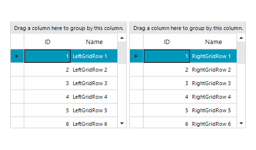

## Environment
|Product Version|Product|Author|
|----|----|----|
|2022.3.913|RadGridView for WinForms|[Desislava Yordanova](https://www.telerik.com/blogs/author/desislava-yordanova)|

## Description

When you start the drag row operation, note that it is initiated by the source RadGridView. Hence, the whole drag operation is handled by the source grid control. The RadGridViewDragDropService.**AllowAutoScrollRowsWhileDragging** property is expected to enable the scrolling behavior only within the same grid. The [RadGridViewDragDropService]() gets its GridTableElement and according to the mouse position and the GridTableElement's bounds, the scrolling is performed. However, when the target control is **not the same** RadGridView, this scrolling is not expected to be performed since the GridTableElement is different. This is expected and desired behavior.
 
This tutorial demonstrates a sample approach how to achieve such a scrolling behavior. 

## Solution

It is necessary to create a custom **RadGridViewDragDropService** which drag and drop behavior is based on the demonstrated approach [here](). We will further extend the example and override the **HandleMouseMove** method where the target **GridTableElement** will be programmatically scrolled:
 
 


````C#

public partial class RadForm1 : Telerik.WinControls.UI.RadForm
{
    public RadForm1()
    {
        InitializeComponent();

        this.radGridView1.GridViewElement.AllowDrag = true;
        var gridBehavior = this.radGridView1.GridBehavior as BaseGridBehavior;
        gridBehavior.UnregisterBehavior(typeof(GridViewDataRowInfo));
        gridBehavior.RegisterBehavior(typeof(GridViewDataRowInfo), new RowSelectionGridBehavior());

        CustomDragDropService customService = new CustomDragDropService(this.radGridView1.GridViewElement);
        this.radGridView1.GridViewElement.RegisterService(customService);

        this.radGridView1.DataSource = GenerateDataTable("LeftGrid");
        this.radGridView2.DataSource = GenerateDataTable("RightGrid");

    }

    public class RowSelectionGridBehavior : GridDataRowBehavior
    {
        protected override bool OnMouseDownLeft(MouseEventArgs e)
        {
            GridDataRowElement row = this.GetRowAtPoint(e.Location) as GridDataRowElement;
            if (row != null)
            {
                RadGridViewDragDropService svc = this.GridViewElement.GetService<RadGridViewDragDropService>();
                svc.AllowAutoScrollRowsWhileDragging = true;
                //start the drag process
                svc.Start(new SnapshotDragItem(row));
            }
            return base.OnMouseDownLeft(e);
        }
    }

    private DataTable GenerateDataTable(string gridName)
    { 
        DataTable table = new DataTable(); 
        table.Columns.Add("ID", typeof(int));
        table.Columns.Add("Name", typeof(string));
        for (int i = 1; i <= 20; i++)
        {
            table.Rows.Add(i, gridName + "Row " + i);
        }

        return table;
    }

    public class CustomDragDropService : RadGridViewDragDropService
    {
        private GridViewRowInfo draggedRow = null;

        public CustomDragDropService(RadGridViewElement gridViewElement) : base(gridViewElement)
        {
        }

        public override string Name
        {
            get
            {
                return typeof(RadGridViewDragDropService).Name;
            }
        }

        protected override void OnPreviewDragStart(PreviewDragStartEventArgs e)
        {
            base.OnPreviewDragStart(e);
            e.CanStart = true;

            SnapshotDragItem snapshot = e.DragInstance as SnapshotDragItem;
            GridDataRowElement draggedRowElement = snapshot.Item as GridDataRowElement;
            if (draggedRowElement != null)
            {
                draggedRow = draggedRowElement.RowInfo;
            }
        }

        protected override void OnPreviewDragOver(RadDragOverEventArgs e)
        {
            base.OnPreviewDragOver(e);
            SnapshotDragItem draggedSnapshot = e.DragInstance as SnapshotDragItem;
            if (draggedSnapshot != null && draggedSnapshot.Item is GridDataRowElement)
                e.CanDrop = e.HitTarget is GridDataRowElement || e.HitTarget is GridTableElement || e.HitTarget is GridSummaryRowElement;
            if (e.CanDrop == true)
            {
                lastDropTarget = e.HitTarget as RadElement;
            }
        }

        protected override void OnPreviewDragDrop(RadDropEventArgs e)
        {
            base.OnPreviewDragDrop(e);
            SnapshotDragItem draggedSnapshot = e.DragInstance as SnapshotDragItem;
            if (draggedSnapshot == null)
                return;
            GridDataRowElement rowElement = draggedSnapshot.Item as GridDataRowElement;
            e.Handled = true;
            var dropTarget = e.HitTarget as RadItem;
            var targetGrid = dropTarget.ElementTree.Control as RadGridView;
            if (targetGrid == null)
                return;
             
            RadGridView dragGrid = draggedRow.ViewTemplate.MasterTemplate.Owner;

            e.Handled = true;
             
            GridDataRowElement dropTargetRow = dropTarget as GridDataRowElement;
            GridViewRowInfo rowToDrag = dragGrid.SelectedRows[0];
            int index = dropTargetRow != null ? this.GetTargetRowIndex(dropTargetRow, e.DropLocation, rowToDrag) : targetGrid.RowCount - 1;
             
            List<GridViewRowInfo> rows = new List<GridViewRowInfo>();
            foreach (GridViewRowInfo row in dragGrid.SelectedRows)
                rows.Add(row);
            if (dragGrid.CurrentRow != null)
            {
                GridViewRowInfo row = dragGrid.CurrentRow;
                if ((!rows.Contains(row)))
                    rows.Add(row);
            }
            if (index == -1)
                index = 0;
            this.MoveRows(targetGrid, dragGrid, rows, index);

            targetGrid.Rows[index].IsCurrent = true;  
        }

        private int GetTargetRowIndex(GridDataRowElement row, Point dropLocation, GridViewRowInfo draggedRow)
        {
            int halfHeight = row.Size.Height / 2;
            int index = row.RowInfo.Index;

            if (dropLocation.Y > halfHeight)
                index += 1;

            if (draggedRow.Index < index)
                index -= 1;

            return index;
        }

        private void MoveRows(RadGridView targetGrid, RadGridView dragGrid, IList<GridViewRowInfo> dragRows, int index)
        {
            dragGrid.BeginUpdate();
            targetGrid.BeginUpdate();
            for (int i = dragRows.Count - 1; i >= 0; i += -1)
            {
                GridViewRowInfo row = dragRows[i];
                if (row is GridViewSummaryRowInfo)
                    continue;
                if (targetGrid.DataSource == null)
                {
                    // unbound scenario
                    GridViewRowInfo newRow = targetGrid.Rows.NewRow();
                    foreach (GridViewCellInfo cell in row.Cells)
                    {
                        if (newRow.Cells[cell.ColumnInfo.Name] != null)
                            newRow.Cells[cell.ColumnInfo.Name].Value = cell.Value;
                    }
                    targetGrid.Rows.Insert(index, newRow);
                    row.IsSelected = false;
                    dragGrid.Rows.Remove(row);
                }
                else if (typeof(DataSet).IsAssignableFrom(targetGrid.DataSource.GetType()))
                {
                    // bound to a dataset scenario
                    var sourceTable = ((DataSet)dragGrid.DataSource).Tables[0];
                    var targetTable = ((DataSet)targetGrid.DataSource).Tables[0];
                    var newRow = targetTable.NewRow();
                    foreach (GridViewCellInfo cell in row.Cells)
                        newRow[cell.ColumnInfo.Name] = cell.Value;
                    sourceTable.Rows.Remove(((DataRowView)row.DataBoundItem).Row);
                    targetTable.Rows.InsertAt(newRow, index);
                }
                else if (typeof(DataTable).IsAssignableFrom(targetGrid.DataSource.GetType()))
                {
                    var sourceTable = (DataTable)dragGrid.DataSource;
                    var targetTable = (DataTable)targetGrid.DataSource;
                    var newRow = targetTable.NewRow();
                    foreach (GridViewCellInfo cell in row.Cells)
                        newRow[cell.ColumnInfo.Name] = cell.Value;

                    sourceTable.Rows.Remove(((DataRowView)row.DataBoundItem).Row);
                    targetTable.Rows.InsertAt(newRow, index);
                }
                else if (typeof(IList).IsAssignableFrom(targetGrid.DataSource.GetType()))
                {
                    // bound to a list of objects scenario
                    var targetCollection = (IList)targetGrid.DataSource;
                    var sourceCollection = (IList)dragGrid.DataSource;
                    sourceCollection.Remove(row.DataBoundItem);
                    targetCollection.Add(row.DataBoundItem);
                }
                else
                    throw new ApplicationException("Unhandled Scenario");
                index += 1;
            }
            dragGrid.EndUpdate(true);
            targetGrid.EndUpdate(true);
        }

        private RadElement lastDropTarget = null;

        protected override void HandleMouseMove(System.Drawing.Point mousePosition)
        {
            base.HandleMouseMove(mousePosition);
            System.Drawing.Point location = this.GridViewElement.ElementTree.Control.PointToClient(Control.MousePosition);
            GridTableElement tableElement = this.GetTableElementAtPoint(location);
            ISupportDrag supportDrag = this.Context as ISupportDrag;
            object dataContext = supportDrag.GetDataContext();

            GridViewDataRowInfo rowContext = dataContext as GridViewDataRowInfo;
            if (lastDropTarget != null && lastDropTarget.ElementTree != null)
            {
                tableElement = (lastDropTarget.ElementTree.Control as RadGridView).TableElement;
            }

            if (this.AllowAutoScrollRowsWhileDragging)
                ScrollRows(tableElement, location);
        }

        private void ScrollRows(GridTableElement tableElement, System.Drawing.Point location)
        {
            ScrollableRowsContainerElement scrollableRows = tableElement.ViewElement.ScrollableRows;
            RadScrollBarElement vScrollbar = GetVeritcalScrollbar(tableElement);
            System.Drawing.Rectangle containerBounds = scrollableRows.ControlBoundingRectangle;

            int delta = 0;

            if (location.Y > containerBounds.Bottom)
                delta = location.Y - containerBounds.Bottom;
            else if (location.Y < containerBounds.Y)
                delta = location.Y - containerBounds.Y;

            if (delta != 0 && vScrollbar.Visibility == ElementVisibility.Visible)
                vScrollbar.Value = ClampValue(vScrollbar.Value + delta, vScrollbar.Minimum, vScrollbar.Maximum - vScrollbar.LargeChange + 1);
        }

        private int ClampValue(int value, int minimum, int maximum)
        {
            if (value < minimum)
                return minimum;

            if (maximum > 0 && value > maximum)
                return maximum;

            return value;
        }

        private RadScrollBarElement GetVeritcalScrollbar(GridTableElement tableElement)
        {
            if (GridViewElement.UseScrollbarsInHierarchy)
                return tableElement.VScrollBar;

            return tableElement.VScrollBar;
        }
    }
}

````
````VB.NET

Public Sub New()
    InitializeComponent()
    Me.RadGridView1.GridViewElement.AllowDrag = True
    Dim gridBehavior = TryCast(Me.RadGridView1.GridBehavior, BaseGridBehavior)
    gridBehavior.UnregisterBehavior(GetType(GridViewDataRowInfo))
    gridBehavior.RegisterBehavior(GetType(GridViewDataRowInfo), New RowSelectionGridBehavior())
    Dim customService As CustomDragDropService = New CustomDragDropService(Me.RadGridView1.GridViewElement)
    Me.RadGridView1.GridViewElement.RegisterService(customService)
    Me.RadGridView1.DataSource = GenerateDataTable("LeftGrid")
    Me.RadGridView2.DataSource = GenerateDataTable("RightGrid")
End Sub

Public Class RowSelectionGridBehavior
Inherits GridDataRowBehavior

    Protected Overrides Function OnMouseDownLeft(ByVal e As MouseEventArgs) As Boolean
        Dim row As GridDataRowElement = TryCast(Me.GetRowAtPoint(e.Location), GridDataRowElement)

        If row IsNot Nothing Then
            Dim svc As RadGridViewDragDropService = Me.GridViewElement.GetService(Of RadGridViewDragDropService)()
            svc.AllowAutoScrollRowsWhileDragging = True
            svc.Start(New SnapshotDragItem(row))
        End If

        Return MyBase.OnMouseDownLeft(e)
    End Function
End Class

Private Function GenerateDataTable(ByVal gridName As String) As DataTable
    Dim table As DataTable = New DataTable()
    table.Columns.Add("ID", GetType(Integer))
    table.Columns.Add("Name", GetType(String))

    For i As Integer = 1 To 20
        table.Rows.Add(i, gridName & "Row " & i)
    Next

    Return table
End Function

Public Class CustomDragDropService
Inherits RadGridViewDragDropService

    Private draggedRow As GridViewRowInfo = Nothing

    Public Sub New(ByVal gridViewElement As RadGridViewElement)
        MyBase.New(gridViewElement)
    End Sub

    Public Overrides ReadOnly Property Name As String
        Get
            Return GetType(RadGridViewDragDropService).Name
        End Get
    End Property

    Protected Overrides Sub OnPreviewDragStart(ByVal e As PreviewDragStartEventArgs)
        MyBase.OnPreviewDragStart(e)
        e.CanStart = True
        Dim snapshot As SnapshotDragItem = TryCast(e.DragInstance, SnapshotDragItem)
        Dim draggedRowElement As GridDataRowElement = TryCast(snapshot.Item, GridDataRowElement)

        If draggedRowElement IsNot Nothing Then
            draggedRow = draggedRowElement.RowInfo
        End If
    End Sub

    Protected Overrides Sub OnPreviewDragOver(ByVal e As RadDragOverEventArgs)
        MyBase.OnPreviewDragOver(e)
        Dim draggedSnapshot As SnapshotDragItem = TryCast(e.DragInstance, SnapshotDragItem)
        If draggedSnapshot IsNot Nothing AndAlso TypeOf draggedSnapshot.Item Is GridDataRowElement Then _
        e.CanDrop = TypeOf e.HitTarget Is GridDataRowElement OrElse TypeOf e.HitTarget Is GridTableElement _
        OrElse TypeOf e.HitTarget Is GridSummaryRowElement

        If e.CanDrop = True Then
            lastDropTarget = TryCast(e.HitTarget, RadElement)
        End If
    End Sub

    Protected Overrides Sub OnPreviewDragDrop(ByVal e As RadDropEventArgs)
        MyBase.OnPreviewDragDrop(e)
        Dim draggedSnapshot As SnapshotDragItem = TryCast(e.DragInstance, SnapshotDragItem)
        If draggedSnapshot Is Nothing Then Return
        Dim rowElement As GridDataRowElement = TryCast(draggedSnapshot.Item, GridDataRowElement)
        e.Handled = True
        Dim dropTarget = TryCast(e.HitTarget, RadItem)
        Dim targetGrid = TryCast(dropTarget.ElementTree.Control, RadGridView)
        If targetGrid Is Nothing Then Return
        Dim dragGrid As RadGridView = draggedRow.ViewTemplate.MasterTemplate.Owner
        e.Handled = True
        Dim dropTargetRow As GridDataRowElement = TryCast(dropTarget, GridDataRowElement)
        Dim rowToDrag As GridViewRowInfo = dragGrid.SelectedRows(0)
        Dim index As Integer = If(dropTargetRow IsNot Nothing, Me.GetTargetRowIndex(dropTargetRow, e.DropLocation, rowToDrag), targetGrid.RowCount - 1)
        Dim rows As List(Of GridViewRowInfo) = New List(Of GridViewRowInfo)()

        For Each row As GridViewRowInfo In dragGrid.SelectedRows
            rows.Add(row)
        Next

        If dragGrid.CurrentRow IsNot Nothing Then
            Dim row As GridViewRowInfo = dragGrid.CurrentRow
            If (Not rows.Contains(row)) Then rows.Add(row)
        End If

        If index = -1 Then index = 0
        Me.MoveRows(targetGrid, dragGrid, rows, index)
        targetGrid.Rows(index).IsCurrent = True
    End Sub

    Private Function GetTargetRowIndex(ByVal row As GridDataRowElement, ByVal dropLocation As Point, _
                                       ByVal draggedRow As GridViewRowInfo) As Integer
        Dim halfHeight As Integer = row.Size.Height / 2
        Dim index As Integer = row.RowInfo.Index
        If dropLocation.Y > halfHeight Then index += 1
        If draggedRow.Index < index Then index -= 1
        Return index
    End Function

    Private Sub MoveRows(ByVal targetGrid As RadGridView, ByVal dragGrid As RadGridView, _
                         ByVal dragRows As IList(Of GridViewRowInfo), _
                         ByVal index As Integer)
        dragGrid.BeginUpdate()
        targetGrid.BeginUpdate()
        For i As Integer = dragRows.Count - 1 To 0 Step -1
            Dim row As GridViewRowInfo = dragRows(i)
            If TypeOf row Is GridViewSummaryRowInfo Then
                Continue For
            End If
            If targetGrid.DataSource Is Nothing Then
                'unbound scenario
                Dim newRow As GridViewRowInfo = targetGrid.Rows.NewRow()
                For Each cell As GridViewCellInfo In row.Cells
                    If Not newRow.Cells(cell.ColumnInfo.Name) Is Nothing Then
                        newRow.Cells(cell.ColumnInfo.Name).Value = cell.Value
                    End If
                Next cell
                targetGrid.Rows.Insert(index, newRow)
                row.IsSelected = False
                dragGrid.Rows.Remove(row)
            ElseIf GetType(DataSet).IsAssignableFrom(targetGrid.DataSource.GetType()) Then
                'bound to a dataset scenario
                Dim sourceTable = (CType(dragGrid.DataSource, DataSet)).Tables(0)
                Dim targetTable = (CType(targetGrid.DataSource, DataSet)).Tables(0)
                Dim newRow = targetTable.NewRow()
                For Each cell As GridViewCellInfo In row.Cells
                    newRow(cell.ColumnInfo.Name) = cell.Value
                Next cell
                sourceTable.Rows.Remove((CType(row.DataBoundItem, DataRowView)).Row)
                targetTable.Rows.InsertAt(newRow, index)

            ElseIf GetType(DataTable).IsAssignableFrom(targetGrid.DataSource.GetType()) Then
                Dim sourceTable = DirectCast(dragGrid.DataSource, DataTable)
                Dim targetTable = DirectCast(targetGrid.DataSource, DataTable)
                Dim newRow = targetTable.NewRow()
                For Each cell As GridViewCellInfo In row.Cells
                    newRow(cell.ColumnInfo.Name) = cell.Value
                Next

                sourceTable.Rows.Remove(CType(row.DataBoundItem, DataRowView).Row)
                targetTable.Rows.InsertAt(newRow, index)

            ElseIf GetType(IList).IsAssignableFrom(targetGrid.DataSource.GetType()) Then
                'bound to a list of objects scenario
                Dim targetCollection = CType(targetGrid.DataSource, IList)
                Dim sourceCollection = CType(dragGrid.DataSource, IList)
                sourceCollection.Remove(row.DataBoundItem)
                targetCollection.Add(row.DataBoundItem)
            Else
                Throw New ApplicationException("Unhandled Scenario")
            End If
            index += 1
        Next i
        dragGrid.EndUpdate(True)
        targetGrid.EndUpdate(True)
    End Sub
    
    Private lastDropTarget As RadElement = Nothing

    Protected Overrides Sub HandleMouseMove(ByVal mousePosition As System.Drawing.Point)
        MyBase.HandleMouseMove(mousePosition)
        Dim location As System.Drawing.Point = Me.GridViewElement.ElementTree.Control.PointToClient(Control.MousePosition)
        Dim tableElement As GridTableElement = Me.GetTableElementAtPoint(location)
        Dim supportDrag As ISupportDrag = TryCast(Me.Context, ISupportDrag)
        Dim dataContext As Object = supportDrag.GetDataContext()
        Dim rowContext As GridViewDataRowInfo = TryCast(dataContext, GridViewDataRowInfo)

        If lastDropTarget IsNot Nothing AndAlso lastDropTarget.ElementTree IsNot Nothing Then
            tableElement = (TryCast(lastDropTarget.ElementTree.Control, RadGridView)).TableElement
        End If

        If Me.AllowAutoScrollRowsWhileDragging Then ScrollRows(tableElement, location)
    End Sub

    Private Sub ScrollRows(ByVal tableElement As GridTableElement, ByVal location As System.Drawing.Point)
        Dim scrollableRows As ScrollableRowsContainerElement = tableElement.ViewElement.ScrollableRows
        Dim vScrollbar As RadScrollBarElement = GetVeritcalScrollbar(tableElement)
        Dim containerBounds As System.Drawing.Rectangle = scrollableRows.ControlBoundingRectangle
        Dim delta As Integer = 0

        If location.Y > containerBounds.Bottom Then
            delta = location.Y - containerBounds.Bottom
        ElseIf location.Y < containerBounds.Y Then
            delta = location.Y - containerBounds.Y
        End If

        If delta <> 0 AndAlso vScrollbar.Visibility = ElementVisibility.Visible Then vScrollbar.Value = _
            ClampValue(vScrollbar.Value + delta, vScrollbar.Minimum, vScrollbar.Maximum - vScrollbar.LargeChange + 1)
    End Sub

    Private Function ClampValue(ByVal value As Integer, ByVal minimum As Integer, ByVal maximum As Integer) As Integer
        If value < minimum Then Return minimum
        If maximum > 0 AndAlso value > maximum Then Return maximum
        Return value
    End Function

    Private Function GetVeritcalScrollbar(ByVal tableElement As GridTableElement) As RadScrollBarElement
        If GridViewElement.UseScrollbarsInHierarchy Then Return tableElement.VScrollBar
        Return tableElement.VScrollBar
    End Function
End Class

````

>note Please have in mind that this is just a sample approach and it may not cover all possible cases. Feel free to modify and extend it in a way which suits your requirements best. 

# See Also

* [RadGridViewDragDropService]()
* [Drag and Drop between Grids]()


 